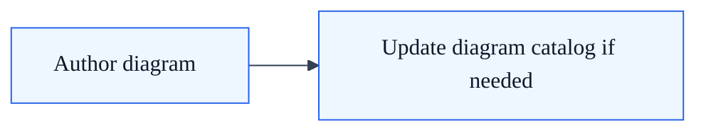

<!-- Audience: Contributors -->
<!-- Type: Explanation -->

# SkyCMS Documentation

Documentation source for [SkyCMS](https://github.com/CWALabs/SkyCMS) — a multi-tenant ASP.NET Core content management system with four visual editors (WYSIWYG, drag-and-drop page builder, code editor, image editor), multi-cloud storage, pluggable identity providers, and static-site publishing.

Published at: [docs.sky-cms.com](https://docs.sky-cms.com)

---

## Documentation Structure

The site is organized by **audience role** so readers find content relevant to their work:

| Folder | Audience | Topics | Description |
| -------- | ---------- | -------- | ------------- |
| [getting-started/](getting-started/quick-start.md) | Everyone | 3 | What is SkyCMS, key concepts, quick start |
| [for-editors/](for-editors/) | Editors, Authors | 30 | Content creation, all four editors, blogging, publishing, collaboration, file management |
| [for-site-builders/](for-site-builders/) | Site Builders | 7 | Layouts, templates, pages, widgets, style guides |
| [for-developers/](for-developers/) | Developers | 18 | Architecture, APIs, multi-tenancy, EF Core cross-provider, middleware pipeline |
| [installation/](installation/overview.md) | Administrators | 14 | Setup wizard (6 steps), Azure/AWS/Docker/Cloudflare deployment, local dev |
| [configuration/](configuration/overview.md) | Administrators | 7+ | Database, storage, CDN, email providers, multi-tenancy, proxy settings |
| [deployment/](deployment/overview.md) | DevOps | 8 | Cloud hosting, CI/CD pipelines, Docker, demo deployment, licensing |
| [reference/](reference/features/index.md) | All | 9 | Feature catalog, changelog, FAQ, glossary, troubleshooting, templates |

### Catalog Overview

The [Feature Catalog](reference/features/index.md) provides a comprehensive inventory of all 56 documented features across 8 categories, with jump-to navigation and cross-reference links to the relevant documentation pages.

---

## Quick Links

- [Getting Started — Quick Start](getting-started/quick-start.md)
- [Installation Overview](installation/overview.md)
- [Feature Catalog](reference/features/index.md)
- [FAQ](reference/faq.md)
- [Troubleshooting](reference/troubleshooting.md)
- [Glossary](reference/glossary.md)
- [Changelog](reference/changelog.md)

### Developer Entry Points

- [Developer Index](for-developers/index.md)
- [Architecture Overview](for-developers/architecture.md)
- [Website Launch Workflow](for-developers/website-launch/index.md)
- [API Reference](for-developers/api/overview.md)
- [AI Context Pack](reference/ai-context-pack.md)

### AI Ingestion Shortcut

For AI assistants, retrieval systems, or prompt grounding, start with [AI Context Pack](reference/ai-context-pack.md). It summarizes canonical SkyCMS terminology, disambiguation rules, and the most authoritative docs to consult next.

---

## Building the Docs Site Locally

The MkDocs configuration lives in the **parent SkyCMS repo** at [`mkdocs.yml`](https://github.com/CWALabs/SkyCMS/blob/main/mkdocs.yml), which references this content via `docs_dir`.

### Prerequisites

- Python 3.8+
- pip

### Setup

```bash
pip install mkdocs-material
```

### Serve Locally

From the **SkyCMS** repo root (not this repo):

```bash
cd /path/to/SkyCMS
mkdocs serve
```

Then open [http://127.0.0.1:8000](http://127.0.0.1:8000) in your browser.

> **Note:** The `mkdocs.yml` nav references a legacy `Docs/` folder structure. Some paths in the nav may differ from the folder layout in this repo. See [Deployment](#deployment) for how the published site is built.

---

## Contributing

### File Placement

Place new documentation based on the target audience:

| If the reader is a... | Put it in... |
| ------------------------ | ------------- |
| Content editor or author | `for-editors/` |
| Site builder working with layouts/templates | `for-site-builders/` |
| Developer extending or integrating SkyCMS | `for-developers/` |
| Administrator installing or configuring | `installation/` or `configuration/` |
| DevOps engineer deploying or managing CI/CD | `deployment/` |

### Metadata Convention

Use YAML frontmatter at the top of every new or materially revised documentation file. This gives MkDocs, search, and AI ingestion a stable, parseable metadata block.

```yaml
---
canonical_title: Page Builder
description: Visual drag-and-drop composition in SkyCMS using GrapesJS.
audience:
  - Content Editors
  - Site Builders
doc_type: How-to
status: Draft
entities:
  - page-builder
  - layers-panel
keywords:
  - grapesjs
  - drag and drop
  - visual editor
---
```

| Field | Purpose |
| ------- | --------- |
| `canonical_title` | Canonical page title used by search and AI context extraction |
| `description` | One-sentence summary for search snippets and retrieval |
| `audience` | Intended readers, as a YAML list |
| `doc_type` | `How-to`, `Explanation`, `Reference`, `Tutorial`, or `Quickstart` |
| `status` | `Draft`, `Canonical`, `Reference`, `Deprecated`, or other explicit state |
| `entities` | Canonical SkyCMS concepts covered by the page |
| `keywords` | Synonyms, aliases, and common search phrases |

Optional fields may be added when helpful, such as `source`, `aliases`, `related_topics`, or `tags`.

Legacy HTML comments may be retained for internal provenance, but they should not replace YAML frontmatter on new or substantially updated pages.

### File Naming

- Use lowercase with hyphens: `url-management.md`, `blog-architecture.md`
- Use `index.md` for section landing pages
- Use `overview.md` for high-level introductions to a topic area

### Feature Catalog

When adding or updating documentation for a SkyCMS feature, also update the corresponding section in the [Feature Catalog](reference/features/) and check the [Documentation Gaps](reference/features/documentation-gaps.md) tracker.

---

## Writing Standards

- **Be role-focused** — Write for the audience specified in the frontmatter. Editors don't need implementation details; developers don't need UI walkthroughs.
- **Link, don't duplicate** — Reference existing pages rather than repeating content. Use the feature catalog as a cross-reference hub.
- **Use tables for structured data** — Configuration options, parameters, comparison matrices.
- **Include code examples** — Use fenced code blocks with language identifiers (`csharp`, `bash`, `powershell`, `yaml`, `json`).
- **Add "See Also" sections** — End pages with links to related documentation.

---

## Known Editor Diagnostics

- `mkdocs.yml` uses MkDocs Material/PyMdown custom YAML tags for emoji configuration:

  - `!!python/name:material.extensions.emoji.twemoji`
  - `!!python/name:material.extensions.emoji.to_svg`

- Some generic YAML validators report unresolved-tag warnings for these lines.
- This is expected and does not indicate a build or runtime issue for MkDocs.
- Workspace mitigation is configured in `.vscode/settings.json` using `yaml.customTags`.

### Mermaid runtime dependency policy

- Mermaid rendering uses vendored local assets, not a CDN.
- Runtime script path: `assets/javascripts/vendor/mermaid.min.js`
- Initializer path: `assets/javascripts/mermaid-init.js`
- `mkdocs.yml` references these local files via `extra_javascript`.

### Mermaid authoring conventions

- Prefer one primary diagram per page section, with one optional secondary diagram when it explains a materially different flow.
- Use the shared theme init block already established in the docs so diagrams stay visually consistent.
- Prefer `flowchart` for topology, ownership, or decision maps; `sequenceDiagram` for request, event, or collaboration timelines; `stateDiagram-v2` for lifecycle behavior.
- Indent Mermaid blocks with spaces, not tabs, to avoid markdownlint `MD010` failures.
- Add or update entries in [for-developers/architecture-diagram-catalog.md](for-developers/architecture-diagram-catalog.md) when a Mermaid diagram becomes a durable navigation aid.
- Validate changes with diagnostics and `./.tmp-link-check.ps1` after editing pages that add new anchors or catalog links.

Example theme preamble:



---

## Deployment

Documentation is automatically deployed when changes are pushed to the `Docs/**` path in the SkyCMS repo:

1. The [`deploy-docs-cloudflare.yml`](https://github.com/CWALabs/SkyCMS/blob/main/.github/workflows/deploy-docs-cloudflare.yml) GitHub Actions workflow triggers
2. MkDocs builds the static site
3. Pre-deployment link validation runs
4. Built files are uploaded to Cloudflare R2
5. Post-deployment link validation confirms the live site

See [CI/CD Pipelines](deployment/cicd-pipelines.md) for full pipeline documentation.

---

## License

See [Licensing & Distribution](deployment/licensing-and-distribution.md).
