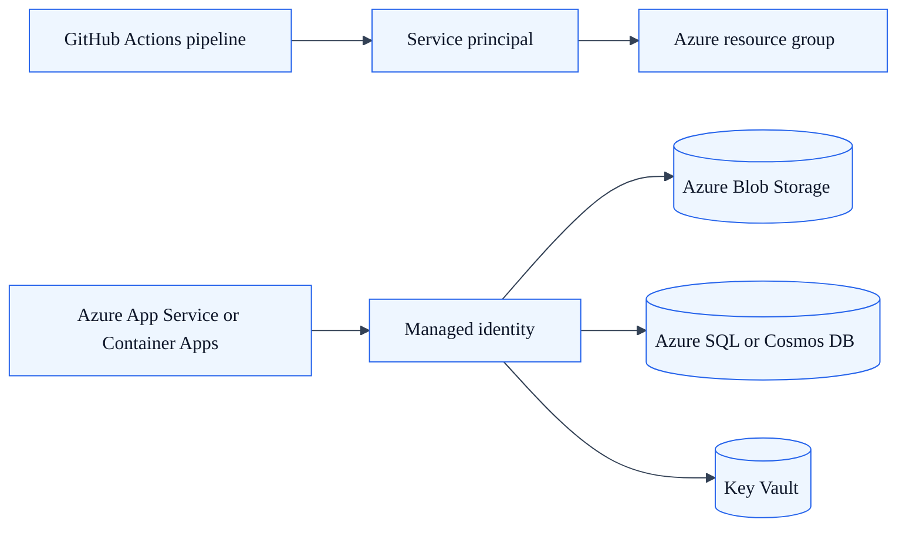

# Azure Deployment Credentials

## Summary

Use this guide to establish the identity and secret configuration needed to deploy SkyCMS to Azure from CI/CD pipelines or from a hosted Azure runtime.

## Outcome

After completing this guide, you will have a service principal for CI/CD pipelines, an optional managed identity for Azure-hosted SkyCMS, and your GitHub Actions secrets uploaded.

## Credential types

SkyCMS deployments to Azure use two identity approaches depending on context:

| Approach | Best for | Where it works |
| --- | --- | --- |
| Service principal | CI/CD automation from GitHub Actions | Any pipeline that pushes to Azure |
| Managed identity | Azure App Service or Container Apps runtime | Azure-hosted SkyCMS only |

Use a service principal for pipeline operations. Use a managed identity to remove long-lived credentials from the SkyCMS runtime configuration on Azure.



## Prerequisites

- An Azure subscription with Contributor access on the target resource group.
- Azure CLI installed and signed in (`az login`).
- Access to the GitHub repository to configure Actions secrets.

## Step 1: Create a service principal for CI/CD

Run the following command. Replace `<SubscriptionId>` and `<ResourceGroup>` with your target values:

```bash
az ad sp create-for-rbac \
  --name "skycms-cicd" \
  --role Contributor \
  --scopes /subscriptions/<SubscriptionId>/resourceGroups/<ResourceGroup> \
  --sdk-auth
```

The command outputs a JSON block:

```json
{
  "clientId": "...",
  "clientSecret": "...",
  "subscriptionId": "...",
  "tenantId": "...",
  ...
}
```

Store the full JSON output as the `AZURE_CREDENTIALS` GitHub Actions secret. This value is consumed by the `azure/login` action in your workflows.

Do not commit the JSON output to source control.

## Step 2: Assign additional roles if needed

The Contributor role on the resource group covers most deployment operations. Some scenarios require additional role assignments:

| Operation | Required role |
| --- | --- |
| Push images to Azure Container Registry | `AcrPush` on the registry |
| Deploy to Azure App Service | `Contributor` on the App Service |
| Deploy to Azure Container Apps | `Contributor` on the Container App |
| Read Key Vault secrets at runtime | `Key Vault Secrets User` on the vault |

To add a role assignment:

```bash
az role assignment create \
  --assignee <clientId> \
  --role "AcrPush" \
  --scope /subscriptions/<SubscriptionId>/resourceGroups/<ResourceGroup>/providers/Microsoft.ContainerRegistry/registries/<RegistryName>
```

## Step 3: Configure a managed identity (Azure-hosted SkyCMS only)

If SkyCMS runs in Azure App Service or Azure Container Apps, a system-assigned managed identity removes the need for long-lived credentials in the runtime configuration.

### Enable the managed identity

For App Service:

```bash
az webapp identity assign \
  --name <AppServiceName> \
  --resource-group <ResourceGroup>
```

For Container Apps:

```bash
az containerapp identity assign \
  --name <ContainerAppName> \
  --resource-group <ResourceGroup> \
  --system-assigned
```

Both commands print the `principalId` of the newly created identity.

### Grant access to Azure resources

Assign the appropriate roles to the managed identity's `principalId`:

| Resource | Recommended role |
| --- | --- |
| Azure Blob Storage | `Storage Blob Data Contributor` |
| Azure SQL | `Contributor` or database-level SQL user |
| Azure Cosmos DB | `Cosmos DB Built-in Data Contributor` |
| Azure Communication Services | `Contributor` |

Example for blob storage:

```bash
az role assignment create \
  --assignee <principalId> \
  --role "Storage Blob Data Contributor" \
  --scope /subscriptions/<SubscriptionId>/resourceGroups/<ResourceGroup>/providers/Microsoft.Storage/storageAccounts/<StorageAccount>
```

When SkyCMS is configured with a managed identity, use the credential-free connection string format (omit the account key). See [Azure Blob Storage](../storage/azure-blob.md) for configuration details.

## Step 4: Upload secrets to GitHub Actions

SkyCMS includes a script to synchronize local secret values to GitHub Actions secrets. Run it from the repository root after configuring values in your local environment:

```powershell
.\UploadSecretsToGithubRepo.ps1
```

At minimum, ensure the following GitHub Actions secrets are present for Azure deployment pipelines:

| Secret | Purpose |
| --- | --- |
| `AZURE_CREDENTIALS` | Service principal JSON from Step 1 |
| `AZURE_SUBSCRIPTION_ID` | Target subscription for deployments |
| `AZURE_RESOURCE_GROUP` | Target resource group |
| `CONNECTIONSTRINGS__*` | Runtime connection strings for integration tests |

See [CI/CD Pipelines](../../deployment/cicd-pipelines.md) for the full list of workflow-specific secrets.

## Verification

Your credential setup is complete when:

- a workflow using `azure/login` with `AZURE_CREDENTIALS` completes the login step without error,
- the deployment workflow can push to the target resource group,
- integration test workflows that use connection strings pass without authentication failures.

## Key rotation

Service principal client secrets expire. Rotate them before expiry to avoid pipeline interruption:

1. In the Azure portal, open **Microsoft Entra ID** → **App registrations** → select `skycms-cicd`.
2. Under **Certificates & secrets**, select **New client secret**, set an expiry, and copy the value immediately.
3. Update the `AZURE_CREDENTIALS` GitHub Actions secret with a new JSON block using the new client secret value.
4. Confirm the pipeline runs successfully, then delete the old client secret.

## Related guides

- [CI/CD Pipelines](../../deployment/cicd-pipelines.md)
- [Deploy to Azure](../../deployment/azure.md)
- [Azure Blob Credentials](../storage/azure-blob-credentials.md)
- [Azure Front Door Credentials](../cdn/azure-front-door-credentials.md)
- [Azure Communication Services Credentials](../email/azure-communication-services-credentials.md)
