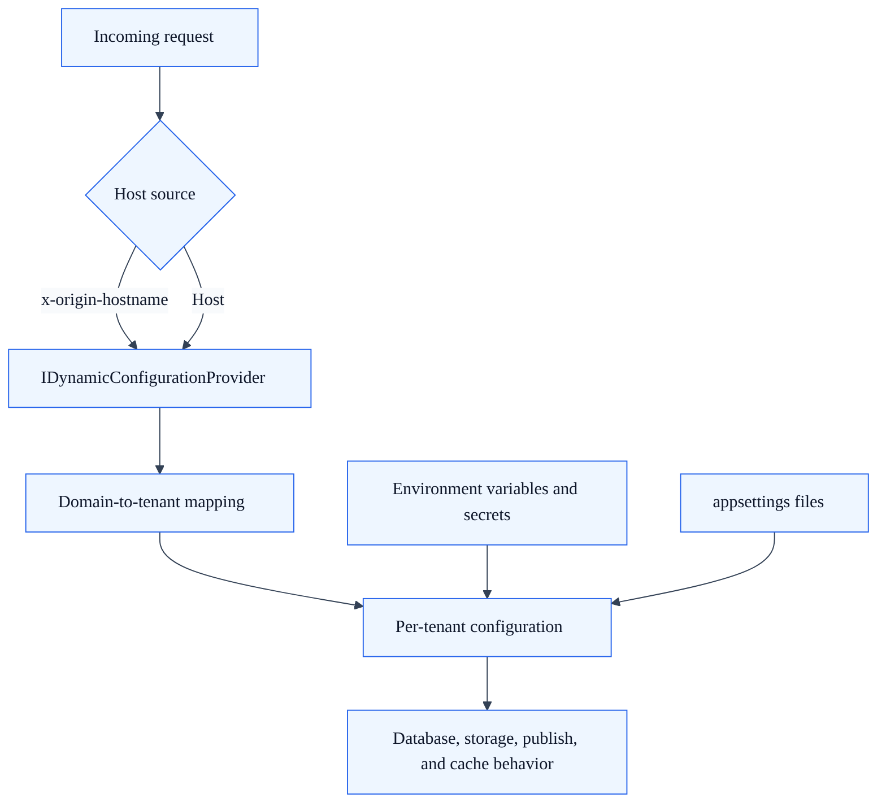

# Multi-Tenancy Configuration

## Summary

Use this guide when you need to:

- enable tenant-aware behavior by domain,
- map hostnames to tenant configuration,
- validate data and content isolation across tenants.

## Outcome

After completing this guide, SkyCMS will resolve tenant context from incoming domain headers, apply per-tenant configuration, and isolate content and settings across tenant boundaries.

## Tenant resolution model

SkyCMS resolves tenant context from incoming host/domain information and uses that context for settings, content access, and publishing behavior.

## Configuration precedence and request flow

## Required settings

- tenant domain entries,
- per-tenant configuration records,
- provider settings valid for each tenant.

## Domain mapping

Recommended mapping approach:

1. define canonical domains per tenant,
2. map each domain to tenant configuration,
3. validate redirects and host-header behavior.

## Testing tenant isolation

Validate with at least two tenant domains:

- each domain resolves the expected tenant,
- content and settings do not leak between tenants,
- publish and cache purge actions affect only the intended tenant assets.

## Troubleshooting

- wrong content by domain: verify domain-to-tenant mapping and proxy forwarding headers,
- shared settings unexpectedly: verify tenant key usage in configuration queries,
- publish affecting another tenant: verify isolation in publish and storage paths.

## Related guides

- [Configuration Overview](./overview.md)
- [Proxy Settings](./proxy-settings.md)
- [Troubleshooting](../reference/troubleshooting.md)
