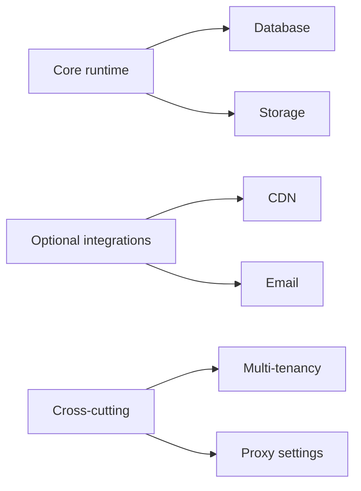

# Configuration Overview

## Summary

SkyCMS configuration controls how the platform connects to your database, storage, delivery layers, and optional service providers.

If you are new to SkyCMS, use this page to understand the configuration model before you start editing environment variables or provider settings.

## Context

Most setup failures come from incomplete or misplaced configuration values.

To reduce that risk, think about configuration in two stages:

- stage 1: required runtime values that let SkyCMS start and publish,
- stage 2: optional integrations that improve production operations.

## Configuration model

SkyCMS groups configuration into four primary areas:

- database,
- storage,
- CDN,
- email.

Cross-cutting areas include:

- multi-tenancy,
- proxy and forwarding behavior.

## Configuration precedence

Apply values in this priority order:

1. environment variables and secret stores,
1. environment-specific appsettings,
1. base defaults.

Do not keep production secrets in source-controlled files.

## How to use configuration guides

When setting up a new environment:

1. start with the required minimum settings,
1. configure database and storage first,
1. add CDN and email integrations after the core publish path is stable,
1. validate tenant and proxy behavior if your environment depends on them.

## Configuration guides

- [Database Overview](./database/overview.md)
- [Storage Overview](./storage/overview.md)
- [CDN Overview](./cdn/overview.md)
- [Email Overview](./email/overview.md)
- [Multi-Tenancy Configuration](./multi-tenancy.md)
- [Proxy Settings](./proxy-settings.md)

## Related links

- [Minimum Required Settings](../installation/minimum-required-settings.md)
- [Installation Overview](../installation/overview.md)
- [Post-Installation Configuration](../installation/post-installation.md)
- [For Developers](../for-developers/index.md)
