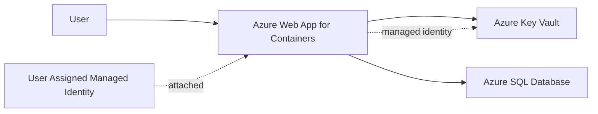
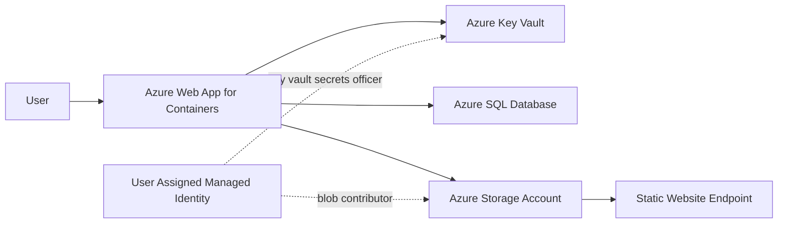
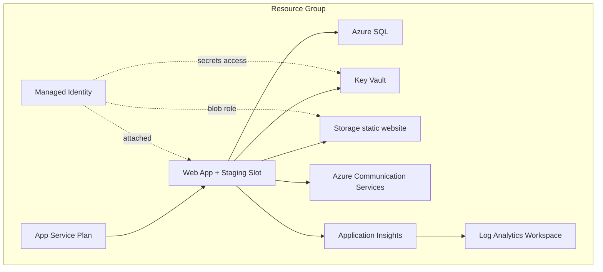

# Deploy to Azure

## Summary

Provision and deploy SkyCMS to Azure using the PowerShell install script and Bicep infrastructure templates.

## Outcome

After completing this guide, SkyCMS Editor will be running in Azure App Service backed by Azure SQL, Key Vault, and a managed identity, with optional blob storage, email, and Application Insights.

## Prerequisites

- Azure subscription with permissions to create resource groups and deploy resources.
- Azure CLI installed and authenticated.
- PowerShell 5.1+.
- Access to SkyCMS container image for the Editor app.

Recommended preflight commands:

```powershell
az --version
az account show
```

## Compliance and licensing

- [Licensing and Distribution](./licensing-and-distribution.md)

## Provision infrastructure

Primary deployment source is [SkyCMS/InstallScripts/Azure/deploy-skycms.ps1](https://github.com/CWALabs/SkyCMS/blob/main/InstallScripts/Azure/deploy-skycms.ps1) with:

- [SkyCMS/InstallScripts/Azure/deploy-skycms.ps1](https://github.com/CWALabs/SkyCMS/blob/main/InstallScripts/Azure/deploy-skycms.ps1)
- [SkyCMS/InstallScripts/Azure/bicep/main.bicep](https://github.com/CWALabs/SkyCMS/blob/main/InstallScripts/Azure/bicep/main.bicep)
- [SkyCMS/InstallScripts/Azure/bicep/modules/webApp.bicep](https://github.com/CWALabs/SkyCMS/blob/main/InstallScripts/Azure/bicep/modules/webApp.bicep)
- [SkyCMS/InstallScripts/Azure/bicep/modules/sqlDatabase.bicep](https://github.com/CWALabs/SkyCMS/blob/main/InstallScripts/Azure/bicep/modules/sqlDatabase.bicep)
- [SkyCMS/InstallScripts/Azure/bicep/modules/keyVault.bicep](https://github.com/CWALabs/SkyCMS/blob/main/InstallScripts/Azure/bicep/modules/keyVault.bicep)

Interactive deployment:

```powershell
cd d:\source\SkyCMS\InstallScripts\Azure
.\deploy-skycms.ps1
```

The script provisions:

- Always: App Service Plan, Web App for Containers (Editor), Azure SQL Server + Database, Key Vault, User Assigned Managed Identity.
- Optional: Blob Storage static website (publisher), Azure Communication Services (email), Application Insights + Log Analytics.
- Optional (enabled by script defaults): staging slot for zero-downtime releases.

### Install scenarios and options

| Scenario | Script flags/options | Result |
| --- | --- | --- |
| Core Editor only | deployPublisher=false, deployEmail=false, deployAppInsights=false | Editor on App Service + Azure SQL + Key Vault + Managed Identity |
| Editor + Publisher | deployPublisher=true | Adds Blob Storage static website endpoint and storage secret |
| Editor + Email | deployEmail=true | Adds ACS and sender email + secret |
| Editor + Monitoring | deployAppInsights=true | Adds Log Analytics + Application Insights + connection string secret |
| Full stack | deployPublisher=true, deployEmail=true, deployAppInsights=true | Core + Publisher + ACS + App Insights |

### Scenario diagrams

Core scenario:



Editor + Publisher scenario:



Full scenario (all options enabled):



## Deploy application

The deployment script performs a resource group deployment using [SkyCMS/InstallScripts/Azure/bicep/main.bicep](https://github.com/CWALabs/SkyCMS/blob/main/InstallScripts/Azure/bicep/main.bicep), creates a temporary parameters JSON file, retries up to 3 times on transient failures, and prints output URLs.

Direct Bicep deployment is also possible:

```powershell
az deployment group create \
  --resource-group <rg-name> \
  --template-file .\bicep\main.bicep \
  --parameters baseName=<base> environment=dev dockerImage=<image>
```

Post-deploy expected outputs include:

- Editor URL and FQDN.
- Key Vault name and URI.
- Optional static website URL.
- Optional sender email from ACS.
- Optional App Insights resource name.

## Smoke tests

After deployment, validate health and core platform wiring:

1. HTTP health check:

```powershell
Invoke-WebRequest https://<editor-host>/___healthz
```

Expected: HTTP 200 with status payload.

1. Web App configuration and identity:

```powershell
az webapp show --resource-group <rg> --name <webapp-name> --query "{httpsOnly:httpsOnly,identity:identity.type}"
```

1. Key Vault secret presence:

```powershell
az keyvault secret list --vault-name <kv-name> --query "[].name"
```

Verify at least:

- ApplicationDbContextConnection
- StorageConnectionString (if publisher deployed)
- AzureCommunicationConnection (if ACS deployed)
- AppInsightsConnectionString (if monitoring deployed)

1. SQL connectivity sanity:

```powershell
az sql db show --resource-group <rg> --server <sql-server-name> --name skycms
```

1. Publisher endpoint (if enabled):

```powershell
Invoke-WebRequest https://<storage>.z13.web.core.windows.net
```

## Operational notes

### Teardown

Use [SkyCMS/InstallScripts/Azure/destroy-skycms.ps1](https://github.com/CWALabs/SkyCMS/blob/main/InstallScripts/Azure/destroy-skycms.ps1) for full cleanup.

```powershell
.\destroy-skycms.ps1 -ResourceGroupName <rg-name>
```

### Script caveat: mixed-era files

The Azure folder contains some historical docs/scripts that reference older Container Apps/MySQL flows. The current executable deployment path in Bicep is App Service plus Azure SQL.

Treat these files as source of truth for current installs:

- [SkyCMS/InstallScripts/Azure/deploy-skycms.ps1](https://github.com/CWALabs/SkyCMS/blob/main/InstallScripts/Azure/deploy-skycms.ps1)
- [SkyCMS/InstallScripts/Azure/bicep/main.bicep](https://github.com/CWALabs/SkyCMS/blob/main/InstallScripts/Azure/bicep/main.bicep)
- [SkyCMS/InstallScripts/Azure/bicep/modules/webApp.bicep](https://github.com/CWALabs/SkyCMS/blob/main/InstallScripts/Azure/bicep/modules/webApp.bicep)

### Validating templates against current SkyCMS version

Yes, this should be part of release readiness. Because these install scripts started on earlier SkyCMS versions, validate template assumptions against current runtime contracts.

Current contract checks to run:

1. Runtime and port alignment.

- Confirm the active Editor container listens on 8080 as expected by webApp.bicep and Dockerfile.
- Sources: [SkyCMS/Editor/Dockerfile](https://github.com/CWALabs/SkyCMS/blob/main/Editor/Dockerfile), [SkyCMS/InstallScripts/Azure/bicep/modules/webApp.bicep](https://github.com/CWALabs/SkyCMS/blob/main/InstallScripts/Azure/bicep/modules/webApp.bicep).

1. Health endpoint alignment.

- Confirm /___healthz remains valid in current SkyCMS.
- Source: [SkyCMS Editor Program.cs](https://github.com/CWALabs/SkyCMS/blob/main/Editor/Program.cs#L815).

1. Required configuration key alignment.

- Confirm ApplicationDbContextConnection, CosmosAllowSetup, CosmosPublisherUrl, and AdminEmail are still consumed by current app startup/setup paths.
- Source: [SkyCMS/Editor/Program.cs](https://github.com/CWALabs/SkyCMS/blob/main/Editor/Program.cs), [SkyCMS/Editor/README.md](https://github.com/CWALabs/SkyCMS/blob/main/Editor/README.md#L203).

1. Database model and migration compatibility.

- Verify SQL migrations in current Editor build are compatible with Azure SQL SKU and TLS settings used by Bicep.

1. Image provenance.

- Avoid latest tags in production. Validate that the configured image tag corresponds to the same SkyCMS release/commit being deployed.

### Validation and test pipeline for install scripts

Use a layered test strategy:

1. Static template validation (no deployment):

```powershell
cd d:\source\SkyCMS\InstallScripts\Azure
.\validate-bicep.ps1
```

Also run:

```powershell
az bicep build --file .\bicep\main.bicep
az deployment group what-if --resource-group <rg> --template-file .\bicep\main.bicep --parameters @.\skycms-params-temp.json
```

Automated in CI by [SkyCMS/](https://github.com/CWALabs/SkyCMS/blob/main/), which runs both:

- [SkyCMS/](https://github.com/CWALabs/SkyCMS/blob/main/)
- [SkyCMS/](https://github.com/CWALabs/SkyCMS/blob/main/)

1. Parameter contract tests:

Validate every scenario flag set (core, publisher, email, monitoring, full) resolves deployment graph and outputs. Fail pipeline if required outputs are missing (editorUrl, editorFqdn, keyVaultName).

1. Ephemeral integration deployment test:

Deploy to a temporary resource group in CI, run smoke tests (health endpoint, secrets, SQL presence, optional storage endpoint), and destroy the resource group at end even on failure.

1. Drift checks against app source:

Automated checks compare template assumptions to current Editor source for health path, exposed port, required config keys, and setup mode flags. Use [SkyCMS/](https://github.com/CWALabs/SkyCMS/blob/main/).

1. Release gate:

Require successful static validation and ephemeral smoke tests before merging changes to Azure templates/scripts.
