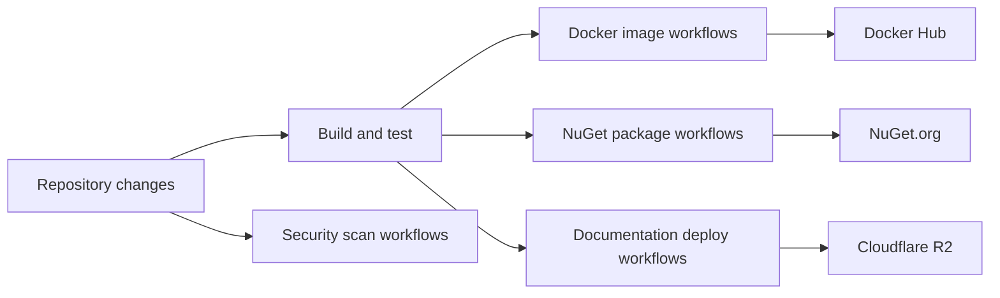

# CI/CD Pipelines

## Summary

SkyCMS uses GitHub Actions for build validation, tests, security scanning, packaging, and deployment workflows.

Use this page to identify which workflow to run, what it requires, and what outputs it produces.

## Outcome

After using this guide, you should be able to select the right GitHub Actions workflow, understand its dependencies and secrets, and run or troubleshoot it with the correct expectations.

## CI/CD topology {#cicd-topology}



## Workflow catalog

| Workflow | Typical trigger | Primary output |
| --- | --- | --- |
| `dotnetbuild.yml` | Manual | Solution build and test validation |
| `sky-tests.yml` | Manual | Integration-oriented test execution |
| `identity-flexdb-tests.yml` | Manual | FlexDb provider compatibility validation |
| `connectivity-tests.yml` | Manual | Storage/database/CDN connectivity checks |
| `connectivity-tests-advanced.yml` | Manual | Extended connectivity checks |
| `docker-image.yml` | Manual or push | Editor and Publisher images in Docker Hub |
| `docker-with-ver.yml` | Manual | Version-tagged Docker images |
| `NuGetPush.yml` | Manual | Cosmos packages published to NuGet.org |
| `deploy-docs-cloudflare.yml` | Push to docs paths | Built docs published to Cloudflare R2 |
| `deploy-spa.yml` | Manual | Editor SPA package deployment |
| `codeql.yml` | Weekly | Security analysis results |
| `test-secrets.yml` | Manual | Secret presence validation |
| `duplicate-test-audit.yml` | Manual | Duplicate test audit report |
| `validate-screenshots.yml` | Manual | Docs screenshot validation |
| `update-badges.yml` | Manual | README badge updates |

## Workflow dependencies {#workflow-dependencies}

Use this section to understand which workflows are baseline validation gates and which ones are release, packaging, or documentation operations.

## Build and test workflows

### `dotnetbuild.yml`

Purpose:

- compile the solution in Release mode,
- run solution tests as a baseline quality gate.

Typical commands:

```bash
dotnet build SkyCMS.sln -c Release
dotnet test SkyCMS.sln -c Release --no-build
```

### `sky-tests.yml`

Purpose:

- execute test suites that rely on configured external services.

### `identity-flexdb-tests.yml`

Purpose:

- validate identity behavior across multiple database providers:
- Azure Cosmos DB,
- SQL Server,
- MySQL.

### Connectivity workflows

`connectivity-tests.yml` and `connectivity-tests-advanced.yml` verify service reachability for configured providers before release operations.

## Packaging and release workflows

### Docker workflows

- `docker-image.yml`: publishes standard tags for Sky.Editor and Sky.Publisher.
- `docker-with-ver.yml`: publishes explicit version tags for release milestones.

### NuGet workflow

`NuGetPush.yml` publishes shared Cosmos libraries (for example Cosmos.Common, Cosmos.BlobService, Cosmos.ConnectionStrings) to NuGet.org.

## Documentation and frontend workflows

### `deploy-docs-cloudflare.yml`

Documentation deployment flow:

1. Build docs site.
2. Run link and validation gates.
3. Upload to Cloudflare R2.
4. Run post-deploy validation checks.

### `deploy-spa.yml`

Builds the editor SPA artifact and deploys to the target editor API path.

## Security workflow

### `codeql.yml`

Runs scheduled static security analysis for C# and JavaScript/TypeScript code.

Use this for continuous vulnerability visibility between feature deliveries.

## Required secrets

| Secret | Used by |
| --- | --- |
| `DOCKERLOGIN` | Docker publish workflows |
| `DOCKERPASSWORD` | Docker publish workflows |
| `NUGET_KEY` | NuGet publish workflow |
| `CONNECTIONSTRINGS__*` | Integration/connectivity test workflows |
| `CDNINTEGRATIONTESTS__CLOUDFLARE__*` | CDN connectivity tests |

## Verification

This reference is working for your team when you can identify the correct workflow for a task, confirm its required secrets and inputs, and interpret its primary output without checking the workflow YAML first.

## Secret synchronization

Use the repository script to upload local secret values to GitHub Actions secrets:

```powershell
.\UploadSecretsToGithubRepo.ps1
```

## Run a workflow manually

1. Open the repository **Actions** tab.
2. Select the target workflow.
3. Click **Run workflow**.
4. Choose branch and input values (if requested).
5. Start run and monitor logs.

## Troubleshooting

- Workflow fails immediately:
  - check required secrets and workflow inputs.
- Integration tests fail unexpectedly:
  - verify external service credentials and network reachability.
- Docker publish fails:
  - confirm Docker Hub credentials and tag policy.
- Docs deploy fails:
  - check docs link and metadata gate outputs before rerunning deployment.

## Related links

- [Deployment Overview](overview.md)
- [Publishing Workflow](publishing-workflow.md)
- [Deploy with Docker](docker.md)
- [Demo Deployment](demo-deployment.md)
