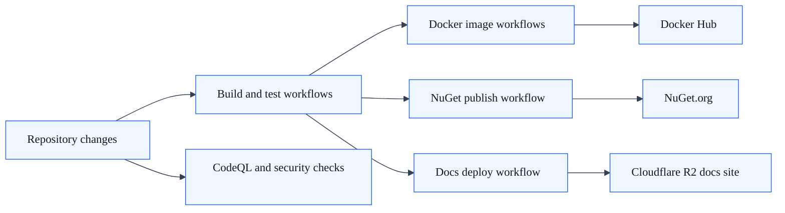
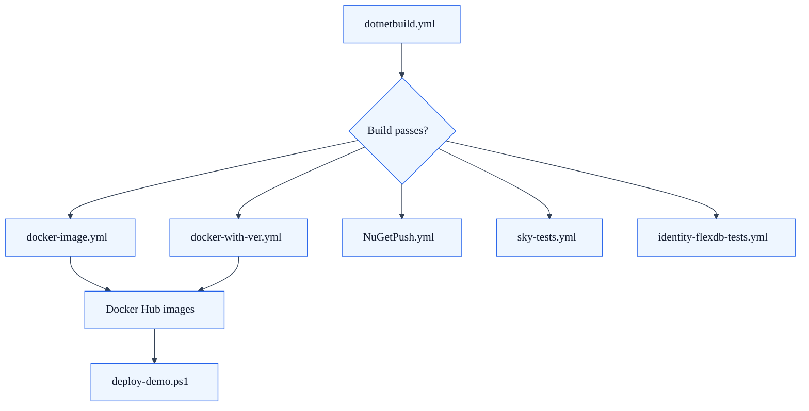

# CI/CD Pipelines

SkyCMS uses GitHub Actions for continuous integration, testing, Docker image builds, NuGet publishing, and documentation deployment. This reference covers every pipeline and how they work together.

**Audience:** Developers, DevOps, Administrators

---

## Pipeline Overview

| Workflow | Trigger | Purpose |
|----------|---------|---------|
| `dotnetbuild.yml` | Manual | Build + test (.NET 9, Release) |
| `docker-image.yml` | Manual / Push | Build Sky.Editor + Sky.Publisher Docker images → Docker Hub |
| `docker-with-ver.yml` | Manual | Build versioned Docker images (e.g., `9.0.0`) |
| `NuGetPush.yml` | Manual | Publish Cosmos.Common, Cosmos.BlobService, Cosmos.ConnectionStrings to NuGet.org |
| `sky-tests.yml` | Manual | Run Sky.Tests + FlexDb tests with live Azure services |
| `identity-flexdb-tests.yml` | Manual | FlexDb tests against Cosmos DB, SQL Server, MySQL |
| `connectivity-tests.yml` | Manual | Validate storage/database/CDN connectivity |
| `connectivity-tests-advanced.yml` | Manual | Extended connectivity validation |
| `deploy-docs-cloudflare.yml` | Push to `Docs/**` | MkDocs build → link validation → deploy to Cloudflare R2 |
| `deploy-spa.yml` | Manual | Build React SPA → zip → deploy to editor API |
| `codeql.yml` | Weekly (Mondays) | CodeQL security scanning (C#, JS/TS) |
| `duplicate-test-audit.yml` | Manual | Audit for duplicate test methods |
| `test-secrets.yml` | Manual | Validate GitHub secrets are configured |
| `validate-screenshots.yml` | Manual | Validate documentation screenshots |
| `update-badges.yml` | Manual | Update README status badges |

## CI/CD topology



---

## Build & Test

### .NET Build (`dotnetbuild.yml`)

Builds the entire solution in Release mode on .NET 9 and runs all unit tests:

```yaml
# Simplified overview
dotnet build SkyCMS.sln -c Release
dotnet test SkyCMS.sln -c Release --no-build
```

Trigger: `workflow_dispatch` (manual).

### Sky.Tests (`sky-tests.yml`)

Runs the main test suite plus FlexDb integration tests against live Azure services. Requires connection strings and Cloudflare CDN credentials configured as GitHub secrets.

### FlexDb Identity Tests (`identity-flexdb-tests.yml`)

Tests the `AspNetCore.Identity.FlexDb` library against multiple database providers:

- Azure Cosmos DB
- Microsoft SQL Server
- MySQL

Validates cross-provider compatibility for the pluggable identity system.

### Connectivity Tests (`connectivity-tests.yml`)

Smoke tests that verify the CI environment can reach:

- Azure Storage (blob and table)
- Database servers (SQL Server, Cosmos DB)
- Cloudflare CDN endpoints

---

## Docker Images

### Standard Build (`docker-image.yml`)

Builds two Docker images and pushes to Docker Hub:

- **Sky.Editor** — The CMS editor and admin interface
- **Sky.Publisher** — The public site rendering engine

Uses `DOCKERLOGIN` and `DOCKERPASSWORD` secrets for Docker Hub authentication.

### Versioned Build (`docker-with-ver.yml`)

Same as the standard build, but tags images with a specific version number (e.g., `9.0.0`). Used for release milestones.

---

## NuGet Publishing

### NuGet Push (`NuGetPush.yml`)

Publishes shared libraries to NuGet.org:

- `Cosmos.Common`
- `Cosmos.BlobService`
- `Cosmos.ConnectionStrings`

Uses the `NUGET_KEY` secret. Version numbers are managed in `Directory.Packages.props`.

---

## Documentation Deployment

### Docs to Cloudflare (`deploy-docs-cloudflare.yml`)

Triggers automatically on pushes to `Docs/**` paths. The pipeline:

1. Builds the MkDocs documentation site
2. Runs pre-deployment link validation
3. Uploads to Cloudflare R2 storage
4. Runs post-deployment link validation

Concurrency is controlled to prevent overlapping deploys.

### SPA Deployment (`deploy-spa.yml`)

Builds the React-based editor SPA, zips the output, and deploys it to the SkyCMS editor API endpoint.

---

## Security Scanning

### CodeQL (`codeql.yml`)

Runs weekly (Mondays) against C# and JavaScript/TypeScript code. Detects:

- SQL injection patterns
- XSS vulnerabilities
- Insecure deserialization
- Other OWASP Top 10 issues

---

## Secret Management

### Required Secrets

| Secret | Used By | Description |
|--------|---------|-------------|
| `DOCKERLOGIN` | Docker workflows | Docker Hub username |
| `DOCKERPASSWORD` | Docker workflows | Docker Hub password/token |
| `NUGET_KEY` | NuGet workflow | NuGet.org API key |
| `CONNECTIONSTRINGS__*` | Test workflows | Azure Storage/DB connection strings |
| `CDNINTEGRATIONTESTS__CLOUDFLARE__*` | Test workflows | Cloudflare CDN test credentials |

### Uploading Secrets

Use `UploadSecretsToGithubRepo.ps1` to synchronize local user secrets to GitHub:

```powershell
.\UploadSecretsToGithubRepo.ps1
```

The script:

1. Reads from .NET user secrets (`secrets.json`)
2. Flattens nested keys using `__` as separator (e.g., `ConnectionStrings:DefaultConnection` becomes `CONNECTIONSTRINGS__DEFAULTCONNECTION`)
3. Uploads each secret via the `gh` CLI (`gh secret set`)

> **Important:** Never commit secrets to source control. Use `.NET user secrets` locally and GitHub secrets for CI. Rotate secrets regularly.

---

## Workflow Dependencies



```
dotnetbuild.yml ──────────────── Build passes?
                                      │
        ┌─────────────────────────────┼──────────────────┐
        │                             │                  │
docker-image.yml            NuGetPush.yml         sky-tests.yml
docker-with-ver.yml                              identity-flexdb-tests.yml
        │
  Docker Hub images
        │
  deploy-demo.ps1
  (uses published images)
```

---

## Running Workflows

All workflows support `workflow_dispatch` (manual trigger from the GitHub Actions UI). Some also trigger on push events:

- `deploy-docs-cloudflare.yml` — Triggers on push to `Docs/**`
- `codeql.yml` — Runs on a weekly schedule

To trigger manually:

1. Go to **Actions** tab in GitHub
2. Select the workflow
3. Click **Run workflow**
4. Select the branch and click **Run workflow**

---

## See Also

- [Demo Deployment](demo-deployment.md) — One-command Azure demo provisioning
- [Docker Deployment](docker.md) — Docker Compose for local and production use
- [Cloudflare Edge Hosting](cloudflare.md) — R2 storage and CDN deployment
