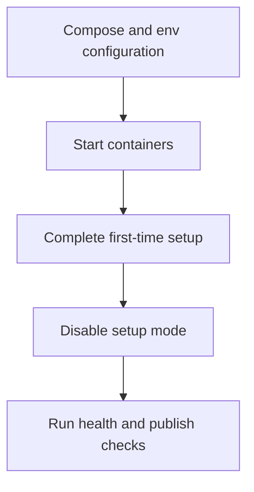

# Deploy with Docker

## Summary

Use this path when your team runs containerized environments with Docker Compose.

## Outcome

After completing this guide, you should have a running SkyCMS deployment in Docker, first-time setup locked down, and basic edit and publish validation completed.

## When to use Docker deployment

- you need local-to-test parity with container runtime behavior,
- you want fast environment spin-up for validation,
- you manage deployment lifecycle outside platform-native PaaS workflows.

## Prerequisites

Before you begin, confirm:

1. Docker Engine is running.
2. Docker Compose is available.
3. Database and storage credentials are prepared.
4. Compose file and environment variable source are finalized.

If needed, review:

- [Minimum Required Settings](../installation/minimum-required-settings.md)
- [Configuration Overview](../configuration/overview.md)

## Deployment flow



## Required configuration values

At minimum, configure:

- ConnectionStrings__ApplicationDbContextConnection
- ConnectionStrings__StorageConnectionString
- AzureBlobStorageEndPoint
- CosmosPublisherUrl
- CosmosAllowSetup=true for first-time setup only

## Steps

### 1. Start the stack

1. Open the directory containing your compose file.
2. Start the stack.

```powershell
docker compose up -d
```

### 2. Complete first-time setup

1. Open the editor URL.
2. Navigate to /___setup.
3. Complete setup and create admin credentials.

### 3. Lock setup mode and restart

1. Set CosmosAllowSetup=false.
2. Restart the stack.

```powershell
docker compose up -d
```

## Verification

Use these checks to confirm the deployment is healthy.

### 1. Confirm containers are running

1. Confirm container status.

```powershell
docker compose ps
```

### 2. Confirm the health endpoint responds

1. Confirm health endpoint.

```powershell
Invoke-WebRequest http://localhost:5000/___healthz
```

### 3. Confirm the publish path works

1. Validate publish path:
   - sign in,
   - create a simple page,
   - publish,
   - verify rendered output and assets.

The deployment is working when containers remain healthy after setup mode is disabled, the health endpoint responds successfully, and a newly published page renders with its assets.

## Troubleshooting quick checks

If setup or startup fails:

```powershell
docker compose logs --tail 200
```

If publishing is stale:

- verify publisher URL,
- verify cache invalidation behavior.

If storage actions fail:

- verify storage connection values,
- verify storage credentials and permissions.

## Upgrade flow

1. Back up database and storage.
2. Pull or build updated image.
3. Roll out updated compose stack.
4. Re-run smoke checks (login, edit, publish, health).

## Compliance and licensing

- [Licensing and Distribution](./licensing-and-distribution.md)

## Related guides

- [Installation Overview](../installation/overview.md)
- [Local Development Installation](../installation/local-development.md)
- [Deployment Overview](./overview.md)
- [Publishing Workflow](./publishing-workflow.md)
