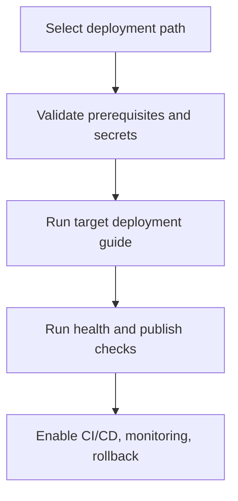

# Deployment Overview

## Summary

Use this page to choose a deployment strategy, run the right guide, and validate release readiness.

## Outcome

After using this guide, you should be able to select the right deployment path, complete the required preflight checks, and verify that the deployment is healthy enough for normal editing and publishing use.

## Choose your path

| Deployment path | Best fit | Primary tradeoff |
| --- | --- | --- |
| [Deploy to Azure](./azure.md) | Azure-native operations and managed services | More cloud-service configuration up front |
| [Deploy with Docker](./docker.md) | Container workflows and local parity | You manage runtime orchestration and updates |
| [Deploy to Cloudflare Edge](./cloudflare.md) | Edge-heavy delivery and global caching | More CDN integration complexity |
| [Run Demo Deployment](./demo-deployment.md) | Evaluation, demos, and onboarding | Not intended as a production baseline |

## Deployment phases

## Preflight checklist

1. Confirm infrastructure access and deployment credentials.
2. Validate required runtime settings for database and storage.
3. Confirm Editor and Publisher target URLs.
4. Confirm chosen publishing model for your environment topology.

## Post-deploy verification

A deployment is complete when all of the following pass:

- health endpoint responds successfully,
- editor login and core edit/publish flow works,
- published output is reachable on intended public URLs,
- storage and CDN behaviors match expected cache/update patterns.

## Verification

This guide is working when you can choose a deployment path confidently, complete the preflight checklist, and confirm a healthy edit-to-publish flow after rollout.

## Ongoing operations baseline

After first successful deployment, implement:

1. release gates in CI/CD,
2. rollback playbook with tested recovery steps,
3. alerting and service health visibility.

## Troubleshooting entry points

- [Publishing Workflow](./publishing-workflow.md) for promotion and approval issues.
- [CI/CD Pipelines](./cicd-pipelines.md) for automation failures.
- [Troubleshooting](../reference/troubleshooting.md) for cross-layer diagnostics.

## Compliance and release safety

- [Licensing and Distribution](./licensing-and-distribution.md)

## Related links

- [Configuration Overview](../configuration/overview.md)
- [Post-Installation Configuration](../installation/post-installation.md)
- [Minimum Required Settings](../installation/minimum-required-settings.md)
