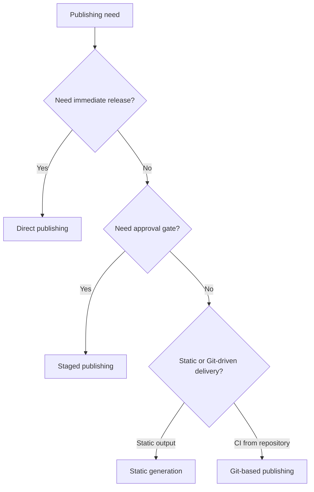
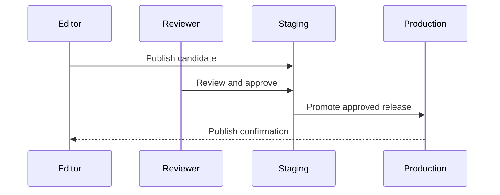

# Publishing Workflow

## Summary

Publishing in SkyCMS is the controlled path from editor content to live output.

Use this page to choose a workflow model and align editors, reviewers, and operators on release safety.

## Outcome

After using this guide, you should be able to choose the right SkyCMS publishing workflow, run the core operational checks for it, and understand the rollback implications before releasing content.

## Why it matters

- workflow choice affects release speed and risk,
- workflow choice affects rollback complexity,
- team clarity on workflow helps prevent production mistakes.

## Quick decision guide

| Need | Recommended workflow |
| --- | --- |
| Fastest path to live content | Direct publishing |
| Review gate before production | Staged publishing |
| Edge/static hosting optimization | Static generation |
| Commit-based release governance | Git-based publishing |

## Publishing modes

### Direct publishing

Best for:

- low-process teams,
- fast editorial updates,
- non-critical environments.

Tradeoff:

- fastest release,
- highest exposure to human error.

### Staged publishing

Best for:

- teams requiring review before production,
- high-visibility sites,
- controlled promotion workflows.

Tradeoff:

- slower release,
- stronger quality controls.

### Static generation

Best for:

- edge/CDN-heavy delivery,
- low-origin runtime overhead,
- predictable static output deployment.

Tradeoff:

- requires generation/deploy step,
- dynamic behavior may require extra patterns.

### Git-based publishing

Best for:

- CI/CD-first teams,
- environments where content changes must be commit-tracked,
- organizations that standardize approval via repository policy.

Tradeoff:

- stronger traceability,
- higher process overhead.

## Publishing workflows

## Core operational checks

Run these checks for any workflow:

1. Confirm target environment URL and credentials.
1. Publish one representative page.
1. Verify rendered output and assets.
1. Confirm cache/CDN refresh behavior.
1. Record release details for rollback traceability.

## Verification

You have selected and applied the right workflow when your team can explain the release path, complete the core operational checks successfully, and identify a known rollback path before publishing high-impact changes.

## Rollback strategy

- keep previous known-good version identifiers,
- retain environment-specific deployment logs,
- use staged promotion for high-impact releases,
- rehearse rollback path before major release windows.

## Common failure patterns

- content published but appears stale:
  - CDN/cache invalidation delay.
- publish operation fails:
  - storage connectivity or permission issue.
- scheduled content does not go live:
  - publishing worker not running at scheduled time.

## Related links

- [Publishing Modes](../for-editors/publishing-modes.md)
- [Deployment Overview](overview.md)
- [CI/CD Pipelines](cicd-pipelines.md)
- [Troubleshooting](../reference/troubleshooting.md)
