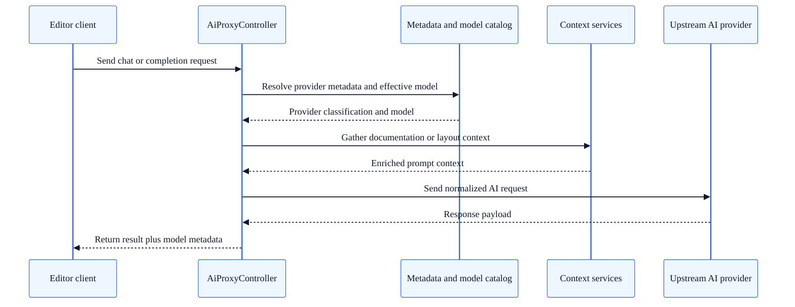

# AI integration architecture

## Summary

Understand how SkyCMS AI components are wired together, including provider selection, model resolution, and editor client integration.

## Current architecture summary

SkyCMS AI is implemented as a **shared editor AI stack** rather than one-off features bolted into individual editors.

The current design has five main layers:

1. tenant AI settings,
2. provider metadata and model catalog resolution,
3. per-user model preference storage,
4. prompt context enrichment,
5. editor clients for Monaco, CKEditor, and AI Help Chat.

## AI request and response sequence

## Main entry point

The central server entry point is `AiProxyController`.

It exposes AI endpoints used by the editor clients, including:

- status checks,
- model catalog loading,
- per-user model preference persistence,
- inline completions,
- chat requests.

Compatibility note:

- the controller supports both `/api/ai-proxy/...` and legacy `/api/copilot/...` routes.

## Tenant configuration model

The primary provider settings are stored through the existing `CopilotProxyOptions` model and service layer.

Although the historical type names still include `Copilot`, the implementation is now broader and provider-neutral in behavior.

Configured fields include:

- enabled flag,
- endpoint,
- model,
- access token,
- timeout,
- temperature,
- max tokens.

## Provider metadata and effective model resolution

`AiProviderMetadataResolver` classifies the configured endpoint and model into provider metadata.

Current provider classifications include:

- GitHub Models,
- OpenAI,
- Azure OpenAI,
- Azure AI Foundry endpoint patterns,
- local providers,
- unknown.

It also resolves the effective model sent upstream.

Examples:

- OpenAI `auto` resolves to `gpt-4o-mini`,
- GitHub Models `auto` resolves to `gpt-4o-mini`,
- Azure OpenAI often resolves to the deployment name inferred from the endpoint URL.

## Model catalog service

`AiProviderModelCatalogService` is responsible for the model picker experience.

Current behavior:

- GitHub Models: live catalog supported,
- OpenAI: live catalog supported,
- Azure OpenAI: deployment inference supported,
- Azure AI Foundry patterns: identified, but current SkyCMS discovery reports that additional configuration is needed,
- local and unsupported providers: manual model entry.

Discovery results are cached and can be force-refreshed.

## Per-user model preferences

`AiUserPreferenceService` stores selected models per user and per editor context.

Scope dimensions include:

- provider key,
- editor kind,
- document kind,
- current user.

The data is stored in the tenant-scoped settings table, under the `AIUSERSETTINGS` group.

This enables scenarios such as:

- Monaco using one preferred model,
- CKEditor using another,
- AI Help Chat using the tenant default.

## Prompt context enrichment

SkyCMS enriches prompts with internal context before sending them upstream.

### Documentation context

`AiDocumentationContextService` retrieves compact snippets from the SkyCMS documentation site to help ground answers in the current product vocabulary and editor workflows.

### Layout context

`AiLayoutContextService` resolves layout metadata and extracts lightweight runtime context such as:

- layout name,
- layout number,
- detected frameworks,
- referenced assets.

This gives the AI assistant more useful context for layout, template, and article-related questions.

## Editor clients

### Monaco

Monaco uses separate browser-side integrations for:

- inline completions,
- chat panel behavior.

The client:

- reads status from the AI proxy,
- syncs the shared model selection state,
- sends active document and section context,
- uses the selected model when the provider allows it.

### CKEditor

The CKEditor client implements region-scoped chat and apply flows.

It also:

- loads model catalog data,
- persists per-user model selections,
- warns when the region changed after a response was generated.

### AI Help Chat

The standalone AI Help Chat is a separate editor experience for non-field-specific conversations.

It supports:

- general help mode,
- site-help mode,
- detached window workflow,
- model selection when available.

## Authentication behavior by provider

Current outbound authentication behavior is determined from the configured endpoint.

- Azure OpenAI deployment endpoints use the `api-key` header.
- Other supported OpenAI-compatible providers use `Authorization: Bearer ...`.

## Current product limitations

Developers extending the AI stack should keep these constraints in mind:

- direct native Anthropic endpoints are not a drop-in match for the current proxy contract,
- Azure OpenAI discovery is deployment inference, not full live deployment listing,
- Azure AI Foundry endpoint classification exists, but the discovery UX is not yet first-class,
- several type and file names still carry legacy `Copilot` naming even though the behavior is now broader than a single provider.

## Extension guidance

If you extend the current AI layer:

1. keep provider-specific logic inside the metadata/catalog layer,
2. keep editor contracts provider-neutral,
3. preserve tenant scoping,
4. avoid assuming all providers support live model discovery,
5. prefer shared prompt-enrichment services over editor-specific custom prompt code.

## Related guides

- [AI Configuration Overview](../configuration/ai/overview.md)
- [AI Provider Comparison](../configuration/ai/provider-comparison.md)
- [AI Assistant for Editors](../for-editors/ai-assistant.md)
