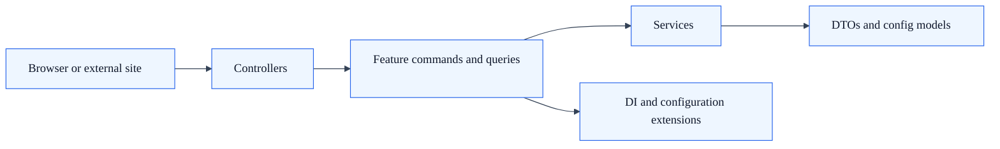

<!-- Audience: Backend and Full-Stack Developers -->
<!-- Type: Overview -->
<!-- Status: Draft -->
<!-- Source: SkyCMS/Docs/Api/README.md -->

# Sky.Cms.Api.Shared Documentation

Welcome to the Sky.Cms.Api.Shared documentation. This shared API library provides common endpoints used across both the Editor and Publisher web applications within the SkyCMS solution.

## Overview

Sky.Cms.Api.Shared is a .NET library that implements a custom CQRS-like pattern for handling API endpoints and business logic. Currently, it provides a contact form API that allows website administrators to receive visitor messages with built-in CAPTCHA validation and rate limiting.

**Latest Updates**: See [Integration Updates](./updates.md) for recent changes and integration notes.

## Architecture

The API follows a modular architecture organized by features:

- **Controllers**: HTTP API endpoints exposed to consumers
- **Services**: Business logic for processing requests
- **Features**: CQRS-style commands and queries organized by feature
- **Models**: Data transfer objects and configuration classes
- **Extensions**: Dependency injection setup and configuration



See [Architecture Overview](./architecture.md) for detailed information about the design patterns and structure.

## Features

### Contact Form API

A complete contact form submission system with:

- Email notifications to administrators
- CAPTCHA validation (reCAPTCHA or Cloudflare Turnstile)
- Rate limiting per IP address
- Anti-forgery token protection
- Comprehensive error handling and logging
- Flexible field name mapping for custom forms

See [Contact Form API Documentation](./contact-form.md) for complete endpoint details and usage examples.

## Getting Started

### Installation & Configuration

1. **Register the API services** in your host application's `Program.cs`:

   ```csharp
   builder.Services.AddContactApi(builder.Configuration);
   ```

2. **Configure rate limiting** middleware:

   ```csharp
   app.UseRateLimiter();
   app.MapControllers();
   ```

3. **Add configuration** to `appsettings.json`:

   ```json
   {
     "ContactApi": {
       "AdminEmail": "admin@example.com",
       "MaxMessageLength": 5000,
       "RequireCaptcha": true,
       "CaptchaProvider": "turnstile",
       "CaptchaSiteKey": "your-site-key",
       "CaptchaSecretKey": "your-secret-key"
     }
   }
   ```

### Quick Tutorial

Want to add a contact form to your website? Follow the [Step-by-Step Tutorial](./tutorial.md) to get a working form in 5 minutes.

See [Configuration Guide](./configuration.md) for all configuration options and environment variable support.

## API Endpoints

### Contact Form

- **GET** `/_api/contact/skycms-contact.js` - Returns JavaScript library with embedded configuration
- **POST** `/_api/contact/submit` - Submit a contact form

See [Contact Form API](./contact-form.md) for request/response schemas and examples.

## For Developers

- [Step-by-Step Tutorial](./tutorial.md) - Add a working contact form to your website in 5 minutes (**START HERE**)
- [Integration Guide](./integration-guide.md) - How to integrate the Contact Form API into your website
- [Contact Form API Reference](./contact-form.md) - Complete endpoint documentation and examples
- [Architecture & Design Patterns](./architecture.md) - How the API is structured
- [Configuration Guide](./configuration.md) - All available configuration options
- [Development Guide](./development.md) - How to extend and add new endpoints
- [Testing](./testing.md) - How to test the API

## Future Enhancements

The API is designed to be extensible. Future endpoints may include:

- Additional contact types or specialized forms
- API authentication and authorization
- More complex business logic operations

The modular feature-based architecture makes it easy to add new endpoints.

## License

Licensed under the MIT License. See LICENSE-MIT in the repository root.
