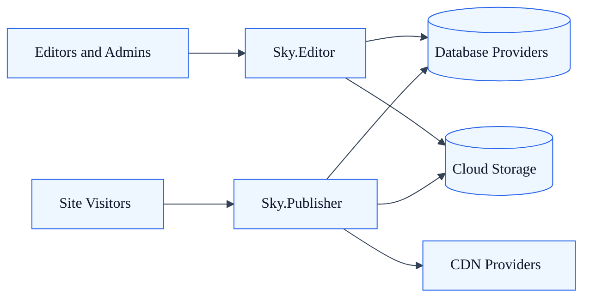
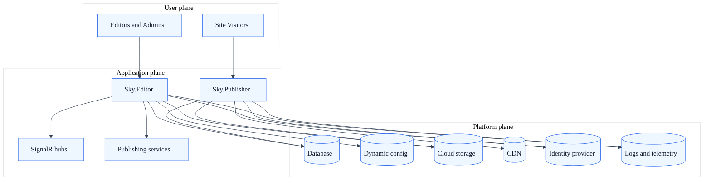
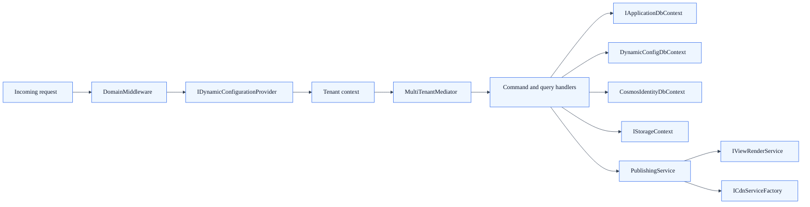
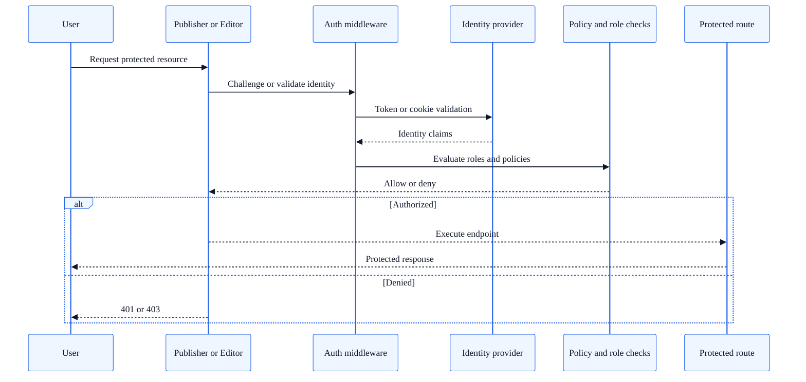
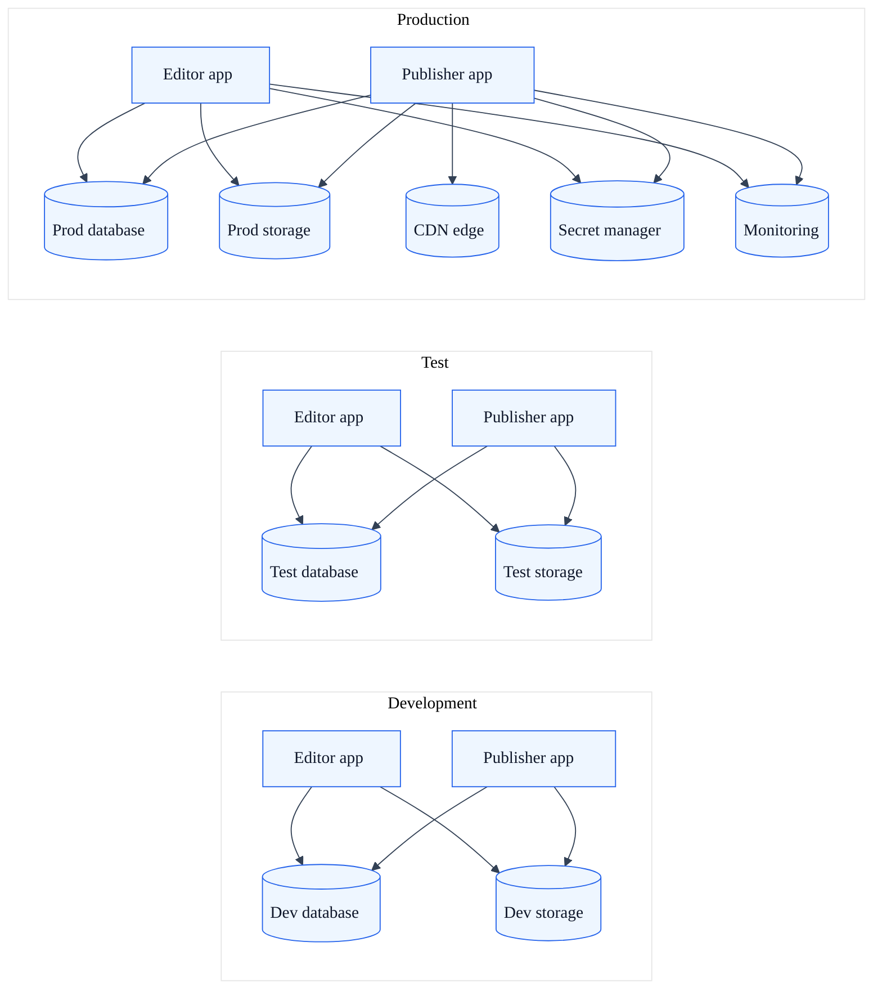
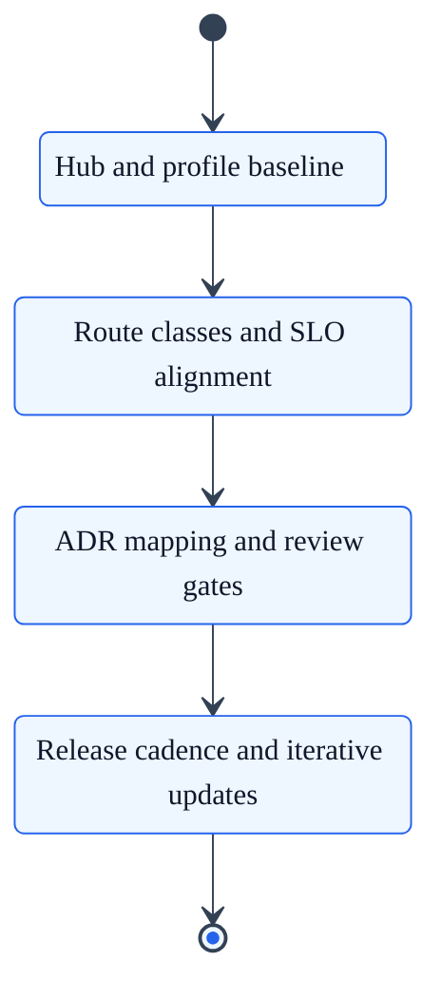

# Core platform architecture

## Summary

Stable architecture model for SkyCMS independent of static, dynamic, or hybrid delivery mode.

> **Reading path:** [Architecture overview](./architecture.md) > [Architecture Executive Summary](./architecture-executive-summary.md) > **Core Platform Architecture** > [Architecture Decision Matrix](./architecture-decision-matrix.md)

## Purpose

This document describes the architecture that is always true for SkyCMS, regardless of deployment pattern.

## System context

SkyCMS is a multi-tenant CMS platform with separated editing and publishing responsibilities.

| Actor or system | Role |
| --- | --- |
| Editors and administrators | Create, review, publish, and manage content |
| Site visitors | Request public pages and assets |
| Sky.Editor | Authoring, setup, admin APIs, publish orchestration |
| Sky.Publisher | Public delivery runtime |
| Database providers | Content, config, and identity persistence |
| Cloud storage | Media assets and static artifacts |
| CDN providers | Edge cache and global distribution |

## Container view

This view focuses on deployable runtime containers and their primary relationships.

## Core architectural boundaries

1. Editor and Publisher are independently deployable applications.
2. Tenant resolution is a first-class concern, handled early in request flow.
3. Published output is derived from authoring state and publish actions.
4. Storage, CDN, and database providers are pluggable behind abstractions.

## Logical component model

| Component group | Main responsibilities |
| --- | --- |
| Tenant context and configuration | Resolve tenant from domain headers and load tenant settings |
| Content domain | Manage articles, layouts, templates, blogs, and publish state |
| Publish orchestration | Build published records, static artifacts, TOC output, and cache purge |
| Public delivery | Serve requests through static or dynamic request paths |
| Platform services | Identity, caching, logging, telemetry, rate limiting, data protection |

## Component relationship view

## Canonical request lifecycle

### 1. Tenant establishment

- Request enters middleware pipeline.
- Domain middleware resolves tenant using proxy-aware host headers.
- Tenant-scoped services resolve connection strings and provider settings for this request.

### 2. Authoring and save

- Editor operations update draft content and supporting entities.
- Domain handlers apply business rules and tenant scoping through application abstractions.

### 3. Publish

- Publish flow creates or updates published records.
- Optional static artifact generation writes rendered files to storage.
- CDN purge and cache invalidation align public delivery with the new publish state.

### 4. Public delivery

- Publisher serves content in static, dynamic, or hybrid pattern.
- Authorization and cache headers are applied per path and configuration.

## Cross-cutting architecture concerns

| Concern | Architecture treatment |
| --- | --- |
| Multi-tenancy | Tenant resolution and tenant-scoped service access per request |
| Data isolation | Application data access abstractions and tenant-aware query patterns |
| Provider compatibility | EF and storage abstractions support multiple providers |
| Performance | In-memory cache, distributed cache options, CDN integration |
| Security | Authentication, authorization, antiforgery, cookie domain isolation |
| Operability | Health endpoints, logging, environment-specific startup and diagnostics |

## Identity and authorization trust flow

## Data model and source of truth

- Draft and editorial state is managed by Editor-side workflows.
- Published state is represented by published content records and optional generated static artifacts.
- Public delivery reads from the runtime source selected by delivery mode.

## Deployment model mapping

Core architecture is shared, but request serving behavior changes by profile:

- [Static Delivery Architecture Profile](architecture-profile-static.md)
- [Dynamic Delivery Architecture Profile](architecture-profile-dynamic.md)
- [Hybrid Delivery Architecture Profile](architecture-profile-hybrid.md)

## Environment and deployment topology

## Current state and target state

| Dimension | Current state | Target state |
| --- | --- | --- |
| Architecture entry point | Architecture overview and deep dives exist, but were historically distributed by topic | Architecture hub with comparable mode profiles and a single decision matrix |
| Delivery model clarity | Static and dynamic are documented, hybrid behavior exists but was less centralized | Static, dynamic, and hybrid each documented with one consistent profile format |
| Decision support | Decisions mostly made by team context and implementation familiarity | Explicit matrix and scenario mapping used for architecture selection |
| ADR discoverability | Full ADR index available | ADR index plus architecture-topic summary map for faster onboarding |
| Evolution planning | Architecture guidance captured mostly as point-in-time references | Current state, target state, and phased migration plan documented and tracked |

## Phased migration roadmap

### Phase 1: Foundations completed

1. Create architecture hub and core platform page.
2. Publish static, dynamic, and hybrid profile pages.
3. Add architecture decision matrix.

### Phase 2: Operationalization

1. Add route classification tables for public static, protected static, and dynamic endpoints.
2. Define mode-specific SLO guidance and dashboard pointers.
3. Add runbook links for publish failure, cache staleness, and tenant-resolution incidents.

### Phase 3: Governance hardening

1. Add ADR topic summaries mapped to architecture concerns.
2. Link architecture choices to test coverage expectations.
3. Add review checklist for pull requests touching tenant, publish, and delivery paths.

### Phase 4: Continuous evolution

1. Update decision matrix as platform capabilities evolve.
2. Review architecture docs at each major release milestone.
3. Keep current versus target deltas visible until closed.

## Roadmap transition view

## Related deep dives

- [Publisher Architecture](publisher-architecture.md)
- [Publisher Rendering Flow](publisher-rendering-flow.md)
- [Content Delivery Architecture](content-delivery-architecture.md)
- [Tenant Isolation Reference](tenant-isolation-reference.md)
- [Architecture Decision Records](architecture-decision-records.md)
