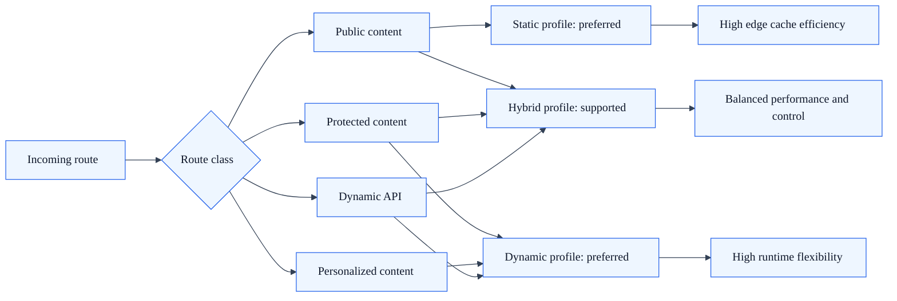

# Architecture Decision Matrix

## Summary

Decision guide for choosing static, dynamic, or hybrid SkyCMS delivery architecture.

## Purpose

Use this matrix to select the best SkyCMS delivery architecture for a specific site or tenant.

## Selection criteria matrix

| Criteria | Static profile | Dynamic profile | Hybrid profile |
| --- | --- | --- | --- |
| Primary traffic type | Anonymous, cache-heavy | Mixed or interactive | Mostly anonymous with protected areas |
| Content freshness expectation | Publish-driven freshness | Request-time freshness | Publish-driven with targeted runtime paths |
| Personalization need | Low | High | Medium |
| Auth-protected public content | Limited | Strong | Strong on selected routes |
| Runtime complexity tolerance | Low | High | Medium |
| Infra cost target | Lowest | Highest | Medium |
| Edge caching effectiveness | Highest | Medium | High |
| Operational simplicity | High | Medium | Medium |

## Request routing matrix visualization

## Fast decision guide

Choose static profile when:

- content is mostly public and cacheable,
- peak traffic is high,
- minimizing runtime complexity is a priority.

Choose dynamic profile when:

- runtime composition or endpoint behavior is central,
- personalization and protected interactions are common,
- the team can support stronger runtime operations.

Choose hybrid profile when:

- public content should remain static-first,
- some routes require authentication or dynamic handling,
- you need balance between performance and flexibility.

## Scenario recommendations

| Scenario | Recommended profile | Notes |
| --- | --- | --- |
| Public marketing site | Static | Use aggressive CDN caching and publish-triggered purge |
| Knowledge base with private sections | Hybrid | Keep docs static, gate private sections |
| Customer portal with user-specific content | Dynamic | Prioritize runtime auth and per-request logic |
| Multi-tenant docs network with small protected admin docs | Hybrid | Static delivery for most tenants, protected paths where needed |

## Non-functional requirement mapping

| NFR priority | Preferred profile |
| --- | --- |
| Lowest latency at global scale | Static |
| Rich runtime behavior | Dynamic |
| Balanced performance and access control | Hybrid |
| Minimal runtime blast radius | Static |
| Strong route-level policy flexibility | Dynamic or Hybrid |

## Review checklist

Before finalizing architecture for a workload, confirm:

1. Route classes are clearly identified.
2. Cache policy for public and protected paths is documented.
3. Tenant isolation assumptions are validated.
4. Publish flow observability is in place.
5. Rollback strategy exists for failed publish or stale cache events.

## Working assets

Use these pages while running a real mode-selection exercise:

- [Architecture Mode Selection Worksheet](architecture-mode-selection-worksheet.md)
- [Architecture Route Inventory Templates](architecture-route-inventory-templates.md)
- [Architecture Review Checklist](architecture-review-checklist.md)

## Related docs

- [Architecture Overview](architecture.md)
- [Core Platform Architecture](architecture-core-platform.md)
- [Static Delivery Architecture Profile](architecture-profile-static.md)
- [Dynamic Delivery Architecture Profile](architecture-profile-dynamic.md)
- [Hybrid Delivery Architecture Profile](architecture-profile-hybrid.md)
- [Architecture Mode Selection Worksheet](architecture-mode-selection-worksheet.md)
- [Architecture Route Inventory Templates](architecture-route-inventory-templates.md)
