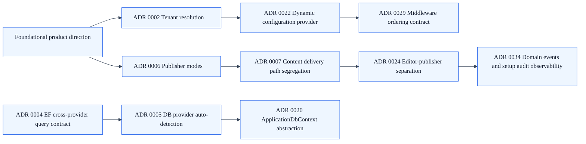

# Architecture Decision Records (ADRs)

## Summary

SkyCMS ADRs are maintained in the main SkyCMS repository as the canonical source of truth.

## Canonical ADR Location

- SkyCMS ADR folder:
  - [SkyCMS ADR folder](https://github.com/CWALabs/SkyCMS/tree/main/docs/adr)

## ADR Index

- [ADR 0001: Editor Naming and Icon Standards](https://github.com/CWALabs/SkyCMS/blob/main/docs/adr/0001-editor-naming-and-icon-standards.md)
- [ADR 0002: Tenant Resolution and Domain Context Establishment](https://github.com/CWALabs/SkyCMS/blob/main/docs/adr/0002-tenant-resolution-and-domain-context-establishment.md)
- [ADR 0003: Editor Deployment Mode Split (Single-Tenant vs Multi-Tenant)](https://github.com/CWALabs/SkyCMS/blob/main/docs/adr/0003-editor-deployment-mode-single-tenant-vs-multi-tenant.md)
- [ADR 0004: EF Cross-Provider Cosmos-Safe Query Contract](https://github.com/CWALabs/SkyCMS/blob/main/docs/adr/0004-ef-cross-provider-cosmos-safe-query-contract.md)
- [ADR 0005: Database Provider Auto-Detection Strategy](https://github.com/CWALabs/SkyCMS/blob/main/docs/adr/0005-database-provider-auto-detection-strategy.md)
- [ADR 0006: Publisher Operating Modes (Dynamic vs Static)](https://github.com/CWALabs/SkyCMS/blob/main/docs/adr/0006-publisher-operating-modes-dynamic-vs-static.md)
- [ADR 0007: Content Delivery Path Segregation](https://github.com/CWALabs/SkyCMS/blob/main/docs/adr/0007-content-delivery-path-segregation.md)
- [ADR 0008: Cookie Domain Isolation for Multi-Tenant Authentication](https://github.com/CWALabs/SkyCMS/blob/main/docs/adr/0008-cookie-domain-isolation-for-multi-tenant-auth.md)
- [ADR 0009: CQRS with Custom Mediator and Vertical Slices](https://github.com/CWALabs/SkyCMS/blob/main/docs/adr/0009-cqrs-with-custom-mediator-and-vertical-slices.md)
- [ADR 0010: SignalR Tenant Isolation and Scoped Progress Reporting](https://github.com/CWALabs/SkyCMS/blob/main/docs/adr/0010-signalr-tenant-isolation-and-scoped-progress-reporting.md)
- [ADR 0011: Policy-Based Rate Limiting Architecture](https://github.com/CWALabs/SkyCMS/blob/main/docs/adr/0011-policy-based-rate-limiting-architecture.md)
- [ADR 0012: Setup Wizard Dual-Flow Architecture](https://github.com/CWALabs/SkyCMS/blob/main/docs/adr/0012-setup-wizard-dual-flow-architecture.md)
- [ADR 0013: Passkey RP ID Strategy for Single and Multi-Tenant Deployments](https://github.com/CWALabs/SkyCMS/blob/main/docs/adr/0013-passkey-rp-id-strategy-for-single-and-multi-tenant.md)
- [ADR 0014: Conditional OAuth Provider Registration Strategy](https://github.com/CWALabs/SkyCMS/blob/main/docs/adr/0014-conditional-oauth-provider-registration-strategy.md)
- [ADR 0015: Startup Migration Orchestration for Schema and Data](https://github.com/CWALabs/SkyCMS/blob/main/docs/adr/0015-startup-migration-orchestration-schema-and-data.md)
- [ADR 0016: Tenant-Scoped Caching Lifecycle Strategy](https://github.com/CWALabs/SkyCMS/blob/main/docs/adr/0016-tenant-scoped-caching-lifecycle-strategy.md)
- [ADR 0017: Storage Provider Auto-Detection by Connection Pattern](https://github.com/CWALabs/SkyCMS/blob/main/docs/adr/0017-storage-provider-auto-detection-by-connection-pattern.md)
- [ADR 0018: Early Configuration Validation and Diagnostic-Only Startup Mode](https://github.com/CWALabs/SkyCMS/blob/main/docs/adr/0018-early-configuration-validation-and-diagnostic-only-mode.md)
- [ADR 0019: Health Probe Endpoint Exemptions in Setup Middleware](https://github.com/CWALabs/SkyCMS/blob/main/docs/adr/0019-health-probe-endpoint-exemptions-in-setup-middleware.md)
- [ADR 0020: ApplicationDbContext Abstraction for Tenant-Aware Data Access](https://github.com/CWALabs/SkyCMS/blob/main/docs/adr/0020-applicationdbcontext-abstraction-for-tenant-aware-data-access.md)
- [ADR 0021: Docs Import Pipeline with Idempotent Hash Tracking](https://github.com/CWALabs/SkyCMS/blob/main/docs/adr/0021-docs-import-pipeline-with-idempotent-hash-tracking.md)
- [ADR 0022: Dynamic Configuration Provider Singleton with Proxy-Aware Domain Resolution](https://github.com/CWALabs/SkyCMS/blob/main/docs/adr/0022-dynamic-configuration-provider-singleton-with-proxy-aware-domain-resolution.md)
- [ADR 0023: Dynamic Email Provider Resolution with NoOp Fallback](https://github.com/CWALabs/SkyCMS/blob/main/docs/adr/0023-dynamic-email-provider-resolution-with-noop-fallback.md)
- [ADR 0024: Editor-Publisher Separation with Shared Data and Storage](https://github.com/CWALabs/SkyCMS/blob/main/docs/adr/0024-editor-publisher-separation-with-shared-data-and-storage.md)
- [ADR 0025: Setup Detection Middleware Cache and Access-Control Strategy](https://github.com/CWALabs/SkyCMS/blob/main/docs/adr/0025-setup-detection-middleware-cache-and-access-control-strategy.md)
- [ADR 0026: Cookie and Transport Security Defaults](https://github.com/CWALabs/SkyCMS/blob/main/docs/adr/0026-cookie-and-transport-security-defaults.md)
- [ADR 0027: Proxy Forwarding and Trusted Header Strategy](https://github.com/CWALabs/SkyCMS/blob/main/docs/adr/0027-proxy-forwarding-and-trusted-header-strategy.md)
- [ADR 0028: Domain Validation Fail-Open Availability Posture](https://github.com/CWALabs/SkyCMS/blob/main/docs/adr/0028-domain-validation-fail-open-availability-posture.md)
- [ADR 0029: Middleware Ordering Contract for Tenant and Security Correctness](https://github.com/CWALabs/SkyCMS/blob/main/docs/adr/0029-middleware-ordering-contract-for-tenant-and-security-correctness.md)
- [ADR 0030: CloudFront Proto Header Normalization Strategy](https://github.com/CWALabs/SkyCMS/blob/main/docs/adr/0030-cloudfront-proto-header-normalization-strategy.md)
- [ADR 0031: Setup Enablement Gate via CosmosAllowSetup](https://github.com/CWALabs/SkyCMS/blob/main/docs/adr/0031-setup-enablement-gate-via-cosmosallowsetup.md)
- [ADR 0032: Environment-Specific Error Handling Strategy](https://github.com/CWALabs/SkyCMS/blob/main/docs/adr/0032-environment-specific-error-handling-strategy.md)
- [ADR 0033: Antiforgery Token Bootstrap Endpoint Pattern](https://github.com/CWALabs/SkyCMS/blob/main/docs/adr/0033-antiforgery-token-bootstrap-endpoint-pattern.md)
- [ADR 0034: Domain Events and Setup Audit Log Observability Model](https://github.com/CWALabs/SkyCMS/blob/main/docs/adr/0034-domain-events-and-setup-audit-log-observability-model.md)
- [ADR 0035: File Explorer Modernization and Connector Adapter Strategy](https://github.com/CWALabs/SkyCMS/blob/main/docs/adr/0035-file-explorer-modernization-and-connector-adapter-strategy.md)
- [ADR 0036: Layout Terminology Standardization and Documentation Strategy](https://github.com/CWALabs/SkyCMS/blob/main/docs/adr/0036-layout-terminology-standardization-and-documentation-strategy.md)

## Architecture topic summaries

Use this section as a fast architecture map before diving into individual ADR files.

### 1. Platform direction and operating model

- [ADR 0003](https://github.com/CWALabs/SkyCMS/blob/main/docs/adr/0003-editor-deployment-mode-single-tenant-vs-multi-tenant.md): Establishes split deployment paths for single-tenant and multi-tenant editor operation.

### 8. Editor modernization and terminology alignment

- [ADR 0035](https://github.com/CWALabs/SkyCMS/blob/main/docs/adr/0035-file-explorer-modernization-and-connector-adapter-strategy.md): Defines the file explorer modernization approach and connector adapter boundary.
- [ADR 0036](https://github.com/CWALabs/SkyCMS/blob/main/docs/adr/0036-layout-terminology-standardization-and-documentation-strategy.md): Standardizes layout terminology and docs strategy for editor consistency.

### 2. Tenant resolution and isolation

- [ADR 0002](https://github.com/CWALabs/SkyCMS/blob/main/docs/adr/0002-tenant-resolution-and-domain-context-establishment.md): Makes early domain-based tenant resolution a first-order architectural constraint.
- [ADR 0022](https://github.com/CWALabs/SkyCMS/blob/main/docs/adr/0022-dynamic-configuration-provider-singleton-with-proxy-aware-domain-resolution.md): Standardizes proxy-aware domain resolution through a singleton dynamic configuration provider.
- [ADR 0008](https://github.com/CWALabs/SkyCMS/blob/main/docs/adr/0008-cookie-domain-isolation-for-multi-tenant-auth.md): Prevents cross-tenant authentication leakage via cookie-domain isolation strategy.

### 3. Data portability and provider strategy

- [ADR 0004](https://github.com/CWALabs/SkyCMS/blob/main/docs/adr/0004-ef-cross-provider-cosmos-safe-query-contract.md): Requires cross-provider query safety, including Cosmos-compatible query constraints.
- [ADR 0005](https://github.com/CWALabs/SkyCMS/blob/main/docs/adr/0005-database-provider-auto-detection-strategy.md): Defines provider auto-detection strategy for portable database runtime behavior.
- [ADR 0017](https://github.com/CWALabs/SkyCMS/blob/main/docs/adr/0017-storage-provider-auto-detection-by-connection-pattern.md): Aligns storage provider selection with connection-pattern detection.

### 4. Publishing and delivery patterns

- [ADR 0006](https://github.com/CWALabs/SkyCMS/blob/main/docs/adr/0006-publisher-operating-modes-dynamic-vs-static.md): Formalizes publisher operating modes and startup mode selection.
- [ADR 0007](https://github.com/CWALabs/SkyCMS/blob/main/docs/adr/0007-content-delivery-path-segregation.md): Splits content delivery paths to support performance, security, and mode flexibility.
- [ADR 0024](https://github.com/CWALabs/SkyCMS/blob/main/docs/adr/0024-editor-publisher-separation-with-shared-data-and-storage.md): Confirms editor-publisher separation with shared data and storage contracts.

### 5. Runtime correctness and security posture

- [ADR 0029](https://github.com/CWALabs/SkyCMS/blob/main/docs/adr/0029-middleware-ordering-contract-for-tenant-and-security-correctness.md): Locks middleware ordering as an architecture-level correctness contract.
- [ADR 0026](https://github.com/CWALabs/SkyCMS/blob/main/docs/adr/0026-cookie-and-transport-security-defaults.md): Sets secure transport and cookie defaults as baseline security posture.
- [ADR 0011](https://github.com/CWALabs/SkyCMS/blob/main/docs/adr/0011-policy-based-rate-limiting-architecture.md): Standardizes policy-based rate limiting for abuse protection.

### 6. Startup safety and setup governance

- [ADR 0018](https://github.com/CWALabs/SkyCMS/blob/main/docs/adr/0018-early-configuration-validation-and-diagnostic-only-mode.md): Adds early validation and diagnostic-only startup mode to reduce misconfiguration risk.
- [ADR 0031](https://github.com/CWALabs/SkyCMS/blob/main/docs/adr/0031-setup-enablement-gate-via-cosmosallowsetup.md): Gates setup entry through explicit setup enablement configuration.
- [ADR 0019](https://github.com/CWALabs/SkyCMS/blob/main/docs/adr/0019-health-probe-endpoint-exemptions-in-setup-middleware.md): Protects operational health checks during setup gating.

### 7. Architecture operations and observability

- [ADR 0016](https://github.com/CWALabs/SkyCMS/blob/main/docs/adr/0016-tenant-scoped-caching-lifecycle-strategy.md): Defines tenant-scoped cache lifecycle behavior.
- [ADR 0034](https://github.com/CWALabs/SkyCMS/blob/main/docs/adr/0034-domain-events-and-setup-audit-log-observability-model.md): Captures domain-event and setup-audit observability model.

## ADR decision dependency map

## Mirror Policy

- Authoritative edits happen in SkyCMS docs/adr.
- This docs page mirrors IDs and titles only.
- CI validates that all canonical ADR IDs are represented here.
