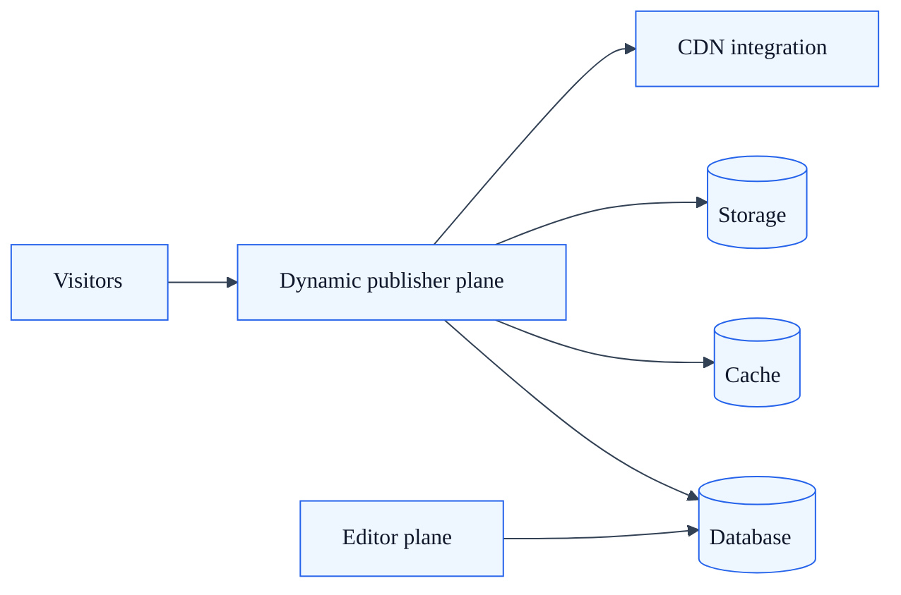
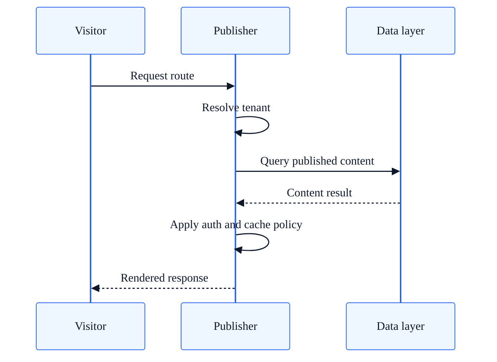

# Dynamic Delivery Architecture Profile

## Summary

Architecture profile for dynamic SkyCMS deployments with on-demand rendering and richer runtime behavior.

## Intended use cases

- Sites requiring runtime composition and dynamic behavior.
- Workloads with protected routes and richer interactive server features.
- Teams optimizing for flexibility over maximum edge-only simplicity.

## Runtime topology

| Plane | Responsibilities |
| --- | --- |
| Editor plane | Authoring, publish orchestration, admin operations |
| Publisher plane | Dynamic request handling, content retrieval, response composition |
| Data and services plane | Database, identity, storage, caching, CDN integration |

## Request path

1. Request enters Publisher middleware pipeline.
2. Tenant context is resolved from host-aware headers.
3. Published content is queried through tenant-aware abstractions.
4. Optional authorization checks are applied.
5. Response is rendered and returned with cache policy.

## Publish path

1. Editor updates published records and supporting metadata.
2. Publisher serves latest state on next request without requiring static artifact read path.
3. CDN behavior depends on cache policy and purge strategy.

## Strengths

- Supports richer runtime scenarios and custom endpoint behavior.
- Enables more direct request-time logic and personalization patterns.
- Reduces dependency on full static artifact coverage for all routes.

## Tradeoffs

- Higher runtime complexity and compute cost than static-first deployments.
- Greater dependency on database and service availability during request serving.
- Requires stronger runtime observability and scaling discipline.

## Common failure modes

| Failure mode | Typical impact | Mitigation |
| --- | --- | --- |
| Slow data query paths | Increased latency | Optimize query patterns and cache strategy |
| Runtime dependency outage | Partial or full content outage | Add health probes, retries, and graceful degradation |
| Tenant config mismatch | Wrong site behavior for a domain | Validate tenant mapping and config precedence |

## Operational guidance

- Track latency by route class and tenant.
- Apply strict provider-compatible query patterns for cross-provider support.
- Tune cache headers for mixed anonymous and authenticated workloads.

## Route classification guidance

Use this table to classify routes that should be handled with dynamic delivery behavior.

| Route class | Typical examples | Runtime expectation | Cache policy guidance |
| --- | --- | --- | --- |
| Dynamic content page | `/news/{slug}`, `/blog/{slug}` | Request-time query and render | Public cache only when content policy allows |
| Personalized endpoint | `/profile`, `/dashboard` | Request-time identity and personalized response | Private cache or no-store |
| Protected content path | `/members/*`, `/account/*` | Authentication and authorization before response | Private cache, avoid CDN caching of user-specific responses |
| Dynamic API endpoint | `/_api/*` | Request-time business logic and persistence operations | Endpoint-specific policy; no cache by default |

## Related docs

- [Publisher Architecture](publisher-architecture.md)
- [Publisher Rendering Flow](publisher-rendering-flow.md)
- [Tenant Isolation Reference](tenant-isolation-reference.md)
- [Architecture Decision Matrix](architecture-decision-matrix.md)
