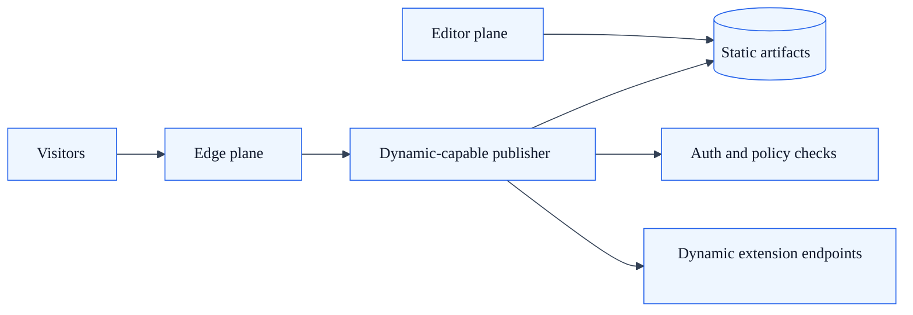
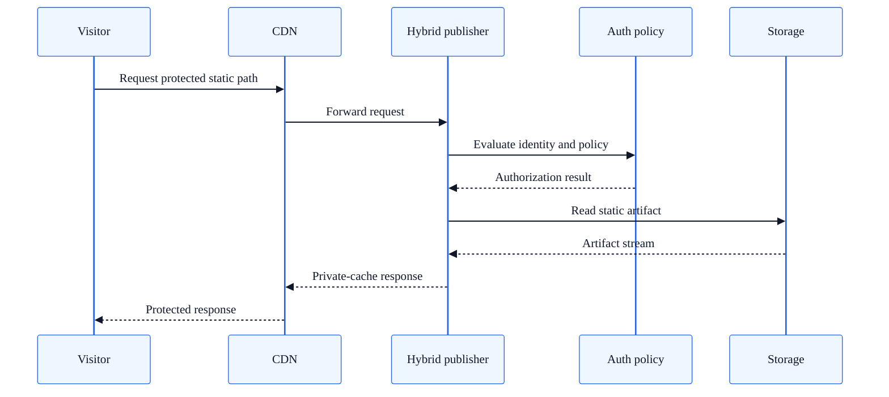

# Hybrid Delivery Architecture Profile

## Summary

Architecture profile for combining static artifact delivery with dynamic authorization or extension endpoints in SkyCMS.

## Intended use cases

- Teams that want static artifact delivery for most paths.
- Scenarios requiring protected access for selected content.
- Environments where pure static hosting is not enough for required runtime features.

## Runtime topology

| Plane | Responsibilities |
| --- | --- |
| Editor plane | Authoring, publish orchestration, static artifact generation |
| Dynamic-capable publisher plane | Static artifact serving plus route-level auth and extension endpoints |
| Edge plane | CDN acceleration for public static and semi-static paths |

## Delivery model

Hybrid delivery is achieved by a dynamic-capable runtime that serves static artifacts while still enforcing authentication and authorization policies where required.

Typical split:

- Public, cacheable routes use static artifact delivery semantics.
- Protected or policy-sensitive routes use authenticated file serving and authorization checks.
- Specialized runtime endpoints remain available for integration needs.

## Request path patterns

### Public static route

1. Request resolves to a static artifact path.
2. Response is served with public cache policy.
3. CDN provides edge acceleration.

### Protected static route

1. Request enters authenticated static path handling.
2. Identity and policy checks run before file delivery.
3. Response uses private cache policy to avoid leakage.

## Strengths

- Preserves static delivery performance for large portions of site traffic.
- Supports protected content and policy gates without abandoning static artifacts.
- Offers pragmatic migration path from dynamic-only to static-first patterns.

## Tradeoffs

- More operational complexity than pure static mode.
- Requires careful cache header design across public and protected paths.
- Team must clearly define route ownership between static and dynamic responsibilities.

## Common failure modes

| Failure mode | Typical impact | Mitigation |
| --- | --- | --- |
| Incorrect cache policy on protected route | Sensitive response caching risk | Enforce private/no-store policy for authenticated routes |
| Route ownership ambiguity | Inconsistent behavior by endpoint | Maintain route classification matrix in ops docs |
| Authorization drift | Access inconsistency across routes | Keep policy checks centralized and regression tested |

## Operational guidance

- Define explicit route classes: public static, protected static, dynamic endpoint.
- Validate auth and cache policy behavior in integration tests.
- Monitor cache hit ratio separately for public and protected path groups.

## Route classification guidance

Use this table to partition route behavior between static delivery and dynamic enforcement.

| Route class | Typical examples | Runtime expectation | Cache policy guidance |
| --- | --- | --- | --- |
| Public static route | `/`, `/docs/*`, `/products/*` | Artifact-first response path | Public CDN cache |
| Protected static route | `/pub/articles/{articleNumber}/*` | Auth policy check before artifact response | Private cache or no-store |
| Dynamic extension endpoint | `/_api/*`, custom integration paths | Dynamic request handling alongside static delivery estate | Endpoint-specific cache policy, default no-store |
| Operational endpoint | `/healthz` | Runtime health response | No CDN cache |

## Related docs

- [Publisher Rendering Flow](publisher-rendering-flow.md)
- [Publisher Architecture](publisher-architecture.md)
- [Content Delivery Architecture](content-delivery-architecture.md)
- [Architecture Decision Matrix](architecture-decision-matrix.md)
