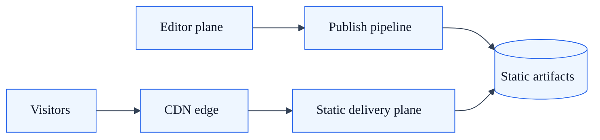
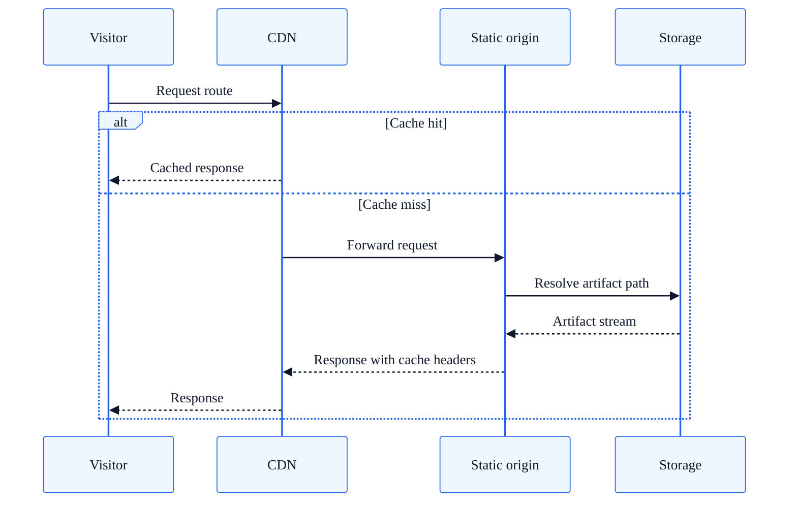

# Static Delivery Architecture Profile

## Summary

Architecture profile for static-first SkyCMS deployments using generated artifacts and edge caching.

## Intended use cases

- High-traffic public sites where most pages are anonymous.
- Teams prioritizing edge cache hit rate and low runtime complexity.
- Environments where publish-time generation is acceptable.

## Runtime topology

| Plane | Responsibilities |
| --- | --- |
| Editor plane | Authoring, publish orchestration, static artifact generation |
| Delivery plane | Static proxy behavior for serving generated files |
| Edge plane | CDN cache and global distribution |

## Request path

1. Visitor requests a path.
2. CDN serves cache hit when available.
3. On miss, origin static path resolution attempts exact file lookup.
4. SPA fallback logic may route to application index artifact.
5. Response cache headers guide browser and edge caching.

## Publish path

1. Editor publish action updates published records.
2. Static artifacts are generated and uploaded to storage.
3. Table of contents and related publish metadata are updated.
4. CDN purge invalidates stale edge content.

## Strengths

- Low request-time compute cost.
- High throughput and cache-friendliness.
- Reduced public runtime attack surface.

## Tradeoffs

- Content freshness depends on publish plus cache invalidation flow.
- Runtime personalization options are limited compared to dynamic mode.
- Requires disciplined publish pipeline observability.

## Common failure modes

| Failure mode | Typical impact | Mitigation |
| --- | --- | --- |
| Stale edge cache | Visitors see old content | Validate purge success, tune TTLs, provide targeted purge |
| Missing artifact path | 404 on published route | Verify artifact generation and path normalization |
| Incomplete publish batch | Partial site update | Add publish progress checks and retry strategy |

## Operational guidance

- Use short TTL on entry artifacts such as index pages and longer TTL on immutable assets.
- Track publish completion and cache purge outcomes as first-class operational signals.
- Validate tenant-isolated storage and cache key strategy in multi-tenant deployments.

## Route classification guidance

Use this table to classify routes that should remain in static-first delivery for this profile.

| Route class | Typical examples | Runtime expectation | Cache policy guidance |
| --- | --- | --- | --- |
| Public static page | `/`, `/about`, `/docs/getting-started` | Served from generated artifact path | Public cache, CDN-enabled |
| Static asset | `/pub/images/*`, `/pub/docs/*`, `/assets/*` | Served as file content with no request-time composition | Long-lived public cache where safe |
| SPA fallback route | `/app/*` for client-side routing | Fallback to SPA entry artifact when path artifact is missing | Public cache with short revalidation window for entry artifact |
| Operational endpoint | `/healthz` | Served by runtime health handler, not static artifact | No CDN cache |

## Related docs

- [Publisher Architecture](publisher-architecture.md)
- [Content Delivery Architecture](content-delivery-architecture.md)
- [Publisher Rendering Flow](publisher-rendering-flow.md)
- [Architecture Decision Matrix](architecture-decision-matrix.md)
