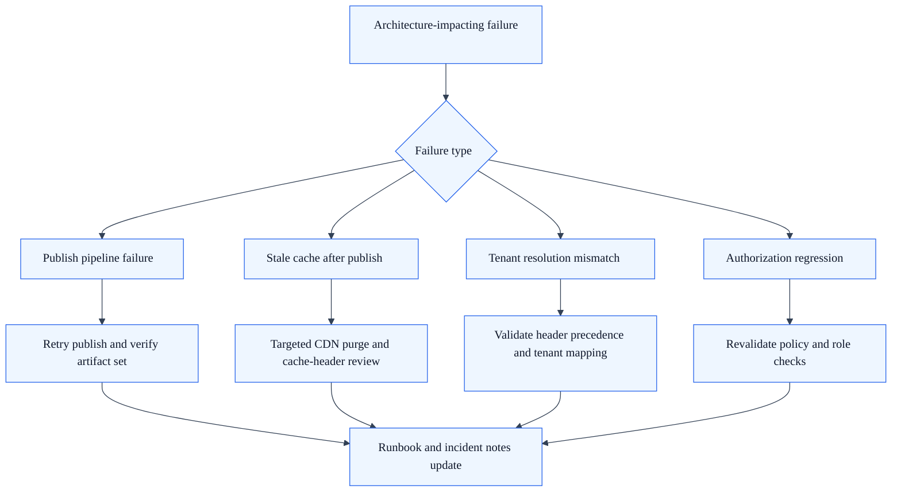

---
canonical_title: Architecture Review Checklist
description: Practical checklist for reviewing SkyCMS changes that affect tenant, publishing, and delivery architecture behavior.
audience:
  - Developers
  - Reviewers
  - Architects
doc_type: Reference
status: Draft
entities:
  - architecture-review
  - pull-request-checklist
  - tenant-isolation
keywords:
  - architecture checklist
  - PR review
  - design review
---

# Architecture Review Checklist

## Purpose

Use this checklist when reviewing pull requests or design changes that may affect architecture behavior.

## 1. Tenant and isolation checks

1. Tenant resolution still occurs before tenant-dependent services or data access.
2. New queries remain tenant-safe and follow cross-provider compatibility rules.
3. Cache keys and storage paths remain tenant-scoped for multi-tenant scenarios.
4. Cookie and auth scope do not introduce cross-tenant leakage.

## 2. Delivery mode checks

1. Route behavior is explicitly classified as static, dynamic, or hybrid.
2. Cache policy is correct for the route class and response sensitivity.
3. Protected routes are not accidentally cacheable at public edge layers.
4. Mode-specific behavior is documented in the relevant profile page.

## 3. Publishing and lifecycle checks

1. Publish flow still updates canonical published records correctly.
2. Static artifact generation and cleanup logic remain consistent with route expectations.
3. CDN purge and cache invalidation behavior is preserved or intentionally changed.
4. Failure handling is explicit for partial publish and stale cache scenarios.

## 4. Middleware and security checks

1. Middleware ordering changes are evaluated against architecture contracts.
2. Auth, antiforgery, and rate limiting behavior remain correct for modified endpoints.
3. Health and setup endpoints remain operationally safe.
4. Proxy-header and domain handling remain compatible with deployment environments.

## 5. Operability checks

1. Logging and diagnostics capture key architecture transitions and errors.
2. Metrics or traces are available for high-risk architecture paths.
3. Runbooks are updated when operational behavior changes.
4. Rollback or mitigation steps are known for architecture-impacting failures.

## Failure mode and recovery map

## 6. Documentation and governance checks

1. Relevant architecture docs are updated with the same pull request.
2. ADR updates are added when design intent or constraints change materially.
3. Decision matrix or profile guidance is updated if route ownership changes.
4. Reviewer confirms current-state and target-state impact where relevant.

## Related docs

- [Architecture Overview](architecture.md)
- [Core Platform Architecture](architecture-core-platform.md)
- [Architecture Decision Matrix](architecture-decision-matrix.md)
- [Architecture Decision Records](architecture-decision-records.md)
