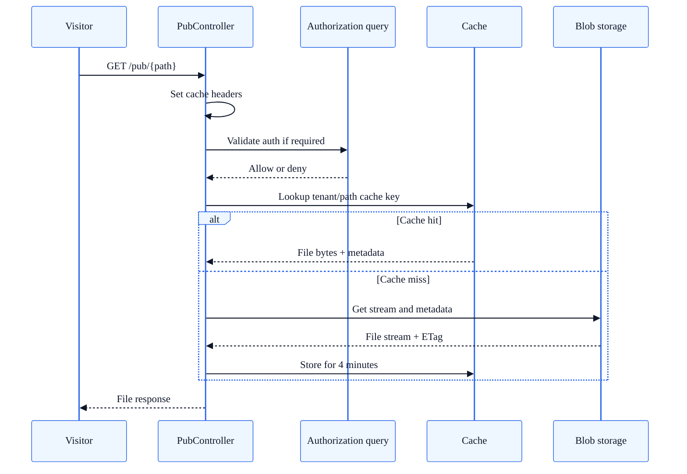
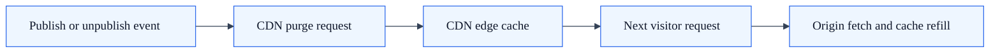

# Content Delivery Architecture

## Summary

How SkyCMS serves files, pages, and assets to site visitors — from blob storage through the application layer to CDN edge caches.

## Delivery Paths

SkyCMS delivers content through three distinct paths:

| Path | Controller | Purpose |
| --- | --- | --- |
| `/pub/*` | `PubController` | Protected file serving with authentication |
| `/*` (static mode) | `StaticProxyController` | Pre-generated HTML from blob storage |
| Static files | ASP.NET Middleware | CSS, JS, and built-in assets from wwwroot |

## Delivery topology

```mermaid
%%{init: {"theme":"base","themeVariables":{"primaryColor":"#eef6ff","primaryTextColor":"#0f172a","primaryBorderColor":"#2563eb","lineColor":"#334155","secondaryColor":"#f8fafc","tertiaryColor":"#ffffff","fontFamily":"Segoe UI, Arial, sans-serif"}}}%%
flowchart LR
    Visitor[Visitor] --> Entry{Route type}
    Entry --> PubPath[/pub/*]
    Entry --> StaticPath[/* static mode]
    Entry --> WwwrootPath[wwwroot static files]

    PubPath --> PubController[PubController]
    StaticPath --> ProxyController[StaticProxyController]
    WwwrootPath --> StaticMiddleware[Static file middleware]

    PubController --> Blob[(Blob storage)]
    ProxyController --> Blob
    PubController --> MemCache[(In-memory cache)]
    ProxyController --> MemCache
    ProxyController --> SpaLookup[(SPA path lookup)]
    PubController --> Auth[Auth and policy checks]
```

---

## Protected File Serving (PubController)

The `PubController` serves files from blob storage with optional authentication and per-article authorization.

### PubController request flow

1. A request to `/pub/{path}` is routed to `PubController.Index()`.
2. Cache headers are set based on authentication requirements.
3. If authentication is required, the user's identity is validated.
4. For article-specific paths (`/pub/articles/{articleNumber}/*`), per-article authorization is checked via `AuthorizeUserForArticleQuery`.
5. The file is served from cache or blob storage.



### Caching

- **In-memory cache:** Files are cached for **4 minutes** after first access.
- **Cache key:** Generated per tenant and path by `ICacheKeyProvider.GenerateFileKey(hostname, path)`.
- **ETag support:** Storage ETags are converted to HTTP `ETag` headers for browser cache validation.

### Cache Control Headers

| Context | Cache-Control |
| --- | --- |
| Authenticated content | `private, no-cache, no-store, must-revalidate` |
| Public content | `public, max-age=3600` |

### Editor vs. Publisher

Both the Editor and Publisher have their own `PubController`, both extending `PubControllerBase`:

| Application | Authentication |
| --- | --- |
| **Editor** | Based on `IEditorSettings.CosmosRequiresAuthentication` |
| **Publisher** | Based on `SiteSettings.CosmosRequiresAuthentication`; marked `[AllowAnonymous]` by default |

---

## Static File Serving (StaticProxyController)

In static mode (`CosmosStaticWebPages = true`), the `StaticProxyController` serves pre-generated HTML files from blob storage.

### Static proxy request flow

1. The request path is normalized (root → `index.html`).
2. Attempt to serve the exact file from storage (checking cache first).
3. If no file found, check for SPA fallback.
4. Return 404 if neither succeeds.

### Cache TTLs

| File Type | Cache Duration |
| --- | --- |
| `index.html` | 10 seconds |
| All other files | 5 minutes |

The short TTL for `index.html` ensures frequent content updates are reflected quickly while still providing caching benefits.

### SPA Fallback Routing

For Single Page Application (SPA) deployments:

1. The controller queries the database for `ArticleType.SpaApp` entries matching the requested URL.
2. If a SPA is found at that path, the controller returns `{path}/index.html` instead of 404.
3. SPA detection results are cached for **5 minutes**.
4. This allows client-side routing to work without server-side route definitions.

---

## Static File Middleware

ASP.NET Core's static file middleware serves built-in assets (CSS, JS, images) from the `wwwroot` directory:

- JavaScript files have explicit `Content-Type: application/javascript` headers.
- Static files are served before controller routing in the middleware pipeline.

### Middleware Order

```text
Routing → CORS → Response Caching → Authentication → Authorization → Rate Limiter → Endpoints
```

---

## Blob Storage Interface

All file serving goes through `IStorageContext`, which abstracts the underlying storage provider:

| Method | Returns | Purpose |
| --- | --- | --- |
| `GetFileAsync(path)` | `FileManagerEntry` | File metadata (name, size, content type, dates) |
| `GetStreamAsync(path)` | `Stream` | File content as a readable stream |
| `BlobExistsAsync(path)` | `bool` | Check if a file exists |
| `GetFilesAndDirectories(path)` | `List<FileManagerEntry>` | Directory listing |

### File Metadata

Each file entry includes:

- **Name** — File name
- **Path** — Full storage path
- **Size** — Size in bytes
- **ContentType** — MIME type
- **Extension** — File extension
- **Created / Modified** — Timestamps (UTC)

---

## CDN Integration

When a CDN is configured, content delivery operates through two layers:

### Visitor Request Path

```text
Visitor → CDN Edge → Publisher → Blob Storage (or cache)
         (cached)    (origin)
```



### Cache Invalidation

- CDN cache is purged on publish/unpublish operations.
- Purge failures do not block publishing — they only affect cache freshness.
- Bulk static page generation triggers a full CDN purge.
- Supported providers: Cloudflare, Azure CDN/Front Door, CloudFront, Sucuri.

### Cache Key Isolation

Cache keys are scoped per tenant:

- `ICacheKeyProvider.GenerateFileKey(hostname, path)` — File cache keys.
- `ICacheKeyProvider.GenerateSpaCheckKey(articleUrl)` — SPA detection cache keys.

This ensures multi-tenant deployments have isolated caches.

---

## Multi-Tenancy

- Blob storage paths are scoped to the current tenant.
- Cache keys include the tenant hostname.
- CDN configuration and purge operations are per-tenant.
- Authentication checks use the tenant's settings.
- `PubControllerBase` injects scoped services that resolve to the current tenant.

---

## See Also

- [Image Processing API](image-processing-api.md) — Thumbnail generation endpoint
- [Publisher Architecture](publisher-architecture.md) — Dynamic vs. static publisher modes
- [Preload & Caching](../for-editors/preload-and-caching.md) — Cache warming and invalidation
- [Tenant Isolation Reference](tenant-isolation-reference.md) — Cross-layer isolation details
