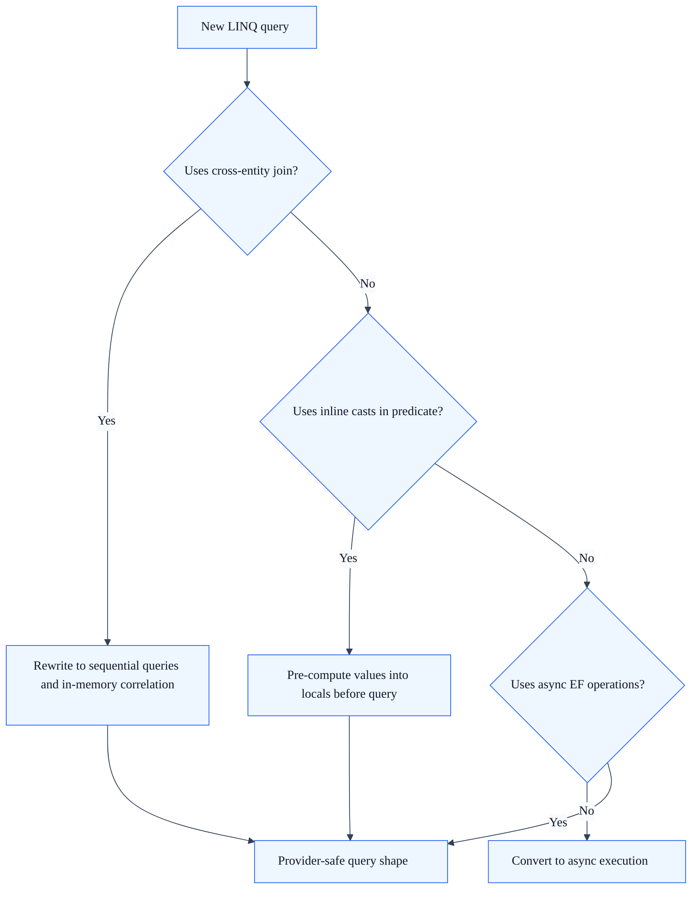

# EF Cross-Provider Compatibility Guide

SkyCMS supports four database providers through a single codebase: **MS SQL Server**, **MySQL**, **SQLite**, and **Azure Cosmos DB**. This guide documents the query restrictions, patterns, and provider detection strategy that maintain compatibility across all four.

**Audience:** Developers

---

## Provider Detection

### Strategy Pattern

`CosmosDbOptionsBuilder` uses a strategy pattern to automatically detect the database provider from a connection string:

| Strategy | Detection Pattern | Provider |
| --- | --- | --- |
| `CosmosDbConfigurationStrategy` | `AccountEndpoint=` in connection string | Azure Cosmos DB |
| `SqlServerConfigurationStrategy` | `Server=` or `Data Source=` (case-insensitive) | MS SQL Server |
| `MySqlConfigurationStrategy` | `server=` (lowercase) with MySQL-specific patterns | MySQL |
| `SqliteConfigurationStrategy` | `.db` file extension or SQLite-specific data source | SQLite |

## Query compatibility decision flow



The first matching strategy configures the `DbContextOptionsBuilder`. If no strategy matches, an exception is thrown.

### Usage

```csharp
var options = CosmosDbOptionsBuilder.GetDbOptions<ApplicationDbContext>(connectionString);
```

This is used throughout the application — both in the Editor and Publisher — to configure EF Core without hardcoding a specific provider.

---

## Cosmos DB Query Restrictions

Cosmos DB's EF Core provider has significant limitations compared to relational providers. All LINQ queries in the application must respect these restrictions.

### 1. No Cross-Container Joins

Cosmos DB does not support joins between different entity types stored in separate containers.

```csharp
// WRONG — Cosmos DB cannot execute this:
var result = from article in db.Articles
             join author in db.Authors on article.AuthorId equals author.Id
             select new { article, author };

// CORRECT — Sequential queries with client-side correlation:
var articles = await db.Articles
    .Where(a => a.Status == publishedStatus)
    .ToListAsync();

var authorIds = articles.Select(a => a.AuthorId).Distinct().ToList();

var authors = await db.Authors
    .Where(a => authorIds.Contains(a.Id))
    .ToListAsync();

var authorLookup = authors.ToDictionary(a => a.Id);
// Correlate in memory
```

### 2. No Inline Casts in Expression Trees

The Cosmos DB EF Core provider cannot translate inline casts (e.g., `(int)SomeEnum.Value`) inside lambda expressions.

```csharp
// WRONG — Cosmos DB cannot translate the cast:
var articles = await db.Articles
    .Where(a => a.StatusCode == (int)ArticleStatus.Published)
    .ToListAsync();

// CORRECT — Pre-compute the cast into a local variable:
int publishedStatus = (int)ArticleStatus.Published;
var articles = await db.Articles
    .Where(a => a.StatusCode == publishedStatus)
    .ToListAsync();
```

This applies to all enum-to-int conversions and any similar cast expressions within LINQ predicates.

### 3. Provider-Specific Warning Suppression

`ApplicationDbContext.OnConfiguring()` detects the provider and suppresses appropriate warnings:

| Provider | Suppressed Warning | Reason |
| --- | --- | --- |
| **Cosmos DB** | `CosmosEventId.SyncNotSupported` | Cosmos requires async operations |
| **Relational** | `RelationalEventId.PendingModelChangesWarning` | Multi-provider migrations coexist in the same assembly |

---

## Migration Strategy

### Shared Migration Assembly

Migrations live in the Common project and are shared across relational providers (SQL Server, MySQL, SQLite). Cosmos DB does not use EF migrations — its schema is managed at runtime.

### Adding Migrations

Use the `AddMigrationScript.ps1` script to create new migrations:

```powershell
.\AddMigrationScript.ps1
```

The script targets the correct project and context. When running against different providers, the migration is applied according to the provider's capabilities.

### Database Initialization

`ApplicationDbContext.EnsureDatabaseExists()` has two overloads:

1. **Relational** — Standard `EnsureCreated()` or migration apply.
2. **Cosmos DB** — Checks for required containers (`Identity`, `Articles`) using the Cosmos client API directly.

---

## FlexDb Multi-Provider Identity

The `AspNetCore.Identity.FlexDb` library extends ASP.NET Core Identity to work across all four providers:

- Uses `CosmosDbOptionsBuilder` for provider auto-detection.
- Identity tables (`AspNetUsers`, `AspNetRoles`, etc.) work on all providers.
- Passkey support (`IdentityUserPasskey<TKey>`) is tested across all providers.
- Default authentication scheme: `IdentityConstants.ApplicationScheme` with login path `/Account/Login`.

### Registration

```csharp
builder.Services.AddCosmosIdentity<ApplicationDbContext, IdentityUser, IdentityRole, string>(options =>
{
    // Identity options configured here
});
```

---

## Cross-Provider Testing

The `AspNetCore.Identity.FlexDb.Tests` project validates compatibility across all providers:

```csharp
[DataTestMethod]
[DataRow(TestDatabaseProvider.Cosmos)]
[DataRow(TestDatabaseProvider.SqlServer)]
[DataRow(TestDatabaseProvider.MySql)]
[DataRow(TestDatabaseProvider.Sqlite)]
public async Task PasskeyLifecycle_UserManager_Test(TestDatabaseProvider provider)
{
    // Runs the same test against all 4 providers
}
```

Over 24 interoperability tests cover:

- User creation, update, deletion
- Role assignment and verification
- Passkey registration and authentication
- Email confirmation flows
- Password hashing and validation

---

## Best Practices for Contributors

1. **Always pre-compute casts** — Never use inline casts in LINQ predicates.
2. **Avoid joins** — Use sequential queries with client-side correlation instead.
3. **Test against multiple providers** — Use `[DataRow]` parameterized tests with all provider values.
4. **Use async everywhere** — Cosmos DB does not support synchronous operations.
5. **Don't assume relational features** — Features like `LIKE`, `DATEPART`, `GROUP BY` with aggregates may not translate to Cosmos DB.
6. **Check provider before using provider-specific features** — Guard with `Database.ProviderName` checks when unavoidable.

---

## See Also

- [Tenant Isolation Reference](tenant-isolation-reference.md) — How ApplicationDbContext filters by tenant
- [Publisher Architecture](publisher-architecture.md) — How the Publisher configures EF
- [Blog Architecture](blog-architecture.md) — Cosmos DB compatibility in blog queries
- [Multi-Tenancy Deep Dive](multi-tenancy-deep-dive.md) — Architectural overview
