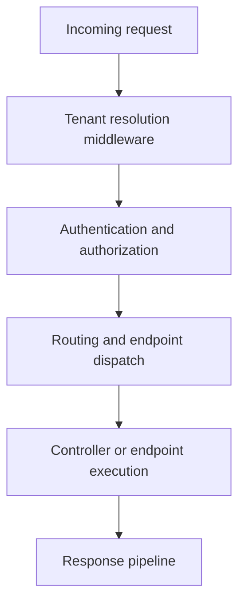

# Middleware Pipeline

## Summary

SkyCMS middleware ordering, tenant and security behavior, customization points, and debugging practices.

## Request flow overview

## Core ordering model

At a high level, middleware is organized as:

1. early request normalization and tenant establishment,
2. security and identity enforcement,
3. routing and endpoint execution,
4. response policies and delivery behavior.

Why this matters:

- tenant resolution must run early so scoped services use correct tenant context,
- security middleware must run before protected endpoints execute,
- static and endpoint routing behavior must remain predictable for editor and publisher paths.

## Middleware responsibilities

| Area | Primary responsibility |
| --- | --- |
| Tenant context | Resolve request tenant and initialize tenant-scoped services |
| Security | Apply authentication, authorization, and access checks |
| Routing | Match request paths to controller/endpoints |
| Delivery behavior | Apply cache-control, response shaping, and path-specific behavior |

## Customization points

Safe extension patterns:

- add new middleware with explicit purpose and ordering rationale,
- isolate environment-specific behavior behind config toggles,
- prefer small focused middleware over broad mixed-responsibility middleware.

Before introducing middleware changes:

1. document intended ordering constraints,
2. verify no tenant-context regression,
3. verify no setup/health endpoint regressions,
4. run end-to-end tests for authenticated and anonymous paths.

## Common failure patterns

- incorrect tenant resolution due to early pipeline gaps,
- authentication redirects for routes expected to be anonymous,
- setup and health endpoints unintentionally blocked,
- static or preview paths handled by wrong middleware branch.

## Debugging guidance

Use this sequence when troubleshooting pipeline issues:

1. reproduce with one known request path,
2. confirm expected tenant identification for that request,
3. confirm auth state and policy behavior,
4. inspect route matching outcome,
5. verify response headers and cache behavior.

Recommended diagnostics to capture:

- request path and host headers,
- resolved tenant identifier,
- auth principal and policy result,
- final endpoint/controller selection,
- response status and critical headers.

## Architecture references

- [Architecture](architecture.md)
- [Core Platform Architecture](architecture-core-platform.md)
- [Editor Rendering Flow](editor-rendering-flow.md)
- [Architecture Review Checklist](architecture-review-checklist.md)
- [Troubleshooting](../reference/troubleshooting.md)
