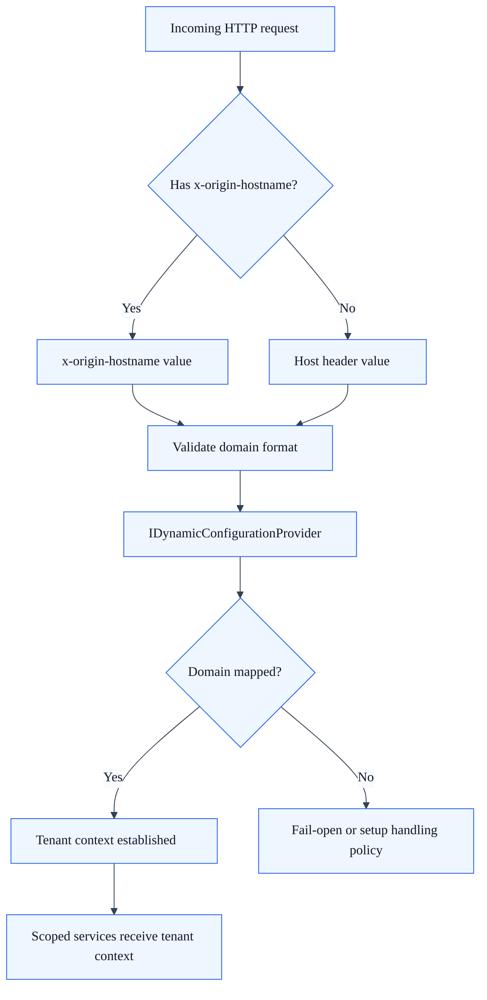
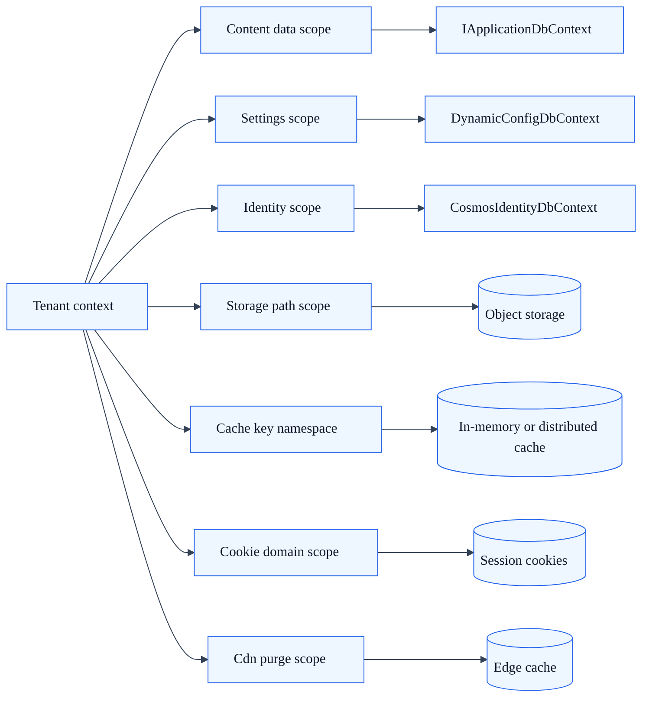

# Multi-Tenancy Deep Dive

## Summary

Detailed view of tenant resolution, isolation boundaries, and multi-tenant runtime behavior in SkyCMS.

## Purpose

Use this page to understand how SkyCMS establishes tenant context per request and how isolation is enforced across data, identity, cache, and storage.

## Tenant resolution

Tenant resolution is executed early in the middleware pipeline and determines all downstream runtime behavior.

### Tenant resolution flow

## IDynamicConfigurationProvider

`IDynamicConfigurationProvider` is the core runtime lookup component for tenant and configuration resolution.

Key responsibilities:

1. Resolve tenant from proxy-aware domain headers.
2. Load tenant-specific settings from dynamic configuration storage.
3. Provide tenant-scoped settings for database, storage, CDN, and email.
4. Cache configuration briefly for performance while preserving update responsiveness.

## DomainMiddleware behavior

`DomainMiddleware` executes before tenant-dependent handlers so that tenant context is available for all downstream services.

Behavior highlights:

1. Reads preferred header order (`x-origin-hostname`, then `Host`).
2. Uses `IDynamicConfigurationProvider` to resolve tenant mapping.
3. Stores tenant context for the current request scope.
4. Enables tenant-safe query and storage behavior by construction.

## Data isolation model

## Cookie isolation

Cookie boundaries are controlled through tenant-aware domain scoping to prevent cross-tenant session leakage.

Key points:

1. Cookie domain is derived from tenant context and claims.
2. Auth cookies are constrained to tenant domain boundaries.
3. Antiforgery behavior remains request-scoped and tenant-safe.

## Common failure modes

| Failure mode | Typical signal | Mitigation |
| --- | --- | --- |
| Missing proxy header mapping | Wrong tenant selected | Validate proxy forwarding and header precedence |
| Domain not mapped | Setup fallback or unexpected site behavior | Add domain mapping in dynamic configuration |
| Cookie scope mismatch | Cross-domain auth issues | Revalidate cookie domain strategy per tenant |
| Cache key collision | Cross-tenant stale data symptoms | Enforce tenant prefixing in cache keys |

## Related docs

- [Tenant Isolation Reference](tenant-isolation-reference.md)
- [Middleware Pipeline](middleware-pipeline.md)
- [Architecture Review Checklist](architecture-review-checklist.md)
