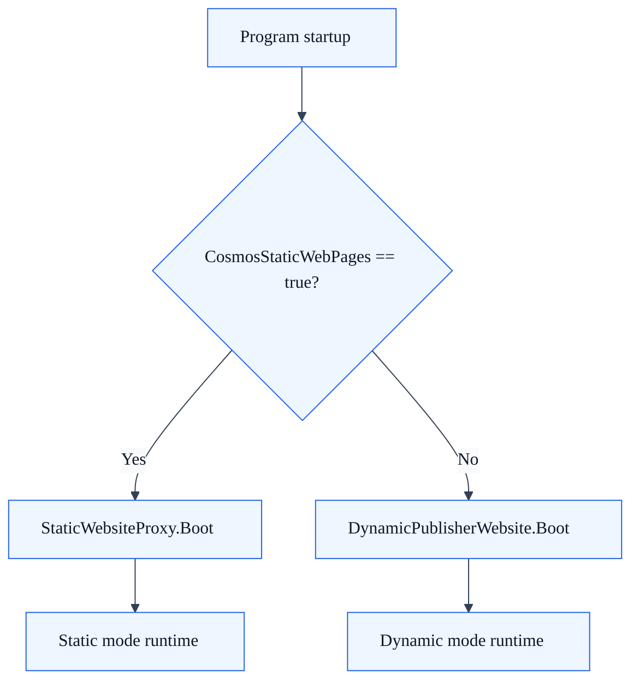
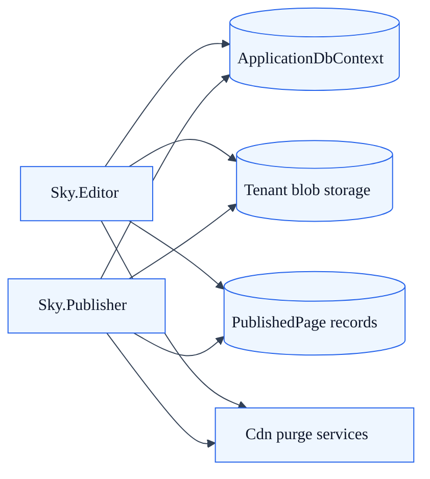

# Publisher Architecture

## Summary

Sky.Publisher is the public-facing SkyCMS component that serves published content to site visitors in either dynamic or static mode depending on deployment configuration.

## Operating Modes

The Publisher's mode is determined at startup by the `CosmosStaticWebPages` configuration key:

| Mode | Config Value | Description |
| --- | --- | --- |
| **Dynamic** | `false` (default) | Full EF integration, real-time content from the database |
| **Static** | `true` | Serves pre-generated HTML from blob storage |

### Startup Decision

```text
Program.cs
  └─ CosmosStaticWebPages == true?
       ├─ Yes → StaticWebsiteProxy.Boot()
       └─ No  → DynamicPublisherWebsite.Boot()
```



---

## Dynamic Mode

In dynamic mode, the Publisher is a full ASP.NET Core application with database access, authentication, and real-time content rendering.

### Services Registered

| Service | Purpose |
| --- | --- |
| **Core services** | Logging, configuration, DI |
| **CORS** | Cross-origin request handling |
| **Database** | EF Core with `ApplicationDbContext` (tenant-filtered) |
| **MediatR** | CQRS query dispatch |
| **Storage context** | Tenant-scoped blob storage access |
| **Rate limiting** | Abuse prevention on public endpoints |
| **JSON serialization** | API response formatting |
| **Response caching** | HTTP response cache headers |
| **Distributed cache** | Redis or in-memory (configurable) |
| **Identity** | ASP.NET Core Identity for authenticated content |
| **OAuth providers** | Google, Microsoft/Entra ID sign-in |
| **Data protection** | Cookie encryption, anti-forgery |
| **Graph integration** | Azure AD group-based authorization |
| **Forwarded headers** | Reverse proxy / load balancer support |

### How Content Is Served

1. A visitor requests a URL (e.g., `/docs/getting-started`).
2. `DomainMiddleware` resolves the tenant from the request host.
3. The controller queries `PublishedPage` via `ApplicationDbContext` (tenant-filtered).
4. The page content is rendered with its template/layout and returned.
5. Response caching headers are set for CDN and browser caching.

---

## Static Mode

In static mode, the Publisher is a lightweight proxy that serves pre-generated HTML files from blob storage. No database queries are needed for page rendering.

### StaticProxyController endpoint

The main controller in static mode handles all incoming requests:

1. **Exact path lookup** — Attempts to serve a file matching the request path from blob storage.
2. **SPA fallback** — If no file is found, checks whether the site is a Single Page Application (SPA). If so, returns `index.html` instead of 404.
3. **Caching** — Uses an in-memory cache with different TTLs:
   - `index.html`: 10-second TTL (frequent updates)
   - Other files: 5-minute TTL

### SPA Detection

The controller queries the `PublishedPage` table for entries with `ArticleType.SpaApp`. If SPA pages exist, 404 responses for non-file paths fall back to the SPA entry point.

### When to Use Static Mode

- **High-performance sites** — No server-side rendering per request.
- **Edge/CDN hosting** — Deploy static files to Cloudflare, Azure Static Web Apps, or S3.
- **Security** — No runtime database access from the public-facing tier.
- **Cost** — Minimal compute resources needed.

---

## Controllers

### PubController

Serves protected content and files through authenticated HTTP endpoints. Extends `PubControllerBase` (in Common) with publisher-specific logic.

### StaticProxyController

Serves static files from blob storage in static mode. Handles SPA fallback routing and file caching.

---

## Relationship to the Editor

The Publisher and Editor are separate applications that share:

- **Database** — Both connect to the same `ApplicationDbContext` (via connection strings from `IDynamicConfigurationProvider`).
- **Blob storage** — Both read/write to the same tenant-scoped storage containers.
- **Published pages** — The Editor writes `PublishedPage` records; the Publisher reads them.
- **Static files** — The Editor generates static HTML; the Publisher (in static mode) serves it.

The Publisher does **not** communicate with the Editor via HTTP. They are independently deployable.

## Editor and publisher shared platform model



---

## Health Checks

| Endpoint | Description |
| --- | --- |
| `/healthz` | Returns `200 OK` when the Publisher is running |

Health check paths are excluded from `DomainMiddleware` — they respond without tenant context, which is critical for container orchestrators and load balancers.

---

## Configuration

| Key | Type | Default | Description |
| --- | --- | --- | --- |
| `CosmosStaticWebPages` | bool | `false` | Enable static proxy mode |
| Authentication expiry | TimeSpan | Configurable | Session timeout for authenticated content |
| Cookie name | string | Configurable | Authentication cookie identifier |

---

## Multi-Tenancy

Both modes support multi-tenancy:

- **Dynamic mode** — Full tenant resolution via `DomainMiddleware` and `IDynamicConfigurationProvider`. Query filters isolate data per tenant.
- **Static mode** — Tenant resolution determines which blob storage container to read from. Files are served from tenant-specific paths.
- **Storage context** — Registered as scoped, retrieves tenant-specific connection strings per request.

---

## See Also

- [Publisher Rendering Flow](publisher-rendering-flow.md) — Request and rendering deep dive across static, dynamic, and hybrid authenticated static delivery
- [Tenant Isolation Reference](tenant-isolation-reference.md) — How isolation works across layers
- [Publishing Modes](../for-editors/publishing-modes.md) — Editor-side publishing workflows
- [Preload & Caching](../for-editors/preload-and-caching.md) — Cache architecture
- [EF Cross-Provider Guide](ef-cross-provider-guide.md) — Database compatibility
