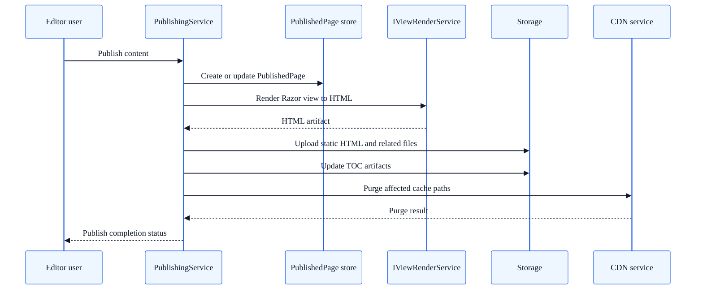

# Publisher Rendering Flow

**Audience:** Backend Developers, Platform Engineers  
**Type:** Deep Dive / Reference

This document explains how SkyCMS serves published pages across three delivery patterns:

1. Static-first delivery (pre-rendered HTML from storage)
2. Dynamic delivery (database-backed, rendered on request)
3. Hybrid authenticated static delivery (static files with dynamic auth/proxy capabilities)

It also covers how the Editor generates static HTML using `IViewRenderService`, and why blog rendering follows a specialized path.

---

## Terminology

The codebase currently has two runtime modes controlled by `CosmosStaticWebPages`:

- `true`: static proxy runtime
- `false`: dynamic publisher runtime

The third pattern is a deployment pattern rather than a startup switch. A practical term is:

- **Hybrid authenticated static delivery**

This means a dynamic-capable Publisher host serves static assets and can enforce authentication/authorization for selected paths.

---

## Startup Decision

```text
Program.cs
  └─ CosmosStaticWebPages == true?
       ├─ Yes → StaticWebsiteProxy.Boot()
       └─ No  → DynamicPublisherWebsite.Boot()
```

Static and dynamic are startup modes. Hybrid behavior is achieved in the dynamic host by serving static files through `PubController` and `PubControllerBase`, optionally with auth enabled.

---

## Flow 1: Static-First Delivery

When `CosmosStaticWebPages=true`, the Publisher uses `StaticProxyController`.

### Static-first request path

```text
GET /docs/getting-started
  → StaticProxyController.Index()
    → TryServeFileAsync(path)
      → Blob storage lookup
      → In-memory cache (10s for index.html, 5m for other files)
    → if miss: GetSpaFallbackPathAsync(path)
      → check PublishedPage for ArticleType.SpaApp
      → fallback to /{spa-root}/index.html
```

### Characteristics

- No per-request page composition from database content
- Fast edge-friendly behavior
- SPA fallback for client-routed apps
- Response content sourced from static artifacts generated during publish

---

## Flow 2: Dynamic Delivery (On-Demand Render)

When `CosmosStaticWebPages=false`, `HomeController.Index` serves pages on request.

### Dynamic request path

```text
GET /some/page
  → HomeController.Index(lang, mode)
    → GetPublishedPageByUrlQuery
    → optional authorization check (if CosmosRequiresAuthentication)
    → cache header assignment
    → render View(article) with shared Razor page
```

### Key Behaviors

- Retrieves published content via CQRS query handlers
- Includes layout (`IncludeLayout=true`) in article model
- Supports `mode=json` for JSON payload output
- Handles redirect pages (`StatusCodeEnum.Redirect`)
- Applies private cache policy for authenticated traffic, public short-lived cache otherwise

---

## Flow 3: Hybrid Authenticated Static Delivery

Hybrid behavior is provided by `PubController` (`PubControllerBase`) in the dynamic host.

### Request Path

```text
GET /pub/articles/{articleNumber}/...
  → PubControllerBase.Index()
    → SetCacheHeaders()
    → if requiresAuthentication: AuthorizeRequestAsync(path)
      → ensure authenticated user
      → for /pub/articles/{articleNumber}: AuthorizeUserForArticleQuery
    → ServeFileAsync(path)
      → in-memory cache check
      → blob storage read
      → file + ETag response
```

### Why This Matters

- Provides static artifact delivery semantics
- Adds optional identity and article-level authorization checks
- Useful when teams want static-style hosting behavior with authentication gates

This pattern is especially relevant when pure platform static hosting cannot satisfy auth or dynamic endpoint requirements.

---

## How Static HTML Is Generated (Editor Side)

Static delivery depends on Editor publishing pipelines writing HTML artifacts to storage.

### End-to-End Publish Path



```text
Editor publish action
  → PublishingService.PublishAsync(article)
    → create/update PublishedPage record
    → CreateStaticFile(page)
      → CreateStaticFileSafeAsync(page, layout, storage, viewRenderer)
        → build ArticleViewModel
        → viewRenderer.RenderToStringAsync("~/Views/Home/Index.cshtml", model)
        → upload HTML to blob storage
    → WriteTocAsync("/")
    → optional blog TOC write
    → CDN purge
```

### `IViewRenderService` Deep Dive

`ViewRenderService` renders Razor views outside a normal MVC request pipeline by constructing:

- `DefaultHttpContext` with DI-backed `RequestServices`
- `ActionContext`
- `ViewDataDictionary` + `TempDataDictionary`
- `ViewContext`

Then it executes `view.RenderAsync(viewContext)` into a `StringWriter`, returning HTML as a string for storage upload.

This is the core mechanism that turns published content plus layout data into deployable static HTML.

---

## Blog Rendering Differences

Blog content is intentionally rendered differently from generic articles.

### Blog Stream

- `BlogPublishingService.PublishBlogStreamAsync` generates a wrapper payload through `IBlogStreamRenderingService`
- Publishes through `PublishingService.PublishAsync`
- Also uploads a versioned wrapper file (`blog-stream-wrapper-{ticks}.html`) for cache-busted direct access

### Blog Post

- Built into an `ArticleViewModel` and rendered through `~/Views/Home/Index.cshtml`
- Uses blog partials in the shared Razor view:
  - `_BlogStreamPartial` for stream pages
  - `_BlogPostPartial` for post pages

### Generic Pages

- Render path uses the same top-level Razor view but outputs article body content directly via `Model.Content`

---

## Shared Razor Composition

`Sky.Shared.Razor/Views/Home/Index.cshtml` is the common rendering shell used by dynamic delivery and static artifact generation.

At a high level, output composition is:

1. `<head>` metadata + layout head + page head scripts
2. Layout header HTML
3. Body content branch:
   - blog stream partial
   - blog post partial
   - generic article content
4. Layout footer HTML + page footer scripts

This common shell keeps dynamic and static output behavior aligned.

---

## Operational Guidance

- Use **static-first** mode for maximum throughput and low runtime complexity
- Use **dynamic** mode for on-demand behavior and interactive features
- Use **hybrid authenticated static** when you need static artifacts plus protected access or custom dynamic endpoints

---

## See Also

- [Editor Rendering Flow](editor-rendering-flow.md)
- [Publisher Architecture](publisher-architecture.md)
- [Publishing Modes (Editor Guide)](../for-editors/publishing-modes.md)
- [Blog Architecture](blog-architecture.md)
