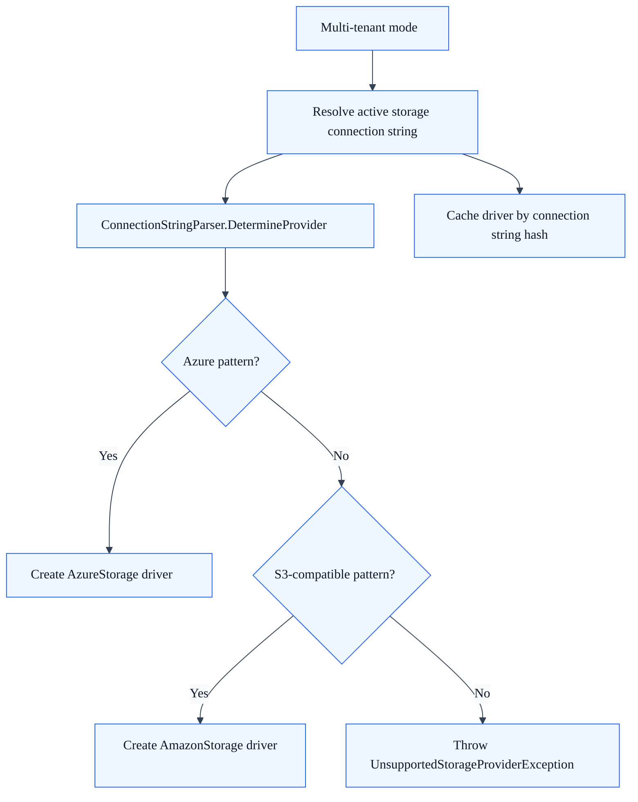

<!-- Audience: Developers -->
<!-- Type: Explanation -->
<!-- Status: Draft -->
<!-- Source: SkyCMS/Cosmos.BlobService -->

# Storage Provider Auto-Detection

## When to use this page

Use this guide when you need to understand how SkyCMS selects a blob storage driver from configuration, or when you are debugging why a tenant resolved to the wrong storage backend.

## Where detection happens

Blob storage provider selection is implemented in `Cosmos.BlobService`.

- `StorageContext` resolves the configured storage connection string.
- `StorageContext.GetDriverFromConnectionString(...)` asks `ConnectionStringParser.DetermineProvider(...)` to classify that connection string.
- `StorageContext` then creates the matching driver instance.

In single-tenant mode, this happens when `StorageContext` is created.

In multi-tenant mode, the same detection logic runs against the tenant-specific connection string returned by the dynamic configuration provider, and the resulting driver is cached per connection string.

## Configuration precedence

`StorageContext` checks configuration in this order:

1. `ConnectionStrings:StorageConnectionString`
2. `ConnectionStrings:AzureBlobStorageConnectionString`

The first non-empty value becomes the active storage connection string.

## Detection rules

Storage driver selection is pattern-based. SkyCMS does not require a separate `StorageProvider` flag for the current blob storage path.

| Pattern in connection string | Detected provider | Driver |
| --- | --- | --- |
| Starts with `DefaultEndpointsProtocol=` | Azure Blob Storage | `AzureStorage` |
| Contains `AccountId` and `Bucket` | Cloudflare R2 | `AmazonStorage` |
| Contains `Bucket` and `Region` | Amazon S3-compatible path | `AmazonStorage` |

## Provider detection flow

Google Cloud Storage is typically configured through an S3-compatible connection pattern, so it follows the same S3-compatible driver path instead of a dedicated GCS-specific runtime detector.

## Runtime flow

The detection flow is straightforward:

1. Resolve the active storage connection string from configuration.
2. Classify it with `ConnectionStringParser.DetermineProvider(...)`.
3. Create `AzureStorage` for Azure patterns.
4. Create `AmazonStorage` for S3-compatible and Cloudflare R2 patterns.
5. Throw an `UnsupportedStorageProviderException` if the connection string shape is unsupported.

For Azure Blob Storage, `StorageContext` also checks whether the connection string points at Azurite. If it does, the Azure driver is created without `DefaultAzureCredential`. Otherwise, the Azure driver can use `DefaultAzureCredential` when the connection string indicates token-based access.

## Multi-tenant behavior

In multi-tenant mode, provider selection is per tenant, not global.

- the current tenant is resolved through `IDynamicConfigurationProvider`,
- the tenant storage connection string is used to create the driver,
- the driver instance is cached using a hash of the connection string,
- different tenants can use different storage providers in the same running application.

This is why storage bugs in multi-tenant deployments should be diagnosed with the tenant-specific connection string, not only with the host application's base settings.

## Debugging sequence

When storage detection does not behave as expected, inspect these points in order:

1. Confirm which configuration key actually won: `StorageConnectionString` or `AzureBlobStorageConnectionString`.
2. Check the exact connection string shape rather than relying on provider labels in comments or environment variable names.
3. Verify that S3-compatible strings include the fields the parser actually looks for.
4. In multi-tenant mode, confirm the tenant-specific connection string returned by the dynamic configuration provider.
5. If startup fails, inspect `UnsupportedStorageProviderException` or `InvalidConnectionStringException` details.

## Tests that cover this behavior

The current selection rules are exercised by the blob storage tests in the main SkyCMS solution, especially the driver selection tests that verify Azure, S3-compatible, and R2 connection-string patterns.

When changing detection behavior, add or update tests for:

- valid provider patterns,
- ambiguous patterns,
- unsupported strings,
- multi-tenant driver reuse and isolation.

## Related guides

- [Storage Overview](../configuration/storage/overview.md)
- [Storage Configuration Reference](../configuration/storage/configuration-reference.md)
- [Content Delivery Architecture](./content-delivery-architecture.md)
- [Tenant Isolation Reference](./tenant-isolation-reference.md)
