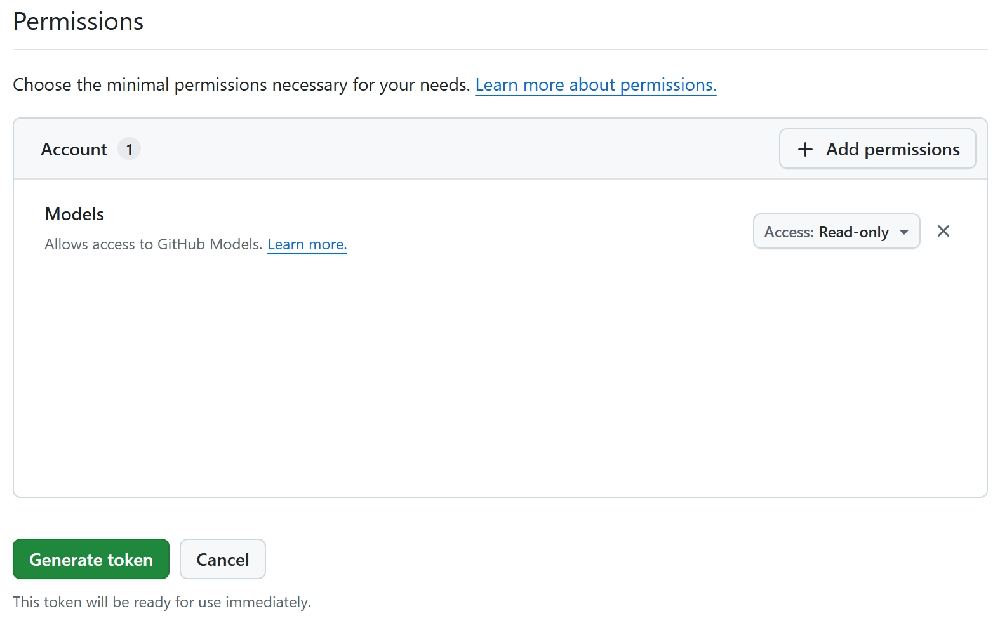

# AI Troubleshooting

## Summary

Use this reference to triage AI availability, status endpoint failures, model catalog issues, and response-quality problems in Monaco, CKEditor, and AI Help Chat.

## "AI unavailable" in the editor

SkyCMS AI can appear unavailable in Monaco, CKEditor, or AI Help Chat when any of the following is true:

| Condition | What to check |
| --- | --- |
| **Enabled is off** | Settings -> AI Provider: toggle **Enabled** on and save. |
| **Endpoint is empty** | Settings -> AI Provider: enter a valid chat completions endpoint. |
| **Access Token is empty** | Settings -> AI Provider: enter a valid provider key or token. |
| **Status endpoint returned an error** | See [Diagnosing status endpoint errors](#diagnosing-status-endpoint-errors). |
| **All retries failed** | The server was unreachable during page load; see [Retry behavior](#retry-behavior). |

---

## The status endpoint

The server exposes a lightweight status check at:

```text
GET /api/ai-proxy/status
```

Requires an authenticated session (same roles as the code editor: Reviewers, Administrators, Editors, Authors).

### Example response — fully configured

```json
{
  "enabled": true,
  "configured": true,
  "endpointConfigured": true,
  "model": "gpt-4o-mini"
}
```

- `enabled` — reflects the **Enabled** toggle in settings.
- `configured` — `true` when both endpoint and access token are non-empty.
- `endpointConfigured` — `true` when the endpoint field is non-empty.
- `model` — the resolved model.

The current response can also include richer AI metadata such as provider display name, configured model, effective model, discovery state, default selection label, and selected per-user model.

### Example response — disabled

```json
{
  "enabled": false,
  "configured": false,
  "endpointConfigured": false,
  "model": "gpt-4o-mini"
}
```

You can call this endpoint manually from a browser DevTools console or cURL to verify the current server-side state:

```bash
curl -b "<session-cookie>" https://<your-domain>/api/ai-proxy/status
```

---

## The model catalog endpoint

If model selection is expected but the picker is empty, test:

```text
GET /api/ai-proxy/models
```

The response tells you whether SkyCMS loaded a live catalog, inferred a deployment, or could not discover models for the configured provider.

---

## Retry behavior

When the editor page loads, the client calls the AI status endpoint with automatic retry on failure:

| Parameter | Default |
| --- | --- |
| Attempts | 3 |
| Initial delay | 250 ms |
| Backoff multiplier | ×2 (250 → 500 → 1 000 ms) |
| Jitter | ±30% of each delay |

Jitter randomizes the exact timing of each retry across concurrent clients to avoid synchronized spikes during server cold-start. After three consecutive failures, the editor settles on **unavailable** and does not retry again until the page is reloaded.

If your server regularly takes more than a few seconds to warm up, increase the retry count or initial delay in the integration options.

---

## Diagnosing status endpoint errors

### 401 Unauthorized

The request session is not authenticated. Users must be signed in with an appropriate role (Reviewers, Administrators, Editors, or Authors).

### 401 or authentication failures with GitHub Models

If you are using a fine-grained GitHub token and authentication fails, verify token permissions:



*Caption: For SkyCMS AI via GitHub Models, set only **Account -> Models** to **Read-only**. Do not add Copilot Chat or other Copilot-specific permissions for this integration.*

### 429 Too Many Requests

The rate limiter (`copilot-inline` policy) is enforcing per-client limits. Default: 60 requests/minute in production. This is not expected during normal use (status is called once per page load). If you are seeing this during testing, reduce the frequency of manual status polls.

### 502 / 503 / 504 from the AI endpoints

These errors originate at the upstream provider (not SkyCMS). They appear in the browser console when a completion request is made, not during the status check.

| Code | Meaning |
| --- | --- |
| 502 Bad Gateway | SkyCMS received a malformed response from the upstream endpoint. |
| 503 Service Unavailable | The upstream endpoint is temporarily unavailable. |
| 504 Gateway Timeout | SkyCMS did not receive a response within `TimeoutMs`. |

For 504 errors, try increasing `TimeoutMs` in AI Provider settings. For persistent 502 / 503 errors, verify the endpoint URL and that your account has access to the requested model.

### "Model not found" errors

If the upstream provider returns a model-not-found error, check:

1. The **Model** field in settings matches a model your endpoint supports.
2. If you are using `auto`, the resolved default is `gpt-4o-mini` — confirm your provider supports this model.
3. For Azure OpenAI, the effective model is typically the **deployment name**, not the raw model family name.

### Model picker is disabled or empty

Check the provider discovery behavior:

- GitHub Models and OpenAI should support live catalogs.
- Azure OpenAI currently uses inferred deployment behavior in SkyCMS.
- Local and custom gateways often require manual model entry.

If needed, reload models from **Settings -> AI Provider** first, then refresh the editor.

---

## Response quality issues

### Suggestions are off-topic or low quality

- Lower **Temperature** (towards `0.0` – `0.2`) for more focused code completions.
- Ensure the correct **language mode** is active in the editor (visible in the status bar). The editor passes the language identifier to the model as context.
- If the provider supports model selection, try a stronger model in the editor picker.

### Suggestions are cut off

Increase **Max Tokens**. The default (160) is suitable for single-line and short multi-line completions. For larger snippet completions, try 256 – 512.

### Suggestions are slow to appear

- Check **Timeout (ms)**: if completions arrive just before the timeout, the upstream model may be under load. Increasing `TimeoutMs` allows the server to wait longer before giving up.
- Review network latency between your SkyCMS server and the upstream endpoint. Requests flow: Editor client → SkyCMS server → upstream provider.

### AI Help Chat answers are too generic

- Use **This site** mode when you want site-aware answers.
- Provide the concrete page path or editor task in your prompt.
- If the provider supports model selection, try a higher-quality model for Help Chat.

---

## Related guides

Start with [AI Configuration Overview](../configuration/ai/overview.md) if the issue may be tenant setup rather than editor behavior. For editor-specific guidance, see [Code Editor Basics](./code-editor.md), [AI Assistant](./ai-assistant.md), and [AI Provider Setup](./ai-provider-setup.md).

## Verification

Troubleshooting is complete when status and model endpoints return expected results, editor AI features are available for authorized users, and completion or chat requests succeed with acceptable quality and latency.
