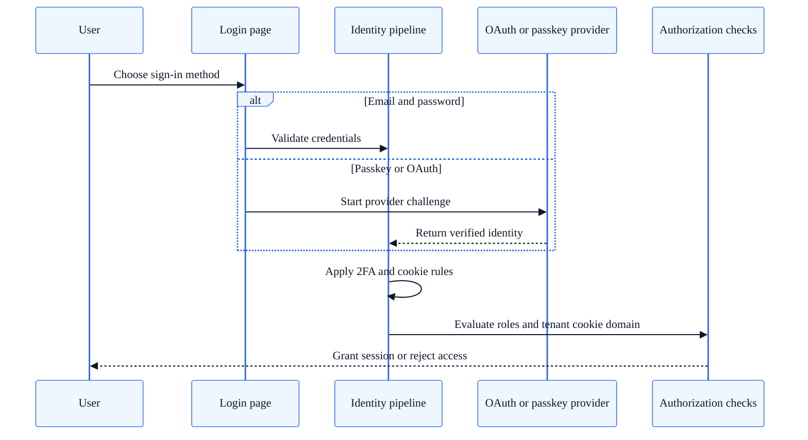

# Authentication & SSO

SkyCMS supports multiple authentication methods — from standard email/password accounts to passwordless passkeys, two-factor authentication, and enterprise SSO with Microsoft Entra ID and Google.

**Audience:** Administrators, Developers

---

## Authentication Methods

### Email & Password

The default authentication method. Users register with an email address and password.

- Email confirmation is required before login (`RequireConfirmedAccount = true`).
- Password reset is available via email.
- Session cookies expire after 1 hour of inactivity (configurable).

### Passkeys (FIDO2 / WebAuthn)

SkyCMS supports passwordless authentication via FIDO2-compatible security keys and platform authenticators (fingerprint, face recognition).

#### Configuration

Passkey behavior is configured in `Program.cs`:

| Setting | Default | Description |
| --- | --- | --- |
| **AuthenticatorTimeout** | 3 minutes | Time limit for the user to complete the passkey challenge |
| **ChallengeSize** | 64 bytes | Cryptographic challenge size |
| **ServerDomain** | Auto-detected | Relying Party (RP) identifier. In single-tenant mode, can be set via `CosmosPasskeyServerDomain` config key. In multi-tenant mode, derived per request from the tenant domain. |

## Authentication flow map



### User Actions

- Users can register passkeys from their account management page.
- Multiple passkeys can be registered per account.
- Passkeys can be removed individually.
- Works across all supported database providers (SQL Server, MySQL, SQLite, Cosmos DB).

### Two-Factor Authentication (2FA)

TOTP-based second factor using authenticator apps (Google Authenticator, Microsoft Authenticator, Authy, etc.).

#### Setup Flow

1. User navigates to **Account → Two-Factor Authentication**.
2. The system displays a QR code and shared key.
3. User scans the QR code with their authenticator app.
4. User enters the 6-digit verification code to confirm.
5. The system generates **10 recovery codes** — user should store these securely.

#### Technical Details

- TOTP format: `otpauth://totp/{issuer}:{email}?secret={key}&issuer={issuer}&digits=6`
- Code format: 6 digits (spaces and hyphens are stripped during validation)
- Recovery codes: One-time use, 10 generated on first 2FA setup

---

## OAuth / SSO Providers

### Google Sign-In

Enable Google authentication by adding these settings to `appsettings.json` or environment variables:

```json
{
  "GoogleOAuth": {
    "ClientId": "your-google-client-id.apps.googleusercontent.com",
    "ClientSecret": "your-google-client-secret"
  }
}
```

The provider is automatically registered when both values are present. Users see a "Sign in with Google" button on the login page.

### Microsoft Account / Entra ID

Enable Microsoft authentication:

```json
{
  "MicrosoftOAuth": {
    "ClientId": "your-azure-app-client-id",
    "ClientSecret": "your-client-secret",
    "TenantId": "your-tenant-id",
    "CallbackDomain": "https://your-site.com"
  }
}
```

| Field | Description |
| --- | --- |
| **ClientId** | Azure App Registration application (client) ID |
| **ClientSecret** | Client secret from the app registration |
| **TenantId** | Azure AD tenant ID. Use `common` for multi-tenant apps. |
| **CallbackDomain** | The domain for OAuth redirect URLs. Required when behind a reverse proxy or CDN. |

The provider uses standard OAuth 2.0 endpoints:

- Authorization: `https://login.microsoftonline.com/{tenantId}/oauth2/v2.0/authorize`
- Token: `https://login.microsoftonline.com/{tenantId}/oauth2/v2.0/token`

### Microsoft Graph Integration

When using Entra ID, SkyCMS can authorize users based on Azure AD group membership:

- `MsGraphClaimsTransformation` enriches user claims with group information.
- `GroupAuthorizationRequirement` enforces group-based access policies.
- `HandlerUsingAzureGroups` is the authorization handler that checks group membership.

Configure the required groups in your application settings.

---

## Cookie Configuration

| Cookie | Purpose | Expiration |
| --- | --- | --- |
| **Application** | Primary session cookie | 1 hour idle timeout (configurable) |
| **External** | Temporary cookie during external OAuth flow | Short-lived |
| **TwoFactorRememberMe** | Persists 2FA approval across sessions | Browser session |
| **TwoFactorUserId** | Holds partial login state during 2FA verification | Short-lived |

### Multi-Tenant Cookie Isolation

In multi-tenant deployments, the `CookieDomain` claim in the user's identity controls cookie scoping. This prevents session leakage between tenants sharing the same application. See [Multi-Tenancy Configuration](../configuration/multi-tenancy.md) for details.

---

## Configuration Reference

### Environment Variables

| Variable | Purpose |
| --- | --- |
| `GoogleOAuth__ClientId` | Google OAuth client ID |
| `GoogleOAuth__ClientSecret` | Google OAuth client secret |
| `MicrosoftOAuth__ClientId` | Microsoft/Entra ID client ID |
| `MicrosoftOAuth__ClientSecret` | Microsoft/Entra ID client secret |
| `MicrosoftOAuth__TenantId` | Azure AD tenant ID |
| `MicrosoftOAuth__CallbackDomain` | OAuth callback domain |
| `CosmosPasskeyServerDomain` | Passkey relying party domain (single-tenant only) |

### Identity Pages

User-facing identity pages (login, register, manage account, 2FA setup) are provided by ASP.NET Core Identity default UI under the `/Identity/Account/` path. These pages are customizable via the standard ASP.NET Core Identity scaffolding approach.

---

## See Also

- [Roles & Permissions](../for-developers/roles-and-permissions.md) — Authorization model
- [User Management](user-management.md) — Admin user management guide
- [Multi-Tenancy Configuration](../configuration/multi-tenancy.md) — Cookie isolation and tenant setup
- [Multi-Tenancy Deep Dive](../for-developers/multi-tenancy-deep-dive.md) — Technical multi-tenant architecture
