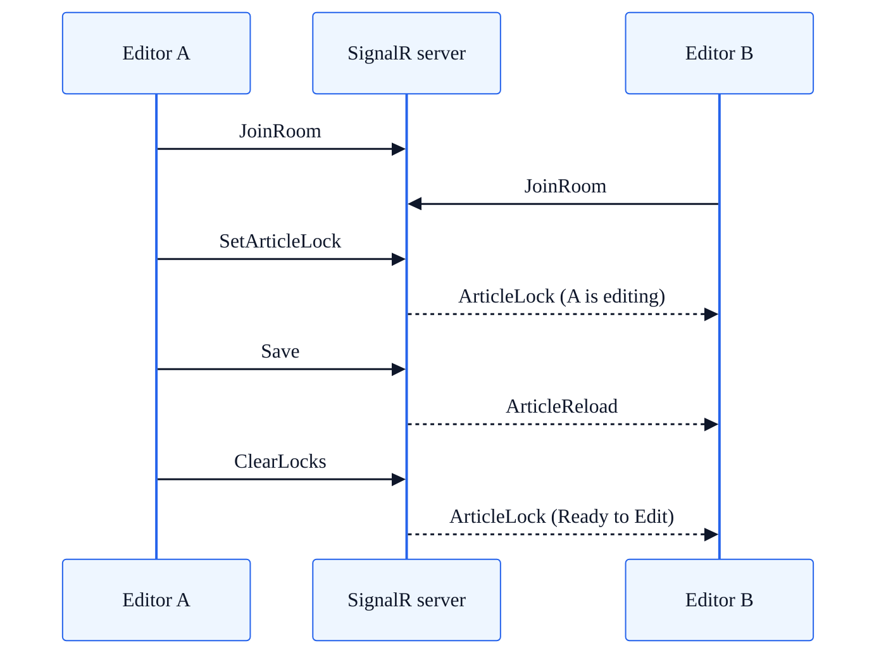

# Real-Time Collaborative Editing

SkyCMS provides a real-time multi-user editing environment built on ASP.NET Core SignalR. The system uses **exclusive article locking** — one user edits at a time while other editors see live status updates and receive automatic content reloads when changes are saved.

**Audience:** Developers, Editors

---

## How It Works



### Editing Model

This is a **lock-based exclusive editing model**, not simultaneous collaborative editing (like Google Docs). Only the lock holder can save changes. Other editors receive notifications and content reloads but cannot modify the article until the lock is released.

---

## SignalR Hubs

### LiveEditorHub

**Endpoint:** `/___cwps_hubs_live_editor`

Handles real-time content broadcasting between editors viewing the same article.

| Method | Direction | Purpose |
| --- | --- | --- |
| `JoinArticleGroup(articleNumber)` | Client → Server | Join an article-specific SignalR group |
| `Notification(data)` | Client → Server | Broadcast commands (`join`, `save`, `SavePageProperties`) |
| `UpdateEditors(editorId, data)` | Client → Server | Send content updates to other editors in the group |
| `broadcastMessage` | Server → Client | Encrypted content update payload |
| `updateEditors` | Server → Client | Decrypted HTML for a specific editor region |

Groups are formed by article number: `Article:{articleNumber}`. Content payloads pass through `CryptoJsDecryption.Decrypt()` before broadcasting.

### ChatHub

**Endpoint:** `/chat` (defined but not currently mapped in `Program.cs`)

Handles article locking, presence tracking, and in-editor chat messaging. Requires `[Authorize]`.

| Method | Direction | Purpose |
| --- | --- | --- |
| `JoinRoom(id, editorType)` | Client → Server | Join editing room for an article |
| `SetArticleLock(id, editorType)` | Client → Server | Acquire exclusive edit lock |
| `ClearLocks(id)` | Client → Server | Release locks for article/connection |
| `AbandonEdits(id, editorType)` | Client → Server | Discard changes and release locks |
| `ArticleSaved(id, editorType)` | Client → Server | Notify that content was saved |
| `Send(sender, message)` | Client → Server | Send chat message |
| `SendTyping(sender)` | Client → Server | Broadcast typing indicator |
| `StopTyping(sender)` | Client → Server | Clear typing indicator |
| `ArticleLock` | Server → Client | Lock state update (who holds the lock) |
| `ArticleReload` | Server → Client | Full content reload after save |
| `broadcastMessage` | Server → Client | Chat message |
| `typing` / `stoptyping` | Server → Client | Typing presence indicators |

> **Note:** The ChatHub is defined in code but its endpoint is not currently registered in `Program.cs`. The client-side code references `/chat`, suggesting this feature may be in development or temporarily disabled.

### PublishingProgressHub

**Endpoint:** `/hubs/publishing-progress`

Covered separately in [Publishing Progress](publishing-progress.md). Tracks bulk publish operations via `ReceiveProgress` events.

---

## Article Locking

### Lock Model

Each lock is stored in the `ArticleLocks` database table:

| Field | Type | Description |
| --- | --- | --- |
| `Id` | Guid | Lock record primary key |
| `ArticleId` | Guid | The article's database record ID |
| `UserEmail` | string | Email of the lock holder |
| `ConnectionId` | string | SignalR connection ID |
| `LockSetDateTime` | DateTimeOffset | When the lock was acquired (UTC) |
| `EditorType` | string | Editor context (see below) |
| `FilePath` | string | File path (for file editor locks) |

### Editor Types

| EditorType | Context |
| --- | --- |
| `ArticleEditor` | Standard article content editing |
| `FileEditor` | File/code editing (loads from blob storage) |
| `LayoutEditor` | Layout template editing |
| `TemplateEditor` | Page template editing |

### Lock Lifecycle

1. **Acquisition** — Client calls `SetArticleLock`. Server checks for existing lock on the article. If none exists, creates a lock record and broadcasts `ArticleLock` to the group.
2. **Hold** — Lock persists while the user edits. Only the lock holder can save.
3. **Release** — Lock is released when:
   - User explicitly calls `ClearLocks()` or `AbandonEdits()`
   - User's SignalR connection disconnects (`OnDisconnectedAsync` auto-clears)
   - User saves and the save handler clears locks
4. **No timeout** — Locks persist indefinitely until explicitly released or the connection drops. There is no automatic time-based expiry.

### Lock Enforcement in the UI

| Lock State | Button Color | Label | Behavior |
| --- | --- | --- | --- |
| Current user holds lock | Green | "Edit Mode" | Full editing enabled |
| Another user holds lock | Red | "{email} is editing" | Read-only view |
| No lock | Gray | "Ready to Edit" | Click to acquire lock |

---

## Presence Indicators

### Editing Status

The lock state doubles as a presence indicator. All editors viewing the same article see who currently holds the lock via the `ArticleLock` server-to-client event.

### Typing Indicators

When an editor types in the chat panel:

1. Client calls `SendTyping(user)` → server broadcasts `typing` event to the group
2. A tooltip appears showing who is typing (`.ccms-typing-indicator`)
3. After 2 seconds of inactivity, `StopTyping(user)` broadcasts `stoptyping`

---

## Client-Side Integration

### Connection Setup

```javascript
window.ccsmsChatHub = new signalR.HubConnectionBuilder()
    .withUrl('/chat')
    .withAutomaticReconnect([0, 2000, 5000, 10000, 15000, 30000])
    .build();
```

Automatic reconnect uses progressive backoff: immediate, 2s, 5s, 10s, 15s, 30s.

### Signal Dispatch

All hub invocations go through a central dispatcher:

```javascript
async function ccmsSendSignal(method) {
    var id = $("#Id").val();
    // editorType defaults to "ArticleEditor"
    await ccsmsChatHub.invoke(method, id, editorType);
}
```

### Content Reload Flow

When a save occurs:

1. `EditorController` saves the content to the database
2. Server sends `UpdateEditors` via `LiveEditorHub` to all clients
3. Server sends `ArticleReload` via `ChatHub` to observers
4. Client calls `ccmsLoadModel(model)` to replace editor content:

```javascript
function cosmosSignalUpdateEditor(data) {
    let iframe = document.getElementById("ccmsContFrame");
    let editors = iframe.contentWindow.ccms_editors;
    $(editors).each(function (index, editor) {
        const editorId = editor.sourceElement.getAttribute("data-ccms-ceid");
        if (editorId === data.EditorId) {
            editor.setData(data.Payload);
        }
    });
}
```

---

## Multi-Tenant Isolation

SignalR connections are tenant-isolated via a custom `IUserIdProvider`:

```csharp
public class SubClaimUserIdProvider : IUserIdProvider
{
    public string GetUserId(HubConnectionContext connection)
    {
        return connection.User?.Claims
            .FirstOrDefault(c => c.Type == "sub")?.Value;
    }
}
```

This maps each connection to the user's `sub` claim, ensuring that lock records and group messages stay within the correct tenant context.

### SignalR Configuration

```csharp
builder.Services.AddSignalR(options =>
{
    options.EnableDetailedErrors = builder.Environment.IsDevelopment();
    options.MaximumReceiveMessageSize = 102400; // 100 KB
    options.StreamBufferCapacity = 10;
});
```

---

## Limitations

| Limitation | Details |
| --- | --- |
| **No simultaneous editing** | Only one user can edit at a time (lock-based, not CRDT/OT) |
| **No lock timeout** | Locks persist until release or disconnect — a stuck connection could block editing |
| **ChatHub not mapped** | The `/chat` endpoint is not currently registered in `Program.cs` |
| **No conflict resolution** | System relies entirely on locks; no merge or diff-based conflict handling |
| **Message size limit** | 100 KB max per SignalR message |

---

## See Also

- [Publishing Progress](publishing-progress.md) — SignalR-based bulk publish tracking
- [Publisher Architecture](../for-developers/publisher-architecture.md) — How content flows from editor to published site
- [Tenant Isolation Reference](../for-developers/tenant-isolation-reference.md) — Multi-tenant isolation patterns
