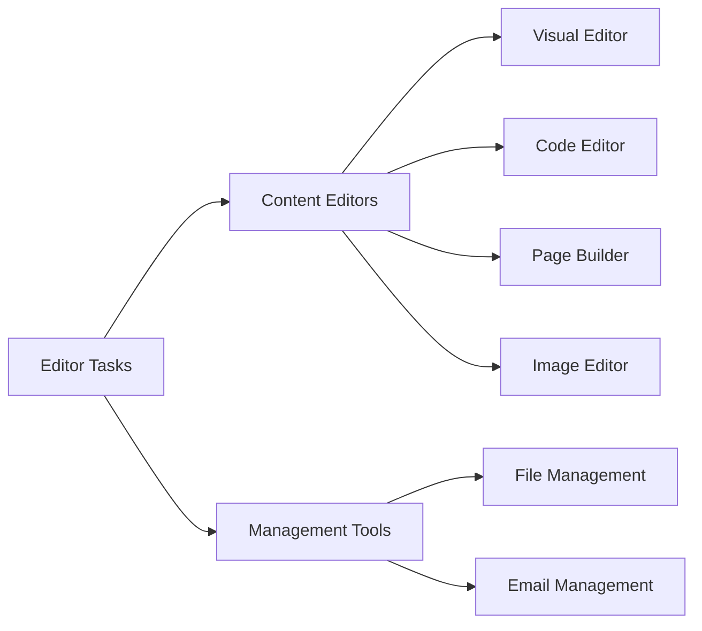

# Editor Feature Catalog

Use this page when you want a concrete list of what tools exist in SkyCMS and where to find task-ready guidance.

## Content Editors

- [Content Editors overview](./content-editors.md)
- [Visual Editor](./visual-editor.md)
- [Code Editor](./code-editor.md)
- [Page Builder](./page-builder.md)
- [Image Editor](./image-editor.md)

## Management Tools

- [File Management](./file-management.md)
- [Email Management](./email-management.md)

## Governance and Integration

- [Canonical Content Model](./canonical-content-model.md)
- [Editor Help Route Map](./editor-help-route-map.md)

## Quick Tool Map

## How to Use This Catalog

1. Start with the tool name that matches your task.
2. Open that tool page to see when to use it and what each control does.
3. Follow a step-by-step workflow from the "Common Tasks" section.
4. Use the linked deep references when you need advanced detail.
