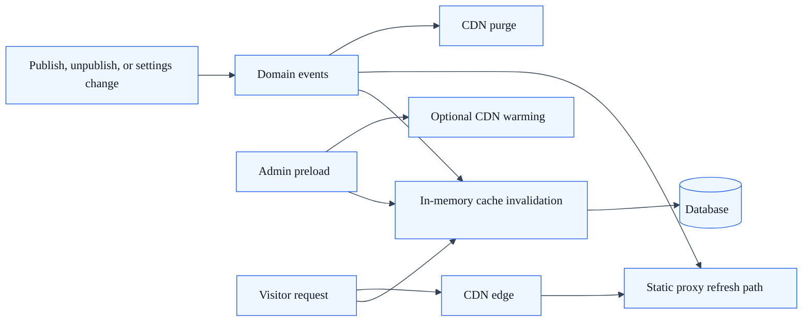

# Preload and caching

## Summary

SkyCMS includes a multi-layer caching system and an admin-only preload function for warming caches. This ensures fast page delivery while keeping content fresh.

---

## Cache architecture

SkyCMS uses several caching layers, each serving a different purpose:

### In-memory cache

The primary cache is an in-memory cache (`ICacheService<T>`) that stores frequently accessed data to avoid repeated database queries.

**Cached data includes:**

| Cache Key | Data | Invalidated By |
| --- | --- | --- |
| `ArticleRedirects` | All redirect mappings | `RedirectCreatedEvent` |
| `ArticleCatalog` | Site navigation catalog | `CatalogEntryUpdatedEvent`, `CatalogEntryDeletedEvent` |
| `SiteMap` | XML sitemap | `ArticlePublishedEvent`, `ArticleUnpublishedEvent` |
| Layouts | Page layout templates | `LayoutPublishedEvent` |
| AI provider options | AI assistant config per tenant | Settings update (30-second TTL) |

## Cache layers and invalidation flow

### Cache operations

The cache service supports:

- **Get/TryGet** — Retrieve cached values by key.
- **Set** — Store values with absolute or sliding expiration.
- **Remove** — Invalidate a specific cache entry.
- **Clear** — Flush all cached data.

### CDN cache

When a CDN is configured (Cloudflare, Azure CDN, CloudFront, or Sucuri), published content is also cached at the edge:

- CDN cache is purged automatically on publish and unpublish.
- Bulk static page generation triggers a full CDN purge.
- CDN configuration is per-tenant.

---

## Cache invalidation

Caches are invalidated automatically through domain events:

| Event | Caches Cleared |
| --- | --- |
| `ArticlePublishedEvent` | Redirects, Catalog, SiteMap |
| `ArticleUnpublishedEvent` | Redirects, Catalog, SiteMap |
| `LayoutPublishedEvent` | Layouts, Catalog |
| `CatalogEntryUpdatedEvent` | Catalog, SiteMap |
| `CatalogEntryDeletedEvent` | Catalog, SiteMap |
| `RedirectCreatedEvent` | Redirects |

The `CacheInvalidationHandler` listens for these events and removes the affected cache entries. This ensures the cache stays consistent without manual intervention.

---

## Preload (cache warming)

Administrators can proactively warm caches to prevent cold-start delays after deployments or cache flushes.

### Using preload

1. Navigate to **Preload** in the admin menu (or go to `/Editor/Preload`).
2. The preload view shows:
   - **PreloadCdn** — Whether to also warm the CDN cache (default: enabled).
   - **PageCount** — Number of cache objects that will be created.
   - **EditorCount** — Number of editors involved.
3. Trigger the preload operation.

**Access:** Administrators only.

### What preload does

- Regenerates cached content for all published pages.
- Optionally pre-fetches content through the CDN to warm edge caches.
- Rebuilds the navigation catalog and sitemap caches.

---

## Static file delivery

The Publisher component serves static files from blob storage with intelligent caching:

- **Static proxy** — The `StaticProxyController` serves pre-generated HTML files from blob storage.
- **SPA fallback** — For single-page application deployments, the proxy falls back to `index.html` for unmatched routes.
- **Cache keys** — The `ICacheKeyProvider` generates consistent cache keys based on host and path, enabling response-level caching.

---

## Multi-tenancy

- Cache keys include the tenant domain to prevent data leakage between tenants.
- Each tenant has an isolated cache namespace.
- CDN purge operations target only the affected tenant's content.
- AI provider configuration caches use tenant-specific keys with a 30-second TTL.

---

## Performance tips

1. **Enable static pages** for production sites — static HTML served from blob storage is significantly faster than server-rendered content.
2. **Configure a CDN** to cache content at edge locations close to your users.
3. **Run Preload after deployments** to avoid cold-start latency for the first visitors.
4. **Monitor cache hit rates** using structured logging to identify frequently missed cache entries.

---

## See also

- [Publishing Modes](publishing-modes.md) — Static site generation workflow
- [Site Settings](site-settings.md) — CDN configuration
- [Audit & Logging](../for-developers/audit-logging.md) — Cache invalidation events
