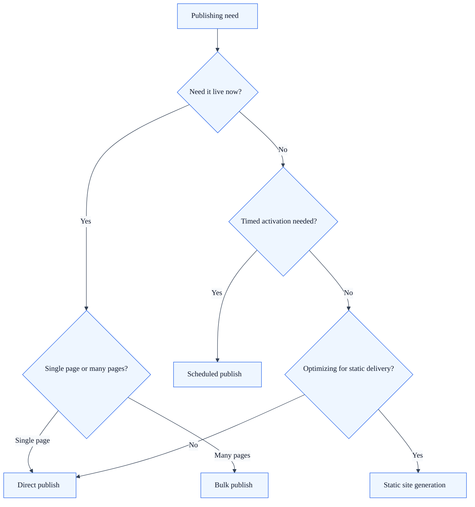

# Publishing Modes

## Summary

SkyCMS supports multiple publishing workflows, from immediate single-page publishing to bulk static generation.

If you are new to SkyCMS, use this page to pick the safest mode for your release goal.

## Outcome

After using this guide, you should be able to choose the right publishing mode for a release, understand its operational effects, and avoid using a broader-impact workflow than the change requires.

## Overview

| Mode | Description | Best For |
| --- | --- | --- |
| **Direct publish** | Publish a single page immediately | Blog posts, quick updates |
| **Scheduled publish** | Set a future date for automatic activation | Embargoed content, campaigns |
| **Static site generation** | Generate HTML files and upload to blob storage | High-performance sites, CDN delivery |
| **Bulk publish** | Publish multiple pages simultaneously with progress tracking | Site-wide template changes, migrations |

## Choosing a publishing mode

Use this quick decision logic:

- Need one page live immediately: Direct publish.
- Need content live at a specific future time: Scheduled publish.
- Need high-performance static output: Static site generation.
- Need many pages updated together: Bulk publish.

## Direct publishing

The simplest workflow — publish a single page immediately.

1. Open the page in the editor.
2. Click **Publish** (or navigate to the publish dialog).
3. The page is immediately available on the live site.

### What happens behind the scenes

1. The article's `Published` timestamp is set to now.
2. Any previously published version of the same page is unpublished.
3. A `PublishedPage` snapshot is created (a read-optimized copy for the live site).
4. If static pages are enabled, an HTML file is generated and uploaded to blob storage.
5. The table of contents (TOC) is regenerated.
6. If the page is a blog post, the blog TOC is also updated.
7. The CDN cache is purged for the page's URL.

## Scheduled publishing

Set a future date and time to publish content automatically.

1. Open the publish dialog for the page.
2. Select a **publish date/time** (UTC).
3. Confirm. The page will become live when the scheduled time arrives.

You can also set an **expiration date** to automatically retire content after a certain date.

## Static site generation

For performance-critical sites, SkyCMS can generate static HTML files that are served directly from blob storage or a CDN — no server-side rendering required for each visitor request.

### Enabling static pages

Static page generation is enabled at the site/tenant level. When enabled:

- Each publish operation also generates a static HTML file.
- Files are uploaded to the configured blob storage container.
- A `toc.json` file is generated with the site's table of contents.
- The Publisher component serves these static files.

### Bulk static generation

Administrators can regenerate static pages in bulk:

1. Navigate to the publish interface.
2. Select pages to regenerate (or leave empty to regenerate all published pages).
3. Click **Publish Static Pages**.
4. Progress is tracked in real-time via SignalR (see [Publishing Progress](#publishing-progress) below).

After bulk generation completes, a full CDN purge is triggered to ensure visitors see the latest content.

### Table of contents (TOC)

The TOC is a JSON file (`toc.json`) that represents the site's navigation structure:

- Generated automatically on every publish/unpublish operation.
- Includes hierarchical parent-child relationships between pages.
- Uploaded to blob storage at `/toc.json` or `/pub/---toc/{prefix}/toc.json`.
- Only generated when static pages are enabled.

## Unpublishing

To remove a page from the live site:

1. Open the page in the editor.
2. Click **Unpublish** (or navigate to `/Editor/UnpublishPage/{articleNumber}`).

### What happens

1. The article's `Published` field is cleared.
2. The `PublishedPage` record is removed (redirect entries are preserved).
3. The static HTML file is deleted from blob storage.
4. The CDN cache is purged for each affected URL.
5. The TOC is regenerated.

## Template publishing

Templates (page designs) have their own versioning and publishing workflow:

1. Edit a template and save changes (creates a new template version).
2. Publish the template version.
3. On publish, the system automatically:
   - Updates the template's published content.
   - Creates new article versions for **all pages using this template**.
   - Republishes any previously published articles with the new template.
   - Creates a new draft version of the template for the next edit cycle.

> **Important:** Publishing a template triggers changes to every page that uses it. This is a high-impact operation — review template changes carefully before publishing.

For first-time users, test template updates on one representative page before broad rollout.

## Publishing progress

Bulk operations report progress in real-time via SignalR:

- A progress indicator shows the current page being processed.
- The total count and completed count are displayed.
- A completion notification appears when all pages are processed.

This feature requires the SignalR `PublishingProgressHub` connection (established automatically when you open the publish interface).

**Access:** Editors and Administrators only.

## Multi-tenancy

All publishing operations are scoped to the current tenant:

- Static files are uploaded to tenant-specific blob paths.
- CDN purge operations target the tenant's configured CDN.
- TOC generation includes only the current tenant's published articles.
- The `PublishedPage` table is filtered by tenant domain.

## Verification

This guide is working when you can explain why one publishing mode is safer or faster for a given release, run that mode intentionally, and anticipate the downstream effects on static output, cache state, and related pages.

## Related guides

- [Visual Editor Quick Start](visual-editor-quickstart.md)
- [Page Builder Quick Start](page-builder-quickstart.md)
- [Version History](version-history.md) — How versions relate to publishing
- [Preload & Caching](preload-and-caching.md) — Cache warming and CDN pre-loading
- [URL Management](url-management.md) — How redirects interact with publishing
- [Blog Architecture](../for-developers/blog-architecture.md) — Blog-specific publishing details
