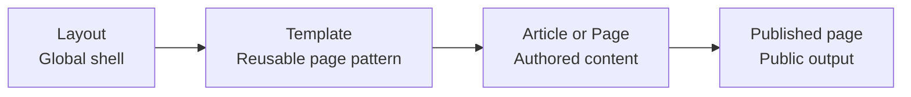

# Layouts

## Summary

Use layouts to define site-wide structure shared by all pages, such as header, footer, and navigation.

If you are new to SkyCMS, decide first what belongs globally in a layout and what belongs in templates.

## Terminology note

Layouts are the site-wide shell in the canonical model:

```text
Layout -> Template (optional) -> Article -> Published Page
```

For complete definitions of these terms, see [Key Concepts](../getting-started/key-concepts.md).

Use **layout** for shared site structure, **template** for reusable article structure, and **article** for authored content.

Use this guide to create and manage consistent page structure across templates and pages, including the header, footer, navigation, spacing, and typography foundations.

Layouts are intentionally framework-agnostic. You can build them with Bootstrap, Tailwind, Materialize, Metro, your own design system, or no framework at all. The goal is to give site builders, designers, and developers the flexibility to choose the approach that best fits the project.

## When to use this guide

Use this guide when you need to:

- establish or evolve site-wide visual structure,
- publish a new default layout version,
- troubleshoot layout-level rendering behavior across many pages.

## What a layout is

A layout is the site-wide shell that wraps rendered pages. In SkyCMS, layout sections typically map to:

- Head content: injected into the HTML `head` tag.
- Header content: shared top-of-page structure.
- Footer content: shared bottom-of-page structure.

Page and template content render inside that shared structure, between the header and footer.

## Getting started

Most first-time layout work follows one of two paths:

- Choose a pre-built layout: fastest path for teams that want a polished baseline.
- Build a custom layout: best when you need full brand-specific control from the start.

Recommended approach:

1. Start with a pre-built layout if your team is moving quickly.
2. Establish design tokens and navigation rules.
3. Create a custom variant only when your requirements exceed the starter design.

## Quick workflow

Use this sequence when creating or revising a production layout:

1. Define layout goals and constraints.
2. Map shared regions (head, header, main, footer).
3. Implement token-driven styling.
4. Validate with templates and representative pages.
5. Release and document handoff guidance.

## Layout responsibilities

Layouts should own:

- Global page structure (`header`, `main`, `footer`)
- Shared navigation and utility regions
- Baseline spacing and responsive breakpoints
- Theme-level design tokens (colors, type scale, spacing scale)
- Global scripts and styles needed across the site

Layouts should avoid owning:

- Page-specific editorial content
- One-off campaign content
- Logic better placed in templates or components

## Layout vs template vs page



- Layout: site-wide shell and shared visual framework.
- Template: reusable content pattern rendered inside a layout.
- Page: a concrete content instance authored by editors; canonically this is an article before publish and a published page after publish.

Rule of thumb:

- If it appears on most pages, it belongs in the layout.
- If it is a reusable content pattern, it belongs in a template.
- If it is one-off content, keep it at the page level.

## Create a layout

### Plan and map shared regions

Define goals:

- Capture brand direction, readability, accessibility, and performance constraints.

Map shared regions:

- Identify header, nav, breadcrumbs area, content container, footer, and utility banners.

Define tokens first:

- Establish CSS custom properties for color, spacing, radius, and typography.

### Build and validate

Build responsive structure:

- Start mobile-first, then add tablet and desktop breakpoints.

Validate with templates:

- Confirm key templates render correctly in the new shell.

Validate with real pages:

- Test home, article, blog, blog post, and long-form content examples.

## Example implementations

If you want a starting point, these example layouts show how the same SkyCMS layout concept can be implemented with different CSS frameworks while keeping the structure server-rendered and framework-neutral.

- [Layout Examples Overview](./layout-examples/overview.md)
- [No-Framework Layout Example](./layout-examples/no-framework.md)
- [Bootstrap 5 Layout Example](./layout-examples/bootstrap-5.md)
- [Tailwind CSS Layout Example](./layout-examples/tailwind.md)
- [Bulma Layout Example](./layout-examples/bulma.md)
- [Foundation Layout Example](./layout-examples/foundation.md)

Use these as reference implementations for layout structure, token placement, navigation patterns, and framework-specific utility choices.

## Working with the layout list

The layout list is your operational view for lifecycle actions.

Typical list metadata includes:

- Version
- Published status
- Last modified timestamp
- Friendly name

Typical actions include:

- Create new layout
- Edit in code mode
- Edit in visual mode
- Update notes/name
- Import community layout
- Promote version

## Layout versions and publish flow

SkyCMS layout changes are versioned.

Behavior to expect:

- Published version remains active until a new version is published.
- Editing a published layout creates a draft version flow.
- Promote action creates a new version derived from an existing one.

Publish rules:

- Only one layout version is active as the default at a time.
- Publishing takes effect immediately for pages using default resolution.
- Previous published versions remain in history for rollback/reference.

## Editing modes

### Code Editor

Use code mode when you need exact control over:

- Head markup (meta, stylesheet/script includes)
- Header shell HTML
- Footer shell HTML

Best practices:

- Keep semantic HTML structure clean.
- Prefer reusable CSS classes and external styles.
- Validate in preview before publish.

### Page Builder (Visual Mode)

Use visual mode when building and iterating structure quickly.

Capabilities:

- Drag-and-drop composition
- Visual styling and responsive checks
- Asset manager integration

Constraints:

- Avoid invalid nested editable region patterns.
- Keep page-content placeholders intact in layout shell contexts.

## Community layouts

Community layouts are a strong accelerator for new sites.

Recommended workflow:

1. Preview layout and verify license/fit.
2. Import into the project.
3. Review imported templates tied to the layout.
4. Customize branding, tokens, and navigation.
5. Publish after responsive and accessibility validation.

## Advanced operations

### Export layout

Export when you need to:

- share layout shells externally,
- archive static snapshots,
- test markup outside the CMS.

### Promote version

Promote to branch a known-good version into a new editable draft path.

### Delete layout

Delete only non-published versions that are no longer needed.

Guidance:

- Never delete active default versions.
- Confirm template dependencies before deletion.

## Apply layout conventions

Naming:

- Use clear names such as `default`, `marketing`, `docs`, `landing`.

CSS strategy:

- Prefer design tokens over one-off hardcoded values.
- Keep selectors shallow and predictable.
- Keep layout styles separate from page-specific styles.

Accessibility:

- Preserve semantic landmarks.
- Ensure keyboard navigation works for global nav and menus.
- Maintain visible focus indicators and sufficient contrast.

Performance:

- Keep global CSS and JS payloads lean.
- Defer non-critical scripts.
- Avoid loading page-specific libraries globally.

## Testing layout behavior

Before rollout, validate:

- Responsive behavior at key breakpoints.
- Header, footer, and navigation consistency.
- Long-title and long-content rendering.
- Image-heavy and blog pages inside the layout.
- Empty-state and error-state rendering.
- Keyboard, focus, and contrast accessibility checks.

## Pre-publish checklist

- [ ] Responsive checks pass at project breakpoints.
- [ ] Global navigation and footer behavior are consistent.
- [ ] Core template/page types render correctly.
- [ ] Accessibility checks pass for landmarks, focus, and contrast.
- [ ] Handoff notes are updated for editors and developers.

## Handoff checklist

- Document intended template pairings.
- Document constraints (hero heights, max widths, region rules).
- Share before/after screenshots for QA.
- Capture fallback behavior for optional regions.

## Troubleshooting

Common issues and checks:

- Save failures: validate markup and check browser console for script errors.
- Layout not visible: verify the intended version is published.
- Visual mode save issues: inspect structure for invalid editable nesting.
- Imported layout appears broken: verify referenced assets and external dependencies.
- Delete action unavailable: confirm the target version is not the currently published default.

## Related guides

- [Site Builder Guide Overview](./overview.md)
- [Layout Examples Overview](./layout-examples/overview.md)
- [Pages](./pages.md)
- [Templates](./templates.md)
- Developer implementation guide: [../for-developers/layouts.md](../for-developers/layouts.md)
- Developer hierarchy guide: [../for-developers/layouts-templates-articles.md](../for-developers/layouts-templates-articles.md)
