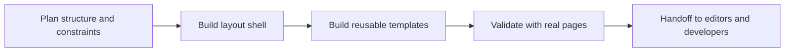

# Site Builder Workflow Deep-Dive

## New here?

Start with [For Site Builders](./index.md) for the role overview and quick links, then return here for the full workflow.

## Summary

Use this page to understand the full site-builder workflow, from structure planning through rollout validation and handoff.

## Outcome

After using this guide, you should be able to choose the right site-builder workflow, identify the next implementation guide you need, and validate handoff quality before editors or developers rely on the output.

## Workflow model

## Steps

1. Define layout goals, constraints, and responsive breakpoints.
2. Build or update the site-wide layout shell.
3. Create reusable templates inside that layout model.
4. Validate on real pages across device classes.
5. Document handoff guidance for editors and developers.

## Design strategy

- Keep global visual and structural rules in layouts.
- Keep repeatable content composition in templates.
- Keep one-off authored content at the page level.
- Prefer tokens and naming conventions over hardcoded styles.

## Quality gates

Before rollout, verify:

- responsive behavior on mobile, tablet, and desktop,
- accessibility landmarks and keyboard navigation,
- acceptable global asset/performance impact,
- compatibility across article, blog, and page contexts.

## Handoff checklist

1. Document intended layout-template pairings.
2. Document known constraints and fallback behavior.
3. Provide example usage and screenshots.
4. Confirm editor-safe regions and guidance are clear.

## Example libraries

- [Layout Examples Overview](./layout-examples/overview.md)
- [Template Examples Overview](./template-examples/overview.md)
- [Article Examples Overview](./article-examples/overview.md)

## Verification

This guide is working when you can map a content goal to the right layout or template work, apply the relevant quality gates, and hand off clear editor-safe structure with supporting examples.

## Related guides

- [For Site Builders](./index.md)
- [Layouts](./layouts.md)
- [Templates](./templates.md)
- [Pages](./pages.md)
- [Widgets](./widgets/overview.md)
- [Website Launch Workflow](../for-developers/website-launch/index.md)
