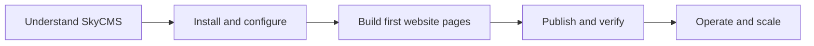

# SkyCMS Documentation

> **Docs version:** These pages reflect **SkyCMS v12.3.0** (April 2026). [See what changed](reference/changelog.md)

_The edge‑native CMS for creative people who value performance, simplicity, and creative freedom_

SkyCMS is a multi-tenant CMS that gives content editors modern publishing tools and gives developers full technical control — without fighting over the same codebase.

[Install SkyCMS](installation/overview.md){ .md-button .md-button--primary } [What is SkyCMS?](getting-started/what-is-skycms.md){ .md-button }

---

## How can we help?

-   :material-pencil:{ .lg .middle } **Content Editor**

    ---

    You publish articles, manage media, and keep your site up to date.

    [:octicons-arrow-right-24: Editor Guide](for-editors/index.md)

-   :material-palette:{ .lg .middle } **Site Builder**

    ---

    You design how the website looks and works by building reusable page templates for your editorial team.

    [:octicons-arrow-right-24: Site Builder Guide](for-site-builders/index.md)

-   :material-code-braces:{ .lg .middle } **Developer**

    ---

    You install, extend, deploy, and integrate SkyCMS with your infrastructure.

    [:octicons-arrow-right-24: Developer Guide](for-developers/index.md)

---

## New to SkyCMS? Start here

Follow this sequence if you are starting from scratch:

1. [What is SkyCMS?](getting-started/what-is-skycms.md) — understand the product before you install.
1. [Installation Overview](installation/overview.md) — choose Azure, Docker, or local development.
1. [Quick Start](getting-started/quick-start.md) — complete your first publish cycle.
1. [Deployment Overview](deployment/overview.md) — move to production.

---

## Popular pages

-   :material-download:{ .lg .middle } **[Installation Overview](installation/overview.md)**

    Azure · Docker · Local Development

-   :material-cog:{ .lg .middle } **[Configuration Overview](configuration/overview.md)**

    Database · Storage · CDN · Email

-   :material-draw:{ .lg .middle } **[Layouts & Templates](for-site-builders/layouts.md)**

    Build the visual structure of your site

-   :material-api:{ .lg .middle } **[API Reference](for-developers/api/overview.md)**

    Contact form and shared API endpoints

-   :material-rocket-launch:{ .lg .middle } **[Deployment](deployment/overview.md)**

    Azure · Docker · CI/CD Pipelines

-   :material-history:{ .lg .middle } **[Changelog](reference/changelog.md)**

    What's new in SkyCMS

---

## Get help

[:material-github: GitHub](https://github.com/CWALabs/SkyCMS){ .md-button } [:material-bug: Report an issue](https://github.com/CWALabs/SkyCMS/issues){ .md-button } [:material-book: Glossary](reference/glossary.md){ .md-button }

---

## Documentation by Role (Secondary Navigation)

Use these role hubs after you complete the Start Here path.

| Role | Start Here | Key Topics |
| ------ | ----------- | ------------ |
| **Content Editors** | [Editor Overview](for-editors/overview.md) | [Visual Editor](for-editors/visual-editor.md) · [Blogging](for-editors/blogging.md) · [Publishing](for-editors/publishing-modes.md) · [File Manager](for-editors/file-manager.md) |
| **Site Builders** | [Builder Overview](for-site-builders/overview.md) | [Layouts](for-site-builders/layouts.md) · [Layout Examples](for-site-builders/layout-examples/overview.md) · [Templates](for-site-builders/templates.md) · [Template Examples](for-site-builders/template-examples/overview.md) · [Article Examples](for-site-builders/article-examples/overview.md) · [Widgets](for-site-builders/widgets/overview.md) |
| **Developers** | [Developer Overview](for-developers/overview.md) | [Architecture](for-developers/architecture.md) · [Architecture Diagram Catalog](for-developers/architecture-diagram-catalog.md) · [API Reference](for-developers/api/overview.md) · [Multi-Tenancy](for-developers/multi-tenancy-deep-dive.md) |
| **Administrators** | [Configuration](configuration/overview.md) | [Database](configuration/database/overview.md) · [Storage](configuration/storage/overview.md) · [Deployment](deployment/overview.md) |

---

## Reference and Support

- [FAQ](reference/faq.md)
- [Troubleshooting](reference/troubleshooting.md)
- [Glossary](reference/glossary.md)
- [Feature Catalog](reference/features/index.md) — 56 features across 8 categories.

---

## AI and Deep Reference

- [AI Context Pack](reference/ai-context-pack.md) — canonical terms and retrieval shortcut.
- [Architecture Diagram Catalog](for-developers/architecture-diagram-catalog.md) — visual map for architecture and flows.
- [Changelog](reference/changelog.md)
