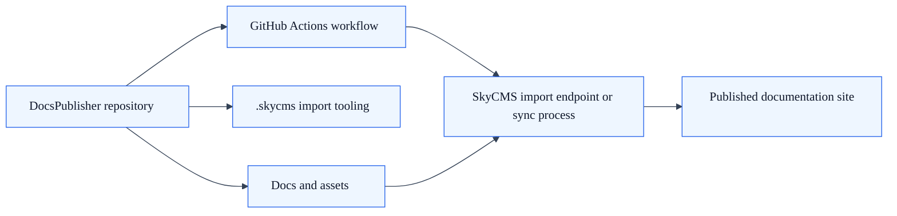

# SkyCMS Docs Publisher

## Summary

Use this page when you want documentation content managed in a standalone repository and synchronized into SkyCMS.

## What it is

SkyCMS.DocsPublisher is a template repository that includes:

- A `Docs/` content tree.
- Import tooling under `.skycms/`.
- GitHub Actions workflow for sync/publish automation.
- Example pages and assets.

## DocsPublisher runtime topology

## Why use it

- Keep product code and docs content in separate repositories.
- Support independent documentation workflows.
- Reuse a proven structure for Markdown import into SkyCMS.

## Verification

DocsPublisher is set up correctly when:

- content is committed in the standalone docs repository,
- required secrets are configured,
- sync or publish workflow runs successfully,
- published documentation appears in the target SkyCMS environment.

## Next steps

1. Clone the SkyCMS.DocsPublisher repository.
2. Follow repository quick-start and README instructions.
3. Configure repository secrets for your target environment.
4. Trigger or commit to run the publishing workflow.

## Related guides

- [Installation Overview](overview.md)
- [Post-Installation Configuration](post-installation.md)
- [Publishing Workflow](../deployment/publishing-workflow.md)
