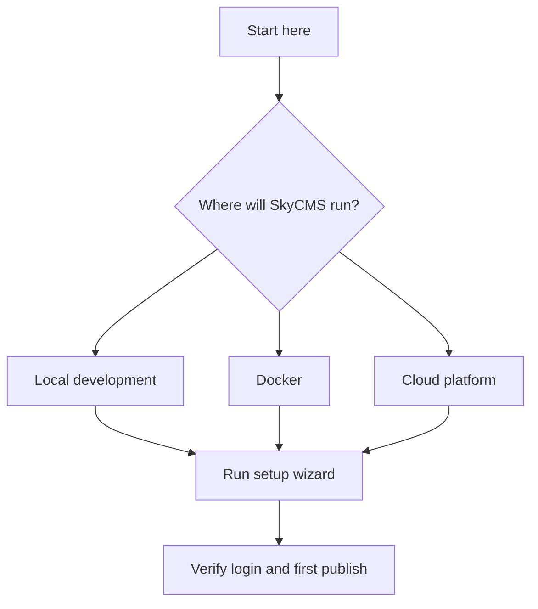

# Installation Overview

## Summary

Use this page to choose an installation path and complete first-time setup without guessing at missing prerequisites.

If you are new to SkyCMS, start here before platform-specific guides.

## Outcome

Reach a working SkyCMS instance where you can sign in and publish a first test page.

## Choose an installation path

Pick the path that matches your environment:

- Setup Wizard first (recommended): use the interactive setup at `/___setup` for most first-time installations.
- Local development: run and test SkyCMS on a local machine during implementation work.
- Docker deployment: use a containerized runtime for repeatable environments.
- Cloud installation: use Azure, AWS, or Cloudflare-hosted patterns.

Quick path map:

## Core prerequisites

Before you start, prepare:

- application runtime access for your target environment,
- one database connection string,
- one storage connection string for media and assets,
- a publisher URL where content will be served.

## Minimum required settings

At minimum, define:

- `ConnectionStrings__ApplicationDbContextConnection`
- `ConnectionStrings__StorageConnectionString`
- `AzureBlobStorageEndPoint`
- `CosmosPublisherUrl`
- `CosmosAllowSetup=true` during setup only

For complete examples, use [Minimum Required Settings](minimum-required-settings.md).

## Procedure

1. Select your install path and gather credentials.
2. Apply minimum required settings.
3. Start SkyCMS with setup enabled.
4. Open `/___setup` and complete wizard steps.
5. Restart with `CosmosAllowSetup=false`.
6. Sign in and run first publish test.

## Verification

Installation is successful when:

- admin login works,
- file upload works,
- publisher URL is reachable,
- first test page publishes and renders.

For hardening and operational follow-up, continue to [Post-Installation Configuration](post-installation.md).

## Related guides

- [Minimum Required Settings](minimum-required-settings.md)
- [Setup Wizard](setup-wizard.md)
- [Local Development Installation](local-development.md)
- [Deploy with Docker](../deployment/docker.md)
- [Deploy to Azure](../deployment/azure.md)
- [Deployment Overview](../deployment/overview.md)
