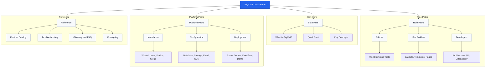

# Documentation Map

Use this page to understand how the documentation is organized and where to start based on your goal.

## Start Points

- New to SkyCMS: start with [What is SkyCMS](../getting-started/what-is-skycms.md), then [Quick Start](../getting-started/quick-start.md).
- Working in a role: jump to [For Editors](../for-editors/index.md), [For Site Builders](../for-site-builders/index.md), or [For Developers](../for-developers/index.md).
- Looking up specifics: use [Feature Catalog](features/index.md), [FAQ](faq.md), and [Troubleshooting](troubleshooting.md).
