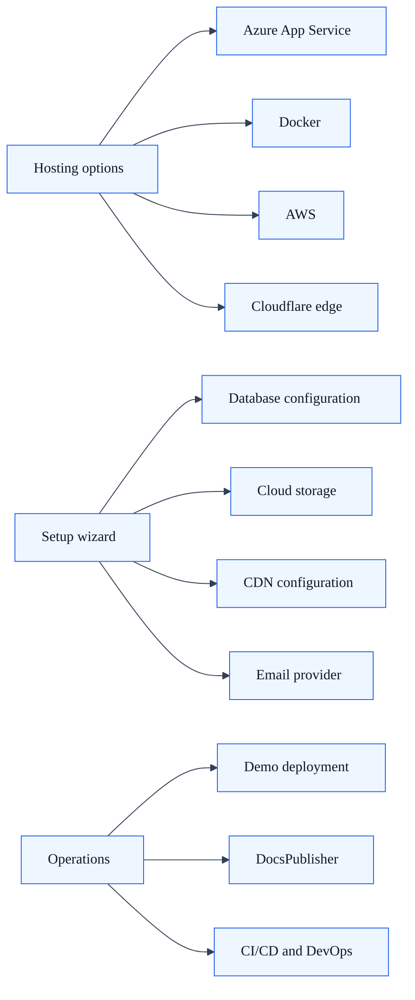

# Deployment & Infrastructure

SkyCMS supports multiple deployment targets and hosting models — from one-click Azure Marketplace installs to Docker containers, AWS, and Cloudflare edge hosting. The system includes a guided setup wizard, automated demo provisioning, and a documentation publishing pipeline.

**Audiences:** Administrators, Developers, Evaluators

**Jump to:**

- [Hosting Options](#1-hosting-options)
- [Setup Wizard](#2-setup-wizard)
- [Database Configuration](#3-database-configuration)
- [Cloud Storage Configuration](#4-cloud-storage-configuration)
- [CDN Configuration](#5-cdn-configuration)
- [Email Provider Configuration](#6-email-provider-configuration)
- [Demo Deployment](#7-demo-deployment)
- [Documentation Publishing (DocsPublisher)](#8-documentation-publishing-docspublisher)
- [CI/CD and DevOps](#9-cicd-and-devops)
- [Licensing](#10-licensing)

---

## 1. Hosting Options

> **Documentation:** [Deployment Overview](../../deployment/overview.md) · [Azure Deployment](../../deployment/azure.md) · [Docker Deployment](../../deployment/docker.md) · [Cloudflare Edge Hosting](../../deployment/cloudflare.md) · [Installation Overview](../../installation/overview.md) · [Azure Installation](../../installation/azure.md) · [AWS Installation](../../installation/aws.md) · [Docker Installation](../../installation/docker.md) · [Local Development](../../installation/local-development.md)

### Azure App Service

### Deployment capability map



- **Azure Marketplace deployment** — One-click ARM template deployment with 9 pre-configured resources
- Customizable template with subscription, resource group, and region selection
- Configurable parameters: email provider, web app plan tier, storage account type
- Premium and Standard tier support
- Docker container hosting on App Service
- Azure Files integration for persistent storage

### Docker

- Official Dockerfile for containerized deployment
- Docker Compose configuration (`docker-compose.yml` + `docker-compose.override.yml`)
- Docker Compose project file (`docker-compose.dcproj`) for Visual Studio integration
- Compatible with any Docker-capable host (Azure Container Instances, AWS ECS, Kubernetes, self-hosted)

### AWS

- Deployment documentation and guidance for AWS hosting
- S3 storage integration via the multi-cloud storage layer
- AWS-compatible via Docker containers

### Cloudflare

- **Cloudflare Cloud Connector** — Connect SkyCMS to Cloudflare's CDN
- **Cloudflare Edge Hosting** — Serve static-generated pages from Cloudflare's edge network
- Cloudflare R2 storage integration (S3-compatible)
- Custom filter expression rules for URL routing

### Local Development

- `dotnet run --project Sky.Editor` for local development
- `launchSettings.json` profiles for IDE launch configurations
- SQLite support for zero-dependency local development
- No cloud services required for development mode

---

## 2. Setup Wizard

> **Documentation:** [Setup Wizard](../../installation/setup-wizard.md) · [Post-Installation](../../installation/post-installation.md) · [Minimum Required Settings](../../installation/minimum-required-settings.md)

An interactive, step-by-step setup experience for initial site configuration.

### Prerequisites

- `CosmosAllowSetup=true` environment variable
- Database connection string configured
- Application deployed and accessible

### Setup Steps

| Step | Purpose |
| --- | --- |
| **Welcome** | Introduction and prerequisites check |
| **Step 1: Storage** | Configure cloud storage connection (Azure Blob, S3, R2) |
| **Step 2: Admin Account** | Create the initial administrator user |
| **Step 3: Publisher** | Configure the public-facing publisher settings |
| **Step 4: Email** (optional) | Configure email provider for notifications and identity |
| **Step 5: CDN** (optional) | Configure CDN provider for content delivery |
| **Step 6: Review** | Review all settings before committing |
| **Complete** | Finalize setup, restart required |

### Post-Setup

- Application restart to apply configuration
- Sign in with administrator credentials
- Validate all settings
- Disable setup mode (`CosmosAllowSetup=false`) for security

### Multi-Tenant vs. Single-Tenant Setup

- Single-tenant: Standard setup wizard at `/__setup`
- Multi-tenant: Multi-tenant setup flow with per-tenant initialization
- Database schema auto-initialized on first tenant access

---

## 3. Database Configuration

> **Documentation:** [Database Overview](../../configuration/database/overview.md) · [Cosmos DB](../../configuration/database/cosmos-db.md) · [SQL Server](../../configuration/database/sql-server.md) · [MySQL](../../configuration/database/mysql.md) · [SQLite](../../configuration/database/sqlite.md) · [Database Configuration Reference](../../configuration/database/configuration-reference.md) · [EF Cross-Provider Compatibility Guide](../../for-developers/ef-cross-provider-guide.md)

### Supported Databases

| Database | Use Case | Connection |
| --- | --- | --- |
| **Azure Cosmos DB** | Production, global scale, multi-region | Cosmos DB connection string |
| **SQL Server / Azure SQL** | Enterprise, ACID compliance | SQL Server connection string |
| **MySQL** | Open-source relational | MySQL connection string |
| **SQLite** | Development, demos, small sites | File path or `:memory:` |

### Database Features

- Auto-detection from connection string (no configuration flags needed)
- Provider selection is based on connection-string shape and documented for developers in the EF cross-provider guide
- Schema auto-migration on startup
- EF Core migrations support (`AddMigrationScript.ps1`)
- Cross-provider query compatibility

---

## 4. Cloud Storage Configuration

> **Documentation:** [Storage Overview](../../configuration/storage/overview.md) · [Azure Blob Storage](../../configuration/storage/azure-blob.md) · [Amazon S3](../../configuration/storage/s3.md) · [Cloudflare R2](../../configuration/storage/cloudflare-r2.md) · [Google Cloud Storage](../../configuration/storage/google-cloud.md) · [Storage Configuration Reference](../../configuration/storage/configuration-reference.md) · [Storage Provider Auto-Detection](../../for-developers/storage-provider-auto-detection.md)

### Supported Cloud Storage Providers

| Provider | Connection Method |
| --- | --- |
| **Azure Blob Storage** | Azure storage connection string |
| **Amazon S3** | AWS access key + secret |
| **Cloudflare R2** | S3-compatible endpoint + credentials |
| **Azure Files** | Azure file share connection string |

### Storage Roles

- **Media storage** — Images, documents, uploaded assets
- **Static site hosting** — Pre-generated HTML pages (Azure Blob static website)
- **File manager** — All file operations routed through storage abstraction
- **Runtime detection** — Active storage driver selected from the connection-string shape at startup or tenant resolution time

---

## 5. CDN Configuration

> **Documentation:** [CDN Overview](../../configuration/cdn/overview.md) · [Azure Front Door](../../configuration/cdn/azure-front-door.md) · [Cloudflare CDN](../../configuration/cdn/cloudflare.md) · [CloudFront](../../configuration/cdn/cloudfront.md) · [Sucuri](../../configuration/cdn/sucuri.md) · [CDN Configuration Reference](../../configuration/cdn/configuration-reference.md)

### Supported CDN Providers

| Provider | Integration Type |
| --- | --- |
| **Azure CDN / Azure Front Door** | API-based cache purge |
| **Cloudflare** | API-based cache purge, edge hosting |
| **AWS CloudFront** | API-based cache invalidation |
| **Sucuri** | API-based cache purge |

### CDN Features

- Configure from admin settings panel
- Automatic cache purge on content publish
- Purge failures don't block publishing (graceful degradation)
- Per-tenant CDN isolation
- Proxy settings configuration (for CDN/reverse proxy header forwarding)

---

## 6. Email Provider Configuration

> **Documentation:** [Email Overview](../../configuration/email/overview.md) · [Azure Communication Services](../../configuration/email/azure-communication-services.md) · [SendGrid](../../configuration/email/sendgrid.md) · [SMTP](../../configuration/email/smtp.md) · [NoOp Provider](../../configuration/email/none.md) · [Email Configuration Reference](../../configuration/email/configuration-reference.md)

### Supported Providers

| Provider | Features |
| --- | --- |
| **Azure Communication Services** | Azure-native, high-volume delivery |
| **SendGrid (Twilio)** | Template support, delivery analytics |
| **SMTP** | Self-hosted, TLS support, username/password auth |
| **NoOp** | Development/test mode (no emails sent) |

### Email Roles

- Identity emails (registration confirmation, password reset)
- Contact form notifications
- Admin alerts

---

## 7. Demo Deployment

> **Documentation:** [Demo Deployment Guide](../../deployment/demo-deployment.md) · [SkyCMS.Demo README](https://github.com/CWALabs/SkyCMS.Demo)

### Automated Demo Provisioning (SkyCMS.Demo)

PowerShell + Bicep automation for one-command demo site deployment to Azure.

### What Gets Deployed

| Resource | Purpose |
| --- | --- |
| **App Service Plan** | Compute (default P1v3 SKU) |
| **Web App** | Docker-hosted SkyCMS Editor |
| **Storage Account** | Blob storage for media assets |
| **Azure File Share** | Persistent storage for SQLite database |

### Demo Features

- Pre-seeded SQLite database with sample content
- Pre-populated blob storage with demo assets
- Interactive PowerShell deployment script (`deploy-demo.ps1`)
- Cleanup script for teardown (`destroy-demo.ps1`)
- Configurable: resource group, region, name prefix, SKU
- Docker image source (from GitHub Container Registry or custom)

---

## 8. Documentation Publishing (DocsPublisher)

> **Documentation:** [DocsPublisher Installation](../../installation/docs-publisher.md) · [DocsPublisher README](https://github.com/CWALabs/SkyCMS.DocsPublisher) · [DocsPublisher Quick Start](https://github.com/CWALabs/SkyCMS.DocsPublisher/blob/main/QUICK_START.md) · [Documentation Standards Stack v1](../../for-developers/documentation-standards-stack-v1.md) · [Documentation Metadata Schema v1](../../for-developers/documentation-metadata-schema.md) · [Documentation Templates](../../for-developers/documentation-templates.md) · [Documentation PR Checklist](../../for-developers/documentation-pr-checklist.md) · [Documentation Adoption Priority Plan](../../for-developers/documentation-adoption-priority-plan.md) · [Documentation Rollout Plan](../../for-developers/documentation-rollout-plan.md) · [Documentation Gap Review and Upgrade Plan](../../for-developers/documentation-standards-gap-review-2026-04.md)

### Markdown-to-CMS Pipeline

A ready-to-run tool for syncing Markdown documentation into SkyCMS.

### Features

| Feature | Description |
| --- | --- |
| **Markdown → HTML** | Automatic conversion of `.md` files to HTML content |
| **Asset upload** | Images and files uploaded to `/pub/docs` storage path |
| **Idempotent sync** | Hash tracking prevents duplicate uploads (`.skycms/docs-import-map.json`) |
| **GitHub Actions CI** | Automated sync on doc changes via workflow |
| **Front matter** | YAML metadata: title, summary, URL path, publish flag, banner image |
| **Relative links** | Internal cross-linking between documentation pages |

### Front Matter Schema

```yaml
---
title: Page Title
summary: Brief description
published: true
published_at: 2026-01-15T00:00:00Z
url_path: /docs/my-page
banner_image: https://example.com/banner.jpg
article_type: documentation
---
```

### Integration

- Uses the SkyCMS Docs Import API (`PUT/DELETE /_api/import/docs/{sourceKey}`)
- Requires: API URL, API key, tenant host, service account user ID
- Jest test suite for import script validation

---

## 9. CI/CD and DevOps

> **Documentation:** [CI/CD Pipelines Guide](../../deployment/cicd-pipelines.md) · [Deployment Overview](../../deployment/overview.md)

### GitHub Actions Workflows

| Workflow | Purpose |
| --- | --- |
| **Docker Image Build** | Build and publish Docker images |
| **NuGet Push** | Publish NuGet packages (AspNetCore.Identity.FlexDb, etc.) |
| **Docs Cloudflare Deploy** | Deploy documentation to Cloudflare Pages |
| **Docs Import** | Sync Markdown documentation to SkyCMS |

### Secret Management

- `UploadSecretsToGithubRepo.ps1` — Upload secrets to GitHub repository
- Cloudflare secrets setup documented (`.github/CLOUDFLARE_SECRETS_SETUP.md`)
- Secrets managed via environment variables and secret stores — never in code

### Package Management

- Central package version management via `Directory.Packages.props`
- NuGet package publishing for shared libraries
- Global tool management (`.config/dotnet-tools.json`)

---

## 10. Licensing

> **Documentation:** [Licensing & Distribution](../../deployment/licensing-and-distribution.md)

### Open Source

- **GPL License** — Core CMS under GNU General Public License
- **MIT License** — Select components under MIT
- **CKEditor GPL** — CKEditor fork under GPL
- Licensing and distribution documentation provided

### Self-Hosting

- Free for self-hosting
- No build pipeline required
- No vendor lock-in — multi-cloud, multi-database
- Docker container for portable deployment
