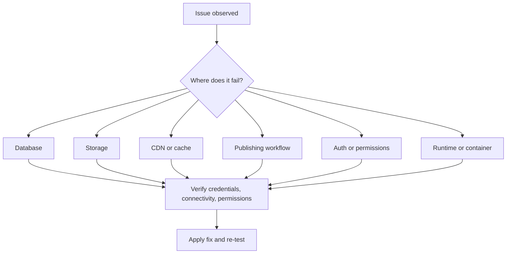

# Troubleshooting

## Summary

Use this guide when SkyCMS setup, publishing, or runtime behavior fails unexpectedly.

## Outcome

After using this guide, you should be able to identify the failing layer, run the most relevant diagnostic checks, and gather the right escalation details if the issue is not resolved immediately.

The fastest diagnosis pattern is layer-by-layer:

1. Database
2. Storage
3. CDN/cache
4. Publishing pipeline
5. Authentication/permissions
6. Runtime/container platform

## Quick triage flow

## Most common root causes

- Incorrect connection strings or secret values.
- Missing provider permissions or IAM roles.
- Firewall/network restrictions.
- Publishing worker downtime.
- Cache invalidation delay after publish.

## Database issues

### Database symptoms

- "Cannot connect to database"
- "Login failed" or "Access denied"
- setup wizard cannot validate database step

### Database checks

1. Confirm provider-specific connection string format.
2. Confirm network/firewall access from runtime host.
3. Confirm credential validity and database permissions.
4. Confirm target database exists and is reachable.

### Database references

- [Cosmos DB configuration](../configuration/database/cosmos-db.md)
- [SQL Server configuration](../configuration/database/sql-server.md)
- [MySQL configuration](../configuration/database/mysql.md)
- [SQLite configuration](../configuration/database/sqlite.md)

## Storage issues

### Storage symptoms

- file upload fails
- publish succeeds but asset writes fail
- setup wizard storage validation fails

### Storage checks

1. Verify storage account/bucket/container exists.
2. Verify read/write/delete permissions for configured identity.
3. Validate credentials using provider CLI tools.
4. Check region/network allowlists.

### Storage references

- [Azure Blob storage configuration](../configuration/storage/azure-blob.md)
- [S3 storage configuration](../configuration/storage/s3.md)
- [Cloudflare R2 storage configuration](../configuration/storage/cloudflare-r2.md)
- [Google Cloud storage configuration](../configuration/storage/google-cloud.md)

## CDN and cache issues

### CDN symptoms

- publish appears successful but site still shows old content
- purge/invalidation errors in logs

### Key point

CDN purge failures usually do not block publication to storage. They delay freshness at edge nodes.

### CDN checks

1. Confirm CDN credentials and zone/distribution identifiers.
2. Re-run purge/invalidation for affected paths.
3. Validate cache TTL behavior.
4. Confirm origin content is updated before debugging CDN edge state.

## Publishing workflow issues

### Publishing symptoms

- publish action fails
- scheduled publish does not run
- template update produces unexpected output

### Publishing checks

1. Confirm publishing service/worker is running.
2. Confirm storage target is writable.
3. Confirm page/template permissions for acting user.
4. Reproduce with one minimal page to isolate workflow from content complexity.

### Publishing references

- [Publishing Workflow](../deployment/publishing-workflow.md)
- [Publishing Modes](../for-editors/publishing-modes.md)

## Authentication and permission issues

### Authentication symptoms

- login fails for known user
- editor actions unavailable despite expected role

### Authentication checks

1. Verify user exists and is active.
2. Verify role assignment for required action.
3. Verify identity backend connectivity.
4. Reset credential or rotate secret if authentication backend changed.

## Runtime and container issues

### Runtime symptoms

- app fails to start
- setup URL unavailable
- intermittent runtime crashes

### Runtime checks

1. Confirm required environment variables are set.
2. Confirm port and host binding are valid.
3. Review container/runtime logs for startup exceptions.
4. Confirm volume mount paths and permissions.

## Setup wizard specific issues

### Wizard cannot proceed to review

Likely causes:

- missing required values,
- invalid storage/CDN credentials,
- failed prior validation step.

Action:

1. Re-check each wizard step for success state.
2. Re-enter provider credentials.
3. Restart app and retry setup path.

### Wizard not available after first run

Expected behavior: setup is disabled after successful completion.

Action:

- temporarily enable setup mode only when intentional re-run is required,
- disable again immediately after setup tasks are complete.

## Escalation package

Before opening an issue, collect:

- exact error text and timestamp,
- affected environment and tenant,
- relevant log excerpt,
- recent configuration changes,
- reproduction steps.

## Verification

This guide is working when you can narrow an issue to the correct diagnostic layer, run the matching checks, and either resolve the problem or produce a useful escalation package without repeating broad trial-and-error steps.

## Related links

- [Configuration Overview](../configuration/overview.md)
- [Minimum Required Settings](../installation/minimum-required-settings.md)
- [Deployment Overview](../deployment/overview.md)
- [FAQ](faq.md)
